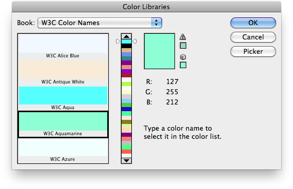
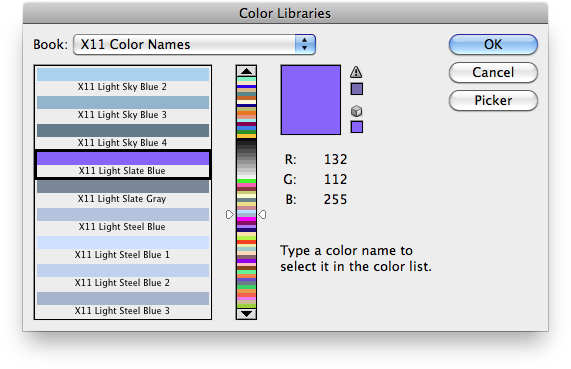

# Color Books

Two custom color book files (.acb) based on the W3C and X11 sets of color names are currently available.

They must be placed in the `Presets/Color Books/` folder, in the default preset location of the Adobe Photoshop application.

Each color book file has been created using the script [Generate Color Book File](/Utility-Scripts/Generate-Color-Book-File), from a JSON text file also provided in the Zip archive.

## W3C Color Names

Number of color names: 141 (no *Grey* variants).

### JSON text file

[W3C Color Names.json](W3C%20Color%20Names.json)

### Screenshot

**W3C Color Names.acb**

### Download

[Download W3C-Color-Names.zip](/Downloads/W3C-Color-Names.zip)

### References

- [CSS Color Module Level 3 – Extended color keywords](https://www.w3.org/TR/css3-color/#svg-color)
- [CSS Color Module Level 4 – Changes from Colors 3](https://www.w3.org/TR/css-color-4/#changes-from-3)
- [SVG 1.1 (Second Edition) – Recognized color keyword names](https://www.w3.org/TR/SVG/types.html#ColorKeywords)
- [X11 color names](https://en.wikipedia.org/wiki/X11_color_names)

## X11 Color Names

Number of color names: 549 (no *Grey* variants).

### JSON text file

[X11 Color Names.json](X11%20Color%20Names.json)

### Screenshot

**X11 Color Names.acb**

### Download

[Download X11-Color-Names.zip](/Downloads/X11-Color-Names.zip)

### References

- [Colors of /usr/lib/X11/rgb.txt](http://www.thomas-guettler.de/rgb.txt.html)
- [/usr/lib/X11/rgb.txt](https://www.astrouw.edu.pl/~jskowron/colors-x11/rgb.html)
