# Adjustment & Fill Gallery

## Description

“Adjustment & Fill Gallery” is a color effects script using the [JSON Action Manager](/JSON-Action-Manager) scripting library.

This stand-alone script written in JavaScript applies on an existing RGB image a preset effect made of a stack of adjustement layers and fill layers. The original image is not modified.

In the dialog box, use the left menu to select the set of effects, then use the right menu to select the effect you want to apply; if you choose the last item named “\*Every Effect\*”, then each effect of the set will be applied on a new copy of the image, giving you the opportunity to compare between them.

Two user options are also available:

- Merge layers while duplicating the original image.
- Create a layer set grouping all the adjustment layers and fill layers.

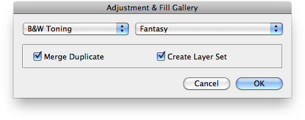
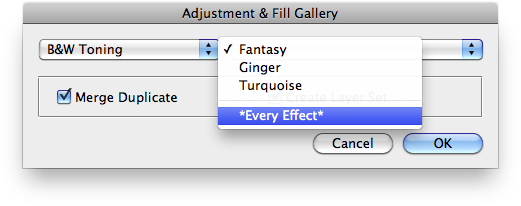

“Adjustment & Fill Gallery” uses the new module `jamLayers`, part of the [JSON Action Manager](/JSON-Action-Manager) scripting library.

## Presets

Presets are actually plain JSON text files, found in the `Presets` folder located at the same level than the script:

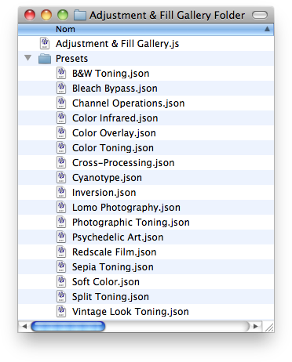

Each preset file contains a JSON object of effects made of sequences of adjustment layers and fill layers, as documented in the [Layer Object Simplified Format](/JSON-Simplified-Formats/Layer-Object-Simplified-Format) page:


- **Black & white adjustment**
- **Brightness/contrast adjustment**
- **Channel mixer adjustment**
- **Color balance adjustment**
- **Curves adjustment**
- **Exposure adjustment**
- **Gradient map adjustment**
- **Hue/saturation adjustment**
- **Invert adjustment**
- **Levels adjustment**
- **Photo filter adjustment**
- **Posterize adjustment**
- **Selective color adjustment**
- **Threshold adjustment**
- **Vibrance adjustment**

- **Gradient fill**
- **Pattern fill**
- **Solid color fill**

Adjustment layers and fill layers are very powerful, they allow you to adjust images without altering the original image, and since their effects are non-destructive, they can be easily modified later on:


- their settings can be edited
- they can be hidden or have their opacity modified
- their blending mode can be changed
- their stacking order can be altered
- they can be duplicated
- they can use layer masks

## Examples

### Original Test Image


### B&W Toning | Fantasy

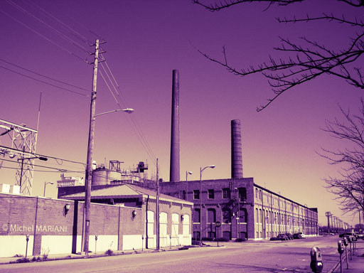 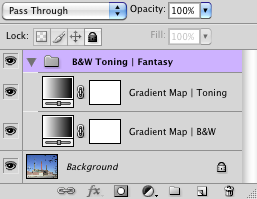

```json
[
    {
        "adjustmentLayer":
        {
            "name": "Gradient Map | B&W",
            "type":
            {
                "gradientMapClass":
                {
                    "gradient":
                    {
                        "gradientForm": "customStops",
                        "interpolation": 4096,
                        "colors":
                        [
                            {
                                "location": 0,
                                "midpoint": 50,
                                "type": "userStop",
                                "color":
                                {
                                    "hue": 0,
                                    "saturation": 0,
                                    "brightness": 0
                                }
                            },
                            {
                                "location": 4096,
                                "midpoint": 58,
                                "type": "userStop",
                                "color":
                                {
                                    "hue": 0,
                                    "saturation": 0,
                                    "brightness": 97
                                }
                            }
                        ]
                    },
                    "dither": true
                }
            }
        }
    },
    {
        "adjustmentLayer":
        {
            "name": "Gradient Map | Toning",
            "mode": "overlay",
            "opacity": 85,
            "type":
            {
                "gradientMapClass":
                {
                    "gradient":
                    {
                        "name": "Fantasy",
                        "gradientForm": "customStops",
                        "interpolation": 4096,
                        "colors":
                        [
                            {
                                "location": 0,
                                "midpoint": 50,
                                "type": "userStop",
                                "color":
                                {
                                    "hue": 270,
                                    "saturation": 100,
                                    "brightness": 100
                                }
                            },
                            {
                                "location": 4096,
                                "midpoint": 50,
                                "type": "userStop",
                                "color":
                                {
                                    "hue": 60,
                                    "saturation": 75,
                                    "brightness": 100
                                }
                            }
                        ]
                    },
                    "dither": true
                }
            }
        }
    }
]
```

### Cross-Processing | C41-E6

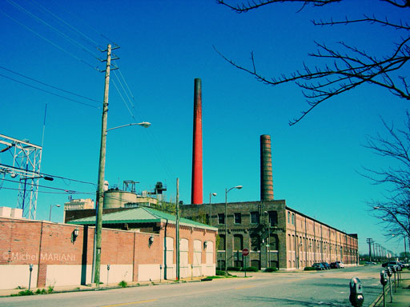 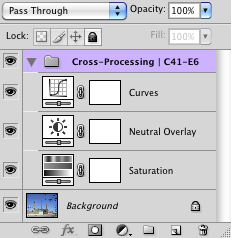

```json
[
    {
        "adjustmentLayer":
        {
            "name": "Saturation",
            "type":
            {
                "hueSaturation":
                {
                    "adjustment":
                    [
                        {
                            "hue": 0,
                            "saturation": 20,
                            "lightness": 0
                        }
                    ]
                }
            }
        }
    },
    {
        "adjustmentLayer":
        {
            "name": "Neutral Overlay",
            "opacity": 45,
            "mode": "overlay",
            "type":
            {
                "brightnessContrast":
                {
                    "brightness": 0,
                    "contrast": 0
                }
            }
        }
    },
    {
        "adjustmentLayer":
        {
            "name": "Curves",
            "type":
            {
                "curves":
                {
                    "adjustment":
                    [
                        {
                            "channel": "composite",
                            "curve":
                            [
                                {
                                    "horizontal": 0,
                                    "vertical": 0
                                },
                                {
                                    "horizontal": 77,
                                    "vertical": 54
                                },
                                {
                                    "horizontal": 185,
                                    "vertical": 197
                                },
                                {
                                    "horizontal": 255,
                                    "vertical": 255
                                }
                            ]
                        },
                        {
                            "channel": "red",
                            "curve":
                            [
                                {
                                    "horizontal": 0,
                                    "vertical": 0
                                },
                                {
                                    "horizontal": 93,
                                    "vertical": 45
                                },
                                {
                                    "horizontal": 167,
                                    "vertical": 162
                                },
                                {
                                    "horizontal": 255,
                                    "vertical": 255
                                }
                            ]
                        },
                        {
                            "channel": "green",
                            "curve":
                            [
                                {
                                    "horizontal": 0,
                                    "vertical": 0
                                },
                                {
                                    "horizontal": 91,
                                    "vertical": 103
                                },
                                {
                                    "horizontal": 255,
                                    "vertical": 211
                                }
                            ]
                        },
                        {
                            "channel": "blue",
                            "curve":
                            [
                                {
                                    "horizontal": 0,
                                    "vertical": 0
                                },
                                {
                                    "horizontal": 95,
                                    "vertical": 100
                                },
                                {
                                    "horizontal": 255,
                                    "vertical": 185
                                }
                            ]
                        }
                    ]
                }
            }
        }
    }
]
```

### Cyanotype | Light

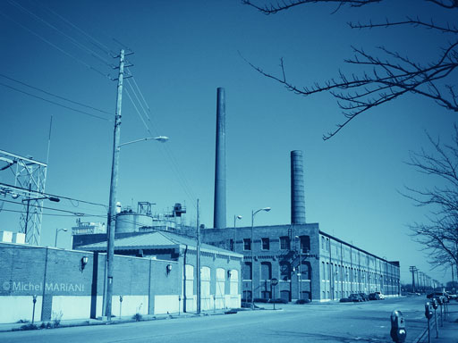 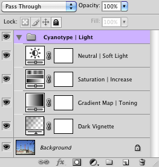

```json
[
    {
        "contentLayer":
        {
            "name": "Dark Vignette",
            "mode": "overlay",
            "opacity": 50,
            "type":
            {
                "gradientLayer":
                {
                    "type": "radial",
                    "angle": 90,
                    "scale": 150,
                    "reverse": true,
                    "dither": true,
                    "gradient":
                    {
                        "name": "Vignette",
                        "gradientForm": "customStops",
                        "interpolation": 4096,
                        "colors":
                        [
                            {
                                "location": 0,
                                "midpoint": 50,
                                "type": "userStop",
                                "color":
                                {
                                    "red": 0,
                                    "green": 0,
                                    "blue": 0
                                }
                            },
                            {
                                "location": 4096,
                                "midpoint": 50,
                                "type": "userStop",
                                "color":
                                {
                                    "red": 252,
                                    "green": 252,
                                    "blue": 252
                                }
                            }
                        ],
                        "transparency":
                        [
                            {
                                "location": 0,
                                "midpoint": 50,
                                "opacity": 50
                            },
                            {
                                "location": 4096,
                                "midpoint": 50,
                                "opacity": 0
                            }
                        ]
                    }
                }
            }
        }
    },
    {
        "adjustmentLayer":
        {
            "name": "Gradient Map | Toning",
            "type":
            {
                "gradientMapClass":
                {
                    "gradient":
                    {
                        "name": "Cyanotype",
                        "gradientForm": "customStops",
                        "interpolation": 4096,
                        "colors":
                        [
                            {
                                "location": 0,
                                "midpoint": 50,
                                "type": "userStop",
                                "color":
                                {
                                    "hue": 220,
                                    "saturation": 83,
                                    "brightness": 19
                                }
                            },
                            {
                                "location": 1024,
                                "midpoint": 50,
                                "type": "userStop",
                                "color":
                                {
                                    "hue": 210,
                                    "saturation": 80,
                                    "brightness": 41
                                }
                            },
                            {
                                "location": 2048,
                                "midpoint": 50,
                                "type": "userStop",
                                "color":
                                {
                                    "hue": 200,
                                    "saturation": 54,
                                    "brightness": 65
                                }
                            },
                            {
                                "location": 3072,
                                "midpoint": 50,
                                "type": "userStop",
                                "color":
                                {
                                    "hue": 185,
                                    "saturation": 30,
                                    "brightness": 83
                                }
                            },
                            {
                                "location": 4096,
                                "midpoint": 50,
                                "type": "userStop",
                                "color":
                                {
                                    "hue": 150,
                                    "saturation": 9,
                                    "brightness": 97
                                }
                            }
                        ]
                    },
                    "dither": true
                }
            }
        }
    },
    {
        "adjustmentLayer":
        {
            "name": "Saturation | Increase",
            "type":
            {
                "hueSaturation":
                {
                    "adjustment":
                    [
                        {
                            "hue": 0,
                            "saturation": 10,
                            "lightness": 0
                        }
                    ]
                }
            }
        }
    },
    {
        "adjustmentLayer":
        {
            "name": "Neutral | Soft Light",
            "mode": "softLight",
            "opacity": 25,
            "type":
            {
                "brightnessContrast":
                {
                    "brightness": 0,
                    "contrast": 0
                }
            }
        }
    }
]
```

### Lomo Photography | Toy Camera

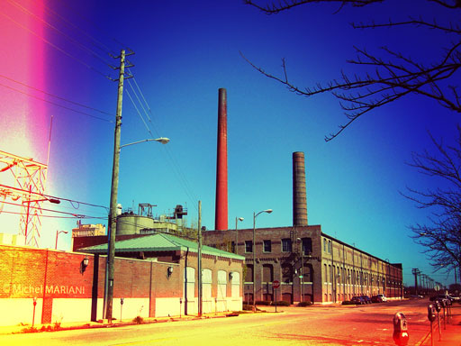 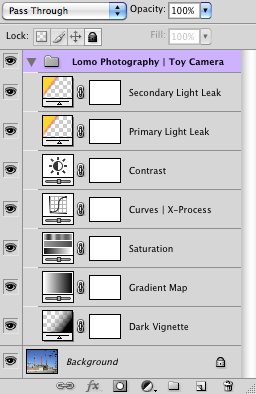

```json
[
    {
        "contentLayer":
        {
            "name": "Dark Vignette",
            "mode": "overlay",
            "opacity": 50,
            "type":
            {
                "gradientLayer":
                {
                    "type": "radial",
                    "angle": 90,
                    "scale": 120,
                    "dither": true,
                    "gradient":
                    {
                        "name": "Vignette",
                        "gradientForm": "customStops",
                        "interpolation": 4096,
                        "colors":
                        [
                            {
                                "location": 0,
                                "midpoint": 50,
                                "type": "userStop",
                                "color":
                                {
                                    "red": 255,
                                    "green": 255,
                                    "blue": 255
                                }
                            },
                            {
                                "location": 4096,
                                "midpoint": 50,
                                "type": "userStop",
                                "color":
                                {
                                    "red": 0,
                                    "green": 0,
                                    "blue": 0
                                }
                            }
                        ],
                        "transparency":
                        [
                            {
                                "location": 0,
                                "midpoint": 50,
                                "opacity": 0
                            },
                            {
                                "location": 4096,
                                "midpoint": 50,
                                "opacity": 100
                            }
                        ]
                    }
                }
            }
        }
    },
    {
        "adjustmentLayer":
        {
            "name": "Gradient Map",
            "opacity": 20,
            "type":
            {
                "gradientMapClass":
                {
                    "gradient":
                    {
                        "name": "Red to Orange",
                        "gradientForm": "customStops",
                        "interpolation": 4096,
                        "colors":
                        [
                            {
                                "location": 0,
                                "midpoint": 50,
                                "type": "userStop",
                                "color":
                                {
                                    "hue": 345,
                                    "saturation": 100,
                                    "brightness": 70
                                }
                            },
                            {
                                "location": 4096,
                                "midpoint": 50,
                                "type": "userStop",
                                "color":
                                {
                                    "hue": 50,
                                    "saturation": 100,
                                    "brightness": 90
                                }
                            }
                        ]
                    },
                    "dither": true
                }
            }
        }
    },
    {
        "adjustmentLayer":
        {
            "name": "Saturation",
            "type":
            {
                "hueSaturation":
                {
                    "adjustment":
                    [
                        {
                            "hue": 0,
                            "saturation": 20,
                            "lightness": 0
                        }
                    ]
                }
            }
        }
    },
    {
        "adjustmentLayer":
        {
            "name": "Curves | X-Process",
            "opacity": 75,
            "type":
            {
                "curves":
                {
                    "adjustment":
                    [
                        {
                            "channel": "red",
                            "curve":
                            [
                                {
                                    "horizontal": 0,
                                    "vertical": 0
                                },
                                {
                                    "horizontal": 160,
                                    "vertical": 120
                                },
                                {
                                    "horizontal": 255,
                                    "vertical": 255
                                }
                            ]
                        },
                        {
                            "channel": "green",
                            "curve":
                            [
                                {
                                    "horizontal": 0,
                                    "vertical": 0
                                },
                                {
                                    "horizontal": 70,
                                    "vertical": 50
                                },
                                {
                                    "horizontal": 185,
                                    "vertical": 200
                                },
                                {
                                    "horizontal": 255,
                                    "vertical": 255
                                }
                            ]
                        },
                        {
                            "channel": "blue",
                            "curve":
                            [
                                {
                                    "horizontal": 0,
                                    "vertical": 0
                                },
                                {
                                    "horizontal": 60,
                                    "vertical": 70
                                },
                                {
                                    "horizontal": 200,
                                    "vertical": 190
                                },
                                {
                                    "horizontal": 255,
                                    "vertical": 255
                                }
                            ]
                        }
                    ]
                }
            }
        }
    },
    {
        "adjustmentLayer":
        {
            "name": "Contrast",
            "type":
            {
                "brightnessContrast":
                {
                    "brightness": 0,
                    "contrast": 75,
                    "useLegacy": false
                }
            }
        }
    },
    {
        "contentLayer":
        {
            "name": "Primary Light Leak",
            "mode": "colorDodge",
            "opacity": 90,
            "type":
            {
                "gradientLayer":
                {
                    "type": "linear",
                    "angle": -1,
                    "scale": 90,
                    "dither": true,
                    "gradient":
                    {
                        "name": "Primary Light Leak",
                        "gradientForm": "customStops",
                        "interpolation": 4096,
                        "colors":
                        [
                            {
                                "location": 0,
                                "midpoint": 50,
                                "type": "userStop",
                                "color":
                                {
                                    "hue": 50,
                                    "saturation": 100,
                                    "brightness": 100
                                }
                            },
                            {
                                "location": 819,
                                "midpoint": 50,
                                "type": "userStop",
                                "color":
                                {
                                    "hue": 0,
                                    "saturation": 100,
                                    "brightness": 100
                                }
                            }
                        ],
                        "transparency":
                        [
                            {
                                "location": 0,
                                "midpoint": 50,
                                "opacity": 100
                            },
                            {
                                "location": 819,
                                "midpoint": 75,
                                "opacity": 0
                            }
                        ]
                    }
                }
            }
        }
    },
    {
        "contentLayer":
        {
            "name": "Secondary Light Leak",
            "mode": "colorDodge",
            "opacity": 90,
            "type":
            {
                "gradientLayer":
                {
                    "type": "linear",
                    "angle": 91,
                    "scale": 105,
                    "dither": true,
                    "gradient":
                    {
                        "name": "Secondary Light Leak",
                        "gradientForm": "customStops",
                        "interpolation": 4096,
                        "colors":
                        [
                            {
                                "location": 0,
                                "midpoint": 50,
                                "type": "userStop",
                                "color":
                                {
                                    "hue": 50,
                                    "saturation": 100,
                                    "brightness": 100
                                }
                            },
                            {
                                "location": 819,
                                "midpoint": 50,
                                "type": "userStop",
                                "color":
                                {
                                    "hue": 0,
                                    "saturation": 100,
                                    "brightness": 100
                                }
                            }
                        ],
                        "transparency":
                        [
                            {
                                "location": 0,
                                "midpoint": 50,
                                "opacity": 100
                            },
                            {
                                "location": 819,
                                "midpoint": 75,
                                "opacity": 0
                            }
                        ]
                    }
                }
            }
        }
    }
]
```

### Psychedelic Art | Fancy [CS4]

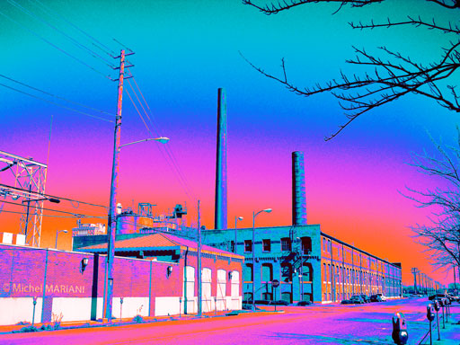 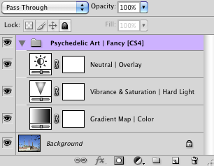

```json
[
    {
        "adjustmentLayer":
        {
            "name": "Gradient Map | Color",
            "mode": "color",
            "type":
            {
                "gradientMapClass":
                {
                    "gradient":
                    {
                        "name": "Fancy",
                        "gradientForm": "customStops",
                        "interpolation": 4096,
                        "colors":
                        [
                            {
                                "color":
                                {
                                    "red": 183,
                                    "green": 21,
                                    "blue": 27
                                },
                                "type": "userStop",
                                "location": 0,
                                "midpoint": 50
                            },
                            {
                                "color":
                                {
                                    "red": 230,
                                    "green": 65,
                                    "blue": 75
                                },
                                "type": "userStop",
                                "location": 606,
                                "midpoint": 50
                            },
                            {
                                "color":
                                {
                                    "red": 233,
                                    "green": 137,
                                    "blue": 123
                                },
                                "type": "userStop",
                                "location": 1229,
                                "midpoint": 50
                            },
                            {
                                "color":
                                {
                                    "red": 124,
                                    "green": 120,
                                    "blue": 184
                                },
                                "type": "userStop",
                                "location": 1925,
                                "midpoint": 50
                            },
                            {
                                "color":
                                {
                                    "red": 0,
                                    "green": 176,
                                    "blue": 176
                                },
                                "type": "userStop",
                                "location": 2621,
                                "midpoint": 50
                            },
                            {
                                "color":
                                {
                                    "red": 123,
                                    "green": 118,
                                    "blue": 182
                                },
                                "type": "userStop",
                                "location": 3236,
                                "midpoint": 50
                            }
                        ]
                    },
                    "dither": true,
                    "reverse": true
                }
            }
        }
    },
    {
        "adjustmentLayer":
        {
            "name": "Vibrance & Saturation | Hard Light",
            "mode": "hardLight",
            "type":
            {
                "vibrance":
                {
                    "vibrance": 100,
                    "saturation": 50
                }
            }
        }
    },
    {
        "adjustmentLayer":
        {
            "name": "Neutral | Overlay",
            "opacity": 50,
            "mode": "overlay",
            "type":
            {
                "brightnessContrast":
                {
                    "brightness": 0,
                    "contrast": 0
                }
            }
        }
    }
]
```

### Redscale Film | Redscale (Strong)

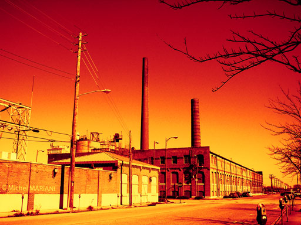 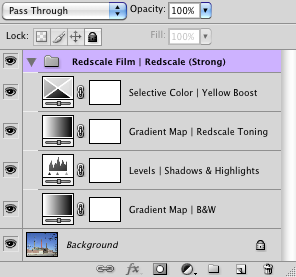


```json
[
    {
        "adjustmentLayer":
        {
            "name": "Gradient Map | B&W",
            "type":
            {
                "gradientMapClass":
                {
                    "gradient":
                    {
                        "gradientForm": "customStops",
                        "interpolation": 4096,
                        "colors":
                        [
                            {
                                "location": 0,
                                "midpoint": 50,
                                "type": "userStop",
                                "color":
                                {
                                    "hue": 0,
                                    "saturation": 0,
                                    "brightness": 0
                                }
                            },
                            {
                                "location": 4096,
                                "midpoint": 50,
                                "type": "userStop",
                                "color":
                                {
                                    "hue": 0,
                                    "saturation": 0,
                                    "brightness": 100
                                }
                            }
                        ]
                    },
                    "dither": true
                }
            }
        }
    },
    {
        "adjustmentLayer":
        {
            "name": "Levels | Shadows & Highlights",
            "type":
            {
                "levels":
                {
                    "adjustment":
                    [
                        {
                            "channel": "composite",
                            "output":
                            [
                                0,
                                215
                            ]
                        }
                    ]
                }
            }
        }
    },
    {
        "adjustmentLayer":
        {
            "name": "Gradient Map | Redscale Toning",
            "mode": "overlay",
            "opacity": 100,
            "type":
            {
                "gradientMapClass":
                {
                    "gradient":
                    {
                        "name": "Redscale 2",
                        "gradientForm": "customStops",
                        "interpolation": 4096,
                        "colors":
                        [
                            {
                                "location": 0,
                                "midpoint": 50,
                                "type": "userStop",
                                "color":
                                {
                                    "hue": 350,
                                    "saturation": 0,
                                    "brightness": 0
                                }
                            },
                            {
                                "location": 1352,
                                "midpoint": 50,
                                "type": "userStop",
                                "color":
                                {
                                    "hue": 350,
                                    "saturation": 100,
                                    "brightness": 100
                                }
                            },
                            {
                                "location": 4096,
                                "midpoint": 33,
                                "type": "userStop",
                                "color":
                                {
                                    "hue": 60,
                                    "saturation": 100,
                                    "brightness": 100
                                }
                            }
                        ]
                    },
                    "dither": true
                }
            }
        }
    },
    {
        "adjustmentLayer":
        {
            "name": "Selective Color | Yellow Boost",
            "type":
            {
                "selectiveColor":
                {
                    "method": "absolute",
                    "colorCorrection":
                    [
                        {
                            "colors": "yellows",
                            "cyan": -100,
                            "magenta": -15,
                            "yellowColor": 100,
                            "black": -10
                        }
                    ]
                }
            }
        }
    }
]
```

### Sepia Toning | Milk Chocolate

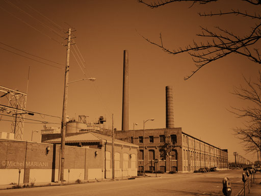 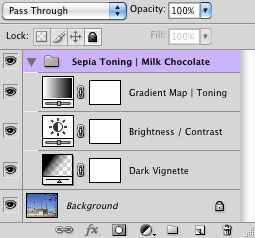

```json
[
    {
        "contentLayer":
        {
            "name": "Dark Vignette",
            "mode": "overlay",
            "opacity": 25,
            "type":
            {
                "gradientLayer":
                {
                    "type": "radial",
                    "angle": 90,
                    "scale": 125,
                    "reverse": true,
                    "dither": true,
                    "gradient":
                    {
                        "name": "Vignette",
                        "gradientForm": "customStops",
                        "interpolation": 4096,
                        "colors":
                        [
                            {
                                "location": 0,
                                "midpoint": 50,
                                "type": "userStop",
                                "color":
                                {
                                    "red": 0,
                                    "green": 0,
                                    "blue": 0
                                }
                            },
                            {
                                "location": 4096,
                                "midpoint": 50,
                                "type": "userStop",
                                "color":
                                {
                                    "red": 252,
                                    "green": 252,
                                    "blue": 252
                                }
                            }
                        ],
                        "transparency":
                        [
                            {
                                "location": 0,
                                "midpoint": 50,
                                "opacity": 100
                            },
                            {
                                "location": 4096,
                                "midpoint": 50,
                                "opacity": 0
                            }
                        ]
                    }
                }
            }
        }
    },
    {
        "adjustmentLayer":
        {
            "name": "Brightness / Contrast",
            "type":
            {
                "brightnessContrast":
                {
                    "brightness": 33,
                    "contrast": 25,
                    "useLegacy": false
                }
            }
        }
    },
    {
        "adjustmentLayer":
        {
            "name": "Gradient Map | Toning",
            "type":
            {
                "gradientMapClass":
                {
                    "gradient":
                    {
                        "name": "Chocolate",
                        "gradientForm": "customStops",
                        "interpolation": 4096,
                        "colors":
                        [
                            {
                                "color":
                                {
                                    "hue": 0,
                                    "saturation": 0,
                                    "brightness": 0
                                },
                                "type": "userStop",
                                "location": 0,
                                "midpoint": 50
                            },
                            {
                                "color":
                                {
                                    "hue": 25,
                                    "saturation": 70,
                                    "brightness": 50
                                },
                                "type": "userStop",
                                "location": 2048,
                                "midpoint": 50
                            },
                            {
                                "color":
                                {
                                    "hue": 33,
                                    "saturation": 55,
                                    "brightness": 85
                                },
                                "type": "userStop",
                                "location": 4096,
                                "midpoint": 50
                            }
                        ]
                    },
                    "dither": true
                }
            }
        }
    }
]
```

### Split Toning | Darken/Lighten

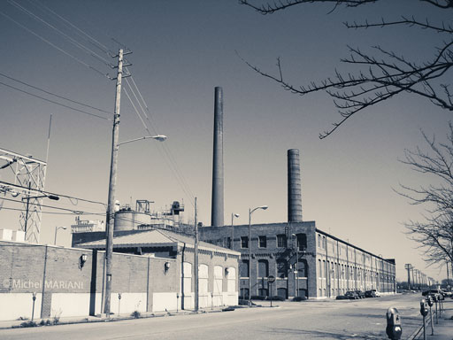 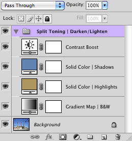

```json
[
    {
        "adjustmentLayer":
        {
            "name": "Gradient Map | B&W",
            "type":
            {
                "gradientMapClass":
                {
                    "gradient":
                    {
                        "gradientForm": "customStops",
                        "interpolation": 4096,
                        "colors":
                        [
                            {
                                "location": 0,
                                "midpoint": 50,
                                "type": "userStop",
                                "color":
                                {
                                    "hue": 0,
                                    "saturation": 0,
                                    "brightness": 0
                                }
                            },
                            {
                                "location": 4096,
                                "midpoint": 50,
                                "type": "userStop",
                                "color":
                                {
                                    "hue": 0,
                                    "saturation": 0,
                                    "brightness": 100
                                }
                            }
                        ]
                    },
                    "dither": true
                }
            }
        }
    },
    {
        "contentLayer":
        {
            "name": "Solid Color | Highlights",
            "mode": "darken",
            "opacity": 25,
            "type":
            {
                "solidColorLayer":
                {
                    "color":
                    {
                        "hue": 40,
                        "saturation": 50,
                        "brightness": 70
                    }
                }
            }
        }
    },
    {
        "contentLayer":
        {
            "name": "Solid Color | Shadows",
            "mode": "lighten",
            "opacity": 25,
            "type":
            {
                "solidColorLayer":
                {
                    "color":
                    {
                        "hue": 210,
                        "saturation": 50,
                        "brightness": 70
                    }
                }
            }
        }
    },
    {
        "adjustmentLayer":
        {
            "name": "Contrast Boost",
            "type":
            {
                "brightnessContrast":
                {
                    "brightness": 0,
                    "contrast": 100,
                    "useLegacy": false
                }
            }
        }
    }
]
```

## Requirements

This script can be used in Adobe Photoshop CS3 or later. It has been successfully tested in CS4 on Mac OS X, but should be platform agnostic.

## Copyright

This Software is copyright © 2013-2015 by Michel MARIANI.

## License

This Software is licensed under the [GNU General Public License (GPL) v3](https://www.gnu.org/licenses/gpl.html).

## Download

[Download Zip File](/Downloads/Adjustment-Fill-Gallery-2.3.zip)

## Installation

Download the Zip file and unzip it.

Move the entire script *FOLDER* (`Adjustment & Fill Gallery Folder`) with its contents into the `Presets/Scripts` folder in the default preset location of the Adobe Photoshop application. On next launch, the script will appear in the File>Automate submenu.
