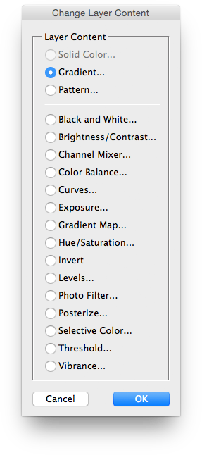

# Change Layer Content

## Description

“Change Layer Content” is a special effects script using the [JSON Action Manager](/JSON-Action-Manager) scripting library.

This stand-alone script written in JavaScript lets you change the content of the currently selected layer (fill layer or adjustment layer), preserving any associated masks and styles.

It is somehow a replacement for a similar feature which used to be available in Photoshop’s Layer menu; unfortunately, it got dropped from version CS4…

It is especially useful for editing images created with the script [Poster Effect Gallery](/Creative-Scripts/Poster-Effect-Gallery).

**Warning**: unfortunately, changing the content of a fill layer may be impossible in most recent versions of Photoshop (CC).

## Requirements

This script can be used in Adobe Photoshop CS or later. It has been successfully tested in CS and CS4 on Mac OS X, but should be platform agnostic.

## Copyright

This Software is copyright © 2016 by Michel MARIANI.

## License

This Software is licensed under the [GNU General Public License (GPL) v3](https://www.gnu.org/licenses/gpl.html).

## Download

[Download Zip File](/Downloads/Change-Layer-Content-1.0.zip)

## Installation

Download the Zip file and unzip it.

Move the script to the `Presets/Scripts` folder in the default preset location of the Adobe Photoshop application. On next launch, the script will get directly accessible from Photoshop’s File menu: in Photoshop CS or CS2, it will appear in the File>Scripts submenu, among all other scripts sorted by lexical order; from Photoshop CS3, it will appear grouped by category in the File>Automate submenu.
