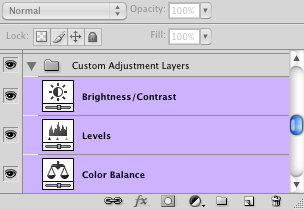
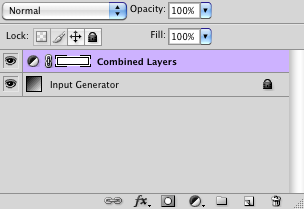
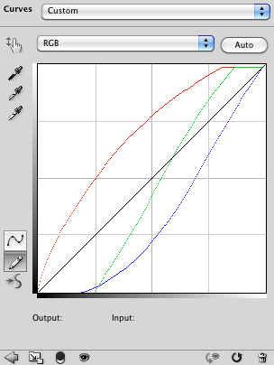

# Combine Adjustment Layers

## Description

“Combine Adjustment Layers” is a color ramps script using the [JSON Action Manager](/JSON-Action-Manager) scripting library.

This stand-alone script written in JavaScript is used to combine the effect of cumulated adjustment layers into a single curves adjustment layer.

It creates a new basic document containing a curves adjustment layer computed from the selected layers of an already opened RGB layered document, and displays it as a gradient map.

This script is inspired by the method detailed by Greg Apodaca in: [008 Combining Adjustment Layers](http://www.gregapodaca.com/photoshopmechanics/files/008.html), part of the video tutorials available on [Photoshop Mechanics](http://www.gregapodaca.com/photoshopmechanics/). 

**Note**: to get accurate and meaningful results, you have to make sure that the adjustment layers you are combining do not mix any channel information (i.e., they affect only one channel at a time); the following types of adjustment layers should keep you on the safe side (but do feel free to experiment with other ones too, such as Gradient Map or even Solid Color!):

- Brightness/Contrast
- Color Balance (without Preserve Luminosity)
- Curves
- Exposure
- Invert
- Levels

## Example

## Requirements

This script can be used in Adobe Photoshop CS or later. It has been successfully tested in CS and CS4 on Mac OS X, but should be platform agnostic.

## Copyright

This Software is copyright © 2014-2015 by Michel MARIANI.

## License

This Software is licensed under the [GNU General Public License (GPL) v3](https://www.gnu.org/licenses/gpl.html).

## Download

[Download Zip File](/Downloads/Combine-Adjustment-Layers-1.6.zip)

## Installation

Download the Zip file and unzip it.

Move the script to the `Presets/Scripts` folder in the default preset location of the Adobe Photoshop application. On next launch, the script will get directly accessible from Photoshop’s File menu: in Photoshop CS or CS2, it will appear in the File>Scripts submenu, among all other scripts sorted by lexical order; from Photoshop CS3, it will appear grouped by category in the File>Automate submenu.
