# Examples of Color Ramp Formulas

## Description

[Create Color Ramp](/Creative-Scripts/Create-Color-Ramp) is a stand-alone script written in JavaScript used to create a 256-color ramp programmatically.

The script makes use of formulas which are saved as plain JSON text files containing all the necessary information.

These files can later be used by clicking on the button labeled “Load Formula…” in the script’s main dialog window.

The examples of formulas listed down below cover many ways of creating color ramps, through the use of various helper functions, for instance.

Formulas fall into two distinct categories:

- **Components formulas**
- **Indexed colors formulas**

## Components formulas

### Chlorophyll

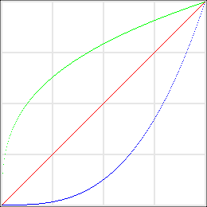


```json
{
    "colorRampFormula":
    {
        "name": "Chlorophyll",
        "colorModel": "RGB",
        "components":
        [
            "x",
            "pow (x, 1/3)",
            "pow (x, 3)"
        ],
        "floatRange": true
    }
}
```

### Cocorico

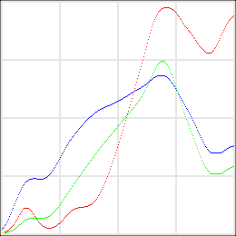


```json
{
    "colorRampFormula":
    {
        "name": "Cocorico",
        "colorModel": "RGB",
        "components":
        [
            "[ 1, 1, 1, 2, 2, 3, 3, 4, 5, 6, 7, 8, 9, 10, 12, 14, 15, 17, 19, 21, 22, 24, 25, 27, 28, 28, 28, 28, 28, 28, 27, 26, 25, 24, 22, 21, 19, 18, 16, 15, 13, 12, 11, 10, 9, 8, 8, 7, 7, 6, 6, 6, 6, 6, 6, 7, 7, 7, 8, 8, 9, 10, 11, 11, 12, 13, 14, 15, 17, 18, 19, 20, 21, 22, 23, 24, 25, 26, 26, 27, 27, 28, 28, 28, 29, 29, 29, 29, 29, 29, 29, 30, 30, 30, 30, 31, 31, 32, 32, 33, 34, 35, 36, 37, 38, 40, 42, 43, 45, 47, 49, 51, 53, 56, 58, 61, 63, 66, 68, 71, 74, 77, 80, 83, 86, 89, 92, 95, 98, 101, 105, 108, 111, 114, 118, 121, 125, 128, 132, 135, 139, 142, 146, 149, 153, 156, 160, 164, 167, 171, 174, 178, 181, 184, 188, 191, 195, 199, 203, 206, 210, 214, 217, 221, 224, 228, 231, 234, 236, 238, 240, 242, 244, 245, 246, 247, 248, 248, 249, 249, 249, 249, 249, 249, 249, 248, 248, 247, 247, 246, 245, 244, 243, 241, 240, 239, 237, 236, 234, 232, 231, 229, 228, 227, 226, 224, 223, 222, 221, 219, 218, 216, 215, 213, 212, 210, 209, 207, 206, 205, 204, 203, 202, 201, 200, 199, 199, 199, 199, 199, 199, 200, 201, 202, 204, 205, 207, 209, 211, 213, 215, 218, 220, 222, 224, 226, 228, 230, 232, 233, 235, 236, 237, 238, 239, 240 ][round (x)]",
            "[ 1, 1, 1, 1, 1, 1, 2, 2, 2, 3, 3, 3, 4, 5, 5, 6, 7, 8, 9, 10, 10, 11, 12, 13, 14, 15, 15, 16, 16, 16, 17, 17, 17, 17, 17, 17, 17, 17, 17, 17, 17, 17, 17, 17, 17, 17, 17, 17, 18, 18, 18, 19, 19, 20, 21, 22, 23, 24, 25, 26, 27, 28, 29, 31, 32, 34, 35, 37, 38, 40, 41, 43, 44, 46, 47, 49, 50, 52, 53, 55, 56, 57, 59, 60, 62, 63, 64, 66, 67, 69, 70, 71, 73, 74, 76, 77, 78, 80, 81, 83, 84, 85, 87, 88, 89, 91, 92, 93, 95, 96, 97, 98, 100, 101, 102, 103, 104, 106, 107, 108, 109, 110, 112, 113, 114, 115, 116, 118, 119, 120, 121, 123, 124, 125, 126, 127, 129, 130, 131, 132, 133, 134, 136, 137, 138, 139, 141, 142, 143, 144, 146, 147, 148, 150, 151, 153, 155, 157, 159, 161, 163, 165, 167, 170, 172, 174, 176, 178, 180, 182, 184, 186, 187, 188, 189, 190, 190, 190, 190, 189, 188, 187, 186, 184, 182, 180, 177, 175, 172, 169, 166, 163, 160, 157, 153, 150, 147, 144, 141, 137, 134, 132, 129, 126, 124, 121, 119, 116, 113, 110, 108, 105, 102, 99, 97, 94, 91, 89, 86, 84, 81, 79, 77, 75, 73, 72, 70, 69, 68, 67, 66, 66, 66, 66, 66, 66, 66, 66, 66, 66, 66, 66, 67, 67, 68, 69, 69, 70, 71, 71, 72, 72, 73, 73, 74, 74 ][round (x)]",
            "[ 5, 6, 7, 9, 10, 12, 14, 16, 19, 21, 23, 26, 28, 31, 33, 36, 38, 40, 43, 45, 47, 49, 51, 53, 54, 56, 57, 58, 58, 59, 60, 60, 60, 60, 61, 61, 61, 61, 60, 60, 60, 60, 60, 60, 60, 60, 61, 61, 62, 62, 63, 64, 65, 66, 67, 69, 70, 72, 73, 75, 77, 78, 80, 82, 84, 86, 88, 89, 91, 93, 95, 97, 98, 100, 102, 103, 104, 106, 107, 108, 110, 111, 112, 113, 115, 116, 117, 118, 119, 120, 122, 123, 124, 125, 126, 127, 128, 129, 129, 130, 131, 132, 133, 134, 134, 135, 136, 136, 137, 137, 138, 138, 139, 139, 140, 140, 141, 141, 141, 142, 142, 143, 143, 144, 144, 145, 145, 146, 146, 147, 147, 148, 148, 149, 150, 150, 151, 151, 152, 153, 153, 154, 155, 155, 156, 156, 157, 158, 158, 159, 159, 160, 160, 161, 162, 162, 163, 164, 164, 165, 166, 167, 168, 169, 169, 170, 171, 172, 172, 173, 173, 174, 174, 174, 174, 174, 174, 174, 174, 174, 173, 173, 172, 171, 170, 169, 167, 166, 165, 163, 162, 160, 158, 157, 155, 153, 151, 149, 147, 146, 144, 142, 140, 138, 137, 135, 133, 131, 129, 127, 125, 123, 121, 119, 117, 114, 112, 110, 108, 106, 104, 102, 100, 98, 96, 95, 93, 92, 91, 90, 89, 89, 89, 89, 89, 89, 89, 89, 89, 89, 89, 89, 90, 90, 91, 92, 92, 93, 94, 94, 95, 95, 96, 96, 96, 97 ][round (x)]"
        ],
        "floatRange": false
    }
}
```

### Color Bar

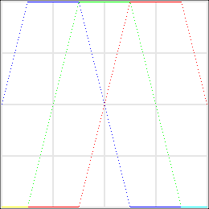

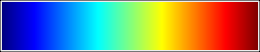

```json
{
    "colorRampFormula":
    {
        "name": "Color Bar",
        "colorModel": "RGB",
        "components":
        [
            "interpolate ([ [ 1/2, 1/2 ], [ 3/4, 3/2 ], [ 1, 1/2 ] ], x)",
            "interpolate ([ [ 1/4, 1/2 ], [ 1/2, 3/2 ], [ 3/4, 1/2 ] ], x)",
            "interpolate ([ [ 0, 1/2 ], [ 1/4, 3/2 ], [ 1/2, 1/2 ] ], x)"
        ],
        "floatRange": true
    }
}
```

### Dark Blue to Light Cyan


```json
{
    "colorRampFormula":
    {
        "name": "Dark Blue to Light Cyan",
        "colorModel": "RGB",
        "components":
        [
            "1 - sin ((1 - x) * PI / 2)",
            "(1 - cos (x * PI)) / 2",
            "sin (x * PI / 2)"
        ],
        "floatRange": true
    }
}
```

### Dark Magenta to Light Red

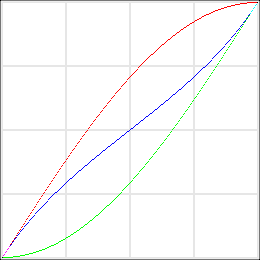


```json
{
    "colorRampFormula":
    {
        "name": "Dark Magenta to Light Red",
        "colorModel": "RGB",
        "components":
        [
            "sin (x * PI / 2)",
            "1 - sin ((1 - x) * PI / 2)",
            "((tan ((x - 0.5) * PI / 2)) / 2) + 0.5"
        ],
        "floatRange": true
    }
}
```

### Dark Red to Light Cyan

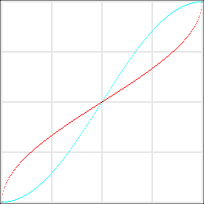


```json
{
    "colorRampFormula":
    {
        "name": "Dark Red to Light Cyan",
        "colorModel": "RGB",
        "components":
        [
            "acos (1 - (2 * x)) / PI",
            "(1 - cos (x * PI)) / 2",
            "(1 - cos (x * PI)) / 2"
        ],
        "floatRange": true
    }
}
```

### Dark Red to Light Yellow (HSL)

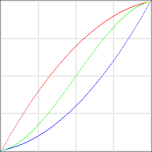


```json
{
    "colorRampFormula":
    {
        "name": "Dark Red to Light Yellow (HSL)",
        "colorModel": "HSL",
        "components":
        [
            "lerp (0/6, 1/6, x)",
            "(x < 0.5 ? 1 - x : x) * 0.8",
            "x"
        ],
        "floatRange": true
    }
}
```

### Dark Yellow to Light Green (HSL)

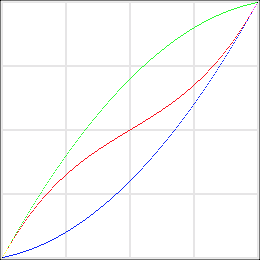


```json
{
    "colorRampFormula":
    {
        "name": "Dark Yellow to Light Green (HSL)",
        "colorModel": "HSL",
        "components":
        [
            "lerp (1/6, 2/6, x)",
            "(x < 0.5 ? 1 - x : x) * 0.8",
            "x"
        ],
        "floatRange": true
    }
}
```

### Deep Pink to Spring Green

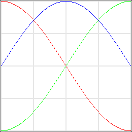


```json
{
    "colorRampFormula":
    {
        "name": "Deep Pink to Spring Green",
        "colorModel": "RGB",
        "components":
        [
            "pow (cos ((x - 0) * PI / 2), 2)",
            "pow (cos ((x - 1) * PI / 2), 2)",
            "pow (cos ((x - 1/2) * PI / 2), 2)"
        ],
        "floatRange": true
    }
}
```

### Diverging

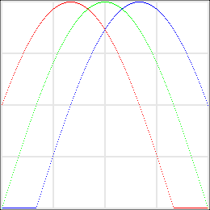


```json
{
    "colorRampFormula":
    {
        "name": "Diverging",
        "colorModel": "RGB",
        "components":
        [
            "cos ((x - 2/6) * PI)",
            "cos ((x - 3/6) * PI)",
            "cos ((x - 4/6) * PI)"
        ],
        "floatRange": true
    }
}
```

### Duotone

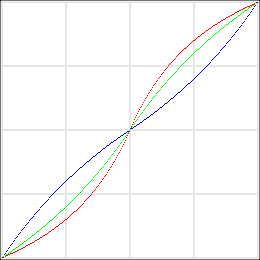


```json
{
    "colorRampFormula":
    {
        "name": "Duotone",
        "colorModel": "RGB",
        "components":
        [
            "gain (x, 0.3)",
            "gain (x, 0.4)",
            "gain (x, 0.6)"
        ],
        "floatRange": true
    }
}
```

### Exotic Bird (XYZ)

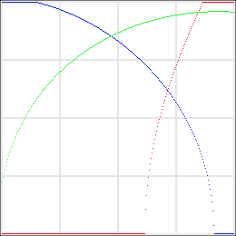


```json
{
    "colorRampFormula":
    {
        "name": "Exotic Bird (XYZ)",
        "colorModel": "XYZ",
        "components":
        [
            "pow (x, 2)",
            "x",
            "cos (x * PI / 2)"
        ],
        "floatRange": true
    }
}
```

### Fairy Dust

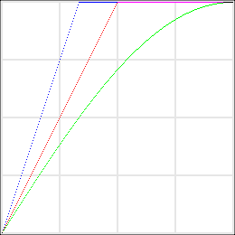


```json
{
    "colorRampFormula":
    {
        "name": "Fairy Dust",
        "colorModel": "RGB",
        "components":
        [
            "2 * x",
            "sin (x * PI / 2)",
            "3 * x"
        ],
        "floatRange": true
    }
}
```

### Fancy

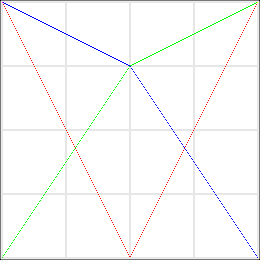


```json
{
    "colorRampFormula":
    {
        "name": "Fancy",
        "colorModel": "RGB",
        "components":
        [
            "(x < 127.5) ? 255 - (2 * x) : (2 * x) - 255",
            "(x < 127.5) ? 1.5 * x : 127.5 + (0.5 * x)",
            "(x < 127.5) ? 127.5 + (0.5 * (255 - x)) : 1.5 * (255 - x)"
        ],
        "floatRange": false
    }
}
```

### Fantasy (HCL)

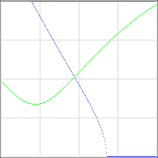


```json
{
    "colorRampFormula":
    {
        "name": "Fantasy (HCL)",
        "colorModel": "HCL",
        "components":
        [
            "-20 + (x / 255) * 110",
            "128",
            "100"
        ],
        "floatRange": false
    }
}
```

### Forty-Two

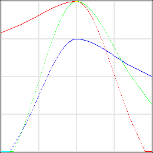


```json
{
    "colorRampFormula":
    {
        "name": "Forty-Two",
        "colorModel": "RGB",
        "components":
        [
            "distribute ([ 215, 255, 44 ], [ 31, 255 - 31 ], x, 100)",
            "distribute ([ 25, 255, 123 ], [ 31, 255 - 31 ], x, 100)",
            "distribute ([ 28, 191, 143 ], [ 31, 255 - 31 ], x, 100)"
        ],
        "floatRange": false
    }
}
```

### Frozen

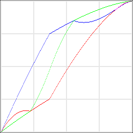


```json
{
    "colorRampFormula":
    {
        "name": "Frozen",
        "colorModel": "HSL",
        "components":
        [
            "7/9 - x/2",
            "1/2",
            "1 - pow (1 - x, 3/2)"
        ],
        "floatRange": true
    }
}
```

### Iron (Cubics)

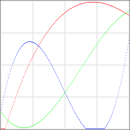


```json
{
    "colorRampFormula":
    {
        "name": "Iron (Cubics)",
        "colorModel": "RGB",
        "components":
        [
            "linear ([ 1.1, 0.57 ], cubic ([ 1, 0, -1, 0 ], linear ([ 0.9, -1.225 ], x)))",
            "linear ([ 1.204, 0.471 ], cubic ([ -1, 0, 1, 0 ], linear ([ 1.292, -0.806 ], x)))",
            "linear ([ 0.943, 0.32 ], cubic ([ 1, 0, -1, 0 ], linear ([ 2.24, -1.081 ], x)))"
        ],
        "floatRange": true
    }
}
```

### Iron (YCbCr)

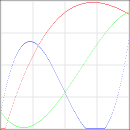


```json
{
    "colorRampFormula":
    {
        "name": "Iron (YCbCr)",
        "colorModel": "YCbCr",
        "components":
        [
            "lerp (0.059, 0.886, x)",
            "cubic ([ 5.99477, -8.68926, 2.53768, 0.550188 ], x)",
            "cubic ([ 0.683558, -2.49828, 1.94276, 0.383144 ], x)"
        ],
        "floatRange": true
    }
}
```

### Linear Grayscale

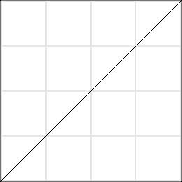


```json
{
    "colorRampFormula":
    {
        "name": "Linear Grayscale",
        "colorModel": "RGB",
        "components":
        [
            "x",
            "x",
            "x"
        ],
        "floatRange": false
    }
}
```

### Mystical Light (HCL)

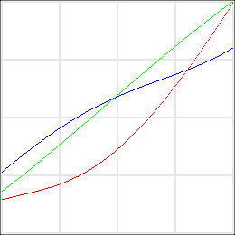


```json
{
    "colorRampFormula":
    {
        "name": "Mystical Light (HCL)",
        "colorModel": "HCL",
        "components":
        [
            "lerp (280, 110, x / 255)",
            "lerp (15, 26, x / 255)",
            "lerp (19, 99, x / 255)"
        ],
        "floatRange": false
    }
}
```

### Natural Splines

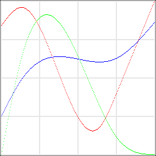


```json
{
    "colorRampFormula":
    {
        "name": "Natural Splines",
        "colorModel": "RGB",
        "components":
        [
            "spline ([ [ 0, 215 ], [ 35, 245 ], [ 162, 44 ], [ 191, 100 ] ], x)",
            "spline ([ [ 0, 0 ], [ 35, 167 ], [ 132, 154 ], [ 191, 30 ], [ 255, 0 ] ], x)",
            "spline ([ [ 0, 64 ], [ 35, 127 ], [ 191, 160 ], [ 255, 220 ] ], x)"
        ],
        "floatRange": false
    }
}
```

### Natural Splines (8 Steps)

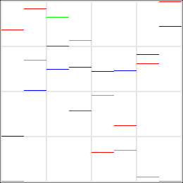


```json
{
    "colorRampFormula":
    {
        "name": "Natural Splines (8 Steps)",
        "colorModel": "RGB",
        "components":
        [
            "spline ([ [ 0, 215 ], [ 35, 245 ], [ 162, 44 ], [ 191, 100 ] ], x)",
            "spline ([ [ 0, 0 ], [ 35, 167 ], [ 132, 154 ], [ 191, 30 ], [ 255, 0 ] ], x)",
            "spline ([ [ 0, 64 ], [ 35, 127 ], [ 191, 160 ], [ 255, 220 ] ], x)"
        ],
        "floatRange": false,
        "steps": 8,
        "alignment": "fill"
    }
}
```

### Orange to Azure

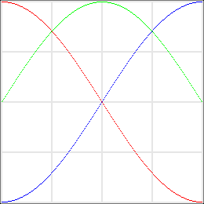


```json
{
    "colorRampFormula":
    {
        "name": "Orange to Azure",
        "colorModel": "RGB",
        "components":
        [
            "pow (cos ((x - 0) * PI / 2), 2)",
            "pow (cos ((x - 1/2) * PI / 2), 2)",
            "pow (cos ((x - 1) * PI / 2), 2)"
        ],
        "floatRange": true
    }
}
```

### Pastel Colors (Half Parabola)

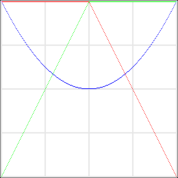


```json
{
    "colorRampFormula":
    {
        "name": "Pastel Colors (Half Parabola)",
        "colorModel": "RGB",
        "components":
        [
            "2 * (1 - x)",
            "2 * x",
            "(2 * x * x) - (2 * x) + 1"
        ],
        "floatRange": true
    }
}
```

### Peach (HCL)

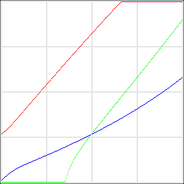


```json
{
    "colorRampFormula":
    {
        "name": "Peach (HCL)",
        "colorModel": "HCL",
        "components":
        [
            "(x / 255) * 60",
            "64",
            "(x / 255) * 100"
        ],
        "floatRange": false
    }
}
```

### Pistachio

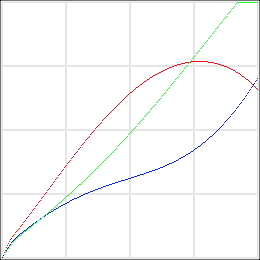


```json
{
    "colorRampFormula":
    {
        "name": "Pistachio",
        "colorModel": "HCL",
        "components":
        [
            "x/2.5",
            "x/2",
            "bias (x, 0.55)"
        ],
        "floatRange": true
    }
}
```

### Primary Colors (Darker)

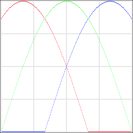


```json
{
    "colorRampFormula":
    {
        "name": "Primary Colors (Darker)",
        "colorModel": "RGB",
        "components":
        [
            "cos ((x - 1/6) * PI)",
            "cos ((x - 3/6) * PI)",
            "cos ((x - 5/6) * PI)"
        ],
        "floatRange": true
    }
}
```

### Primary Colors (Lighter)

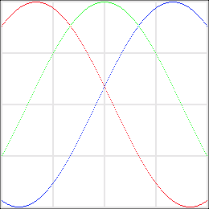


```json
{
    "colorRampFormula":
    {
        "name": "Primary Colors (Lighter)",
        "colorModel": "RGB",
        "components":
        [
            "pow (cos ((x - 1/6) * PI / 1.5), 2)",
            "pow (cos ((x - 3/6) * PI / 1.5), 2)",
            "pow (cos ((x - 5/6) * PI / 1.5), 2)"
        ],
        "floatRange": true
    }
}
```

### Primary Colors (Sunny)

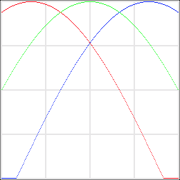


```json
{
    "colorRampFormula":
    {
        "name": "Primary Colors (Sunny)",
        "colorModel": "RGB",
        "components":
        [
            "cos ((x - 1/6) * PI / 1.5)",
            "cos ((x - 3/6) * PI / 1.5)",
            "cos ((x - 5/6) * PI / 1.5)"
        ],
        "floatRange": true
    }
}
```

### Pseudo Thermic

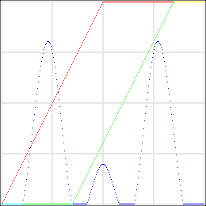


```json
{
    "colorRampFormula":
    {
        "name": "Pseudo Thermic",
        "colorModel": "RGB",
        "components":
        [
            "x * 2",
            "(x - 89) * 2",
            "spline ([ [ 0, 0 ], [ 26, 0 ], [ 60, 204 ], [ 88, 0 ], [ 127.5 - 20, 0 ], [ 127.5, 50 ], [ 127.5 + 20, 0 ], [ 255 - 88, 0 ], [ 255 - 60, 204 ], [ 255 - 26, 0 ], [ 255, 0 ] ], x)"
        ],
        "floatRange": false
    }
}
```
### Quantum Leap

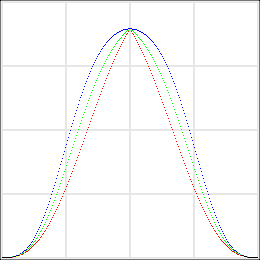


```json
{
    "colorRampFormula":
    {
        "name": "Quantum Leap",
        "colorModel": "RGB",
        "components":
        [
            "smootherstep (0, 1, interpolate ([ [ 0, 0 ], [ 0.5, 0.75 ], [ 1, 0 ] ], x, 0))",
            "smootherstep (0, 1, interpolate ([ [ 0, 0 ], [ 0.5, 0.75 ], [ 1, 0 ] ], x, 50))",
            "smootherstep (0, 1, interpolate ([ [ 0, 0 ], [ 0.5, 0.75 ], [ 1, 0 ] ], x, 100))"
        ],
        "floatRange": true
    }
}
```

### Rainbow

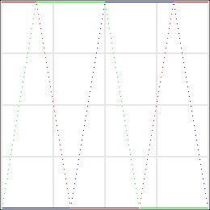

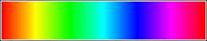

```json
{
    "colorRampFormula":
    {
        "name": "Rainbow",
        "colorModel": "HSB",
        "components":
        [
            "x",
            "1",
            "1"
        ],
        "floatRange": true
    }
}
```

### Red to Green (HSL)

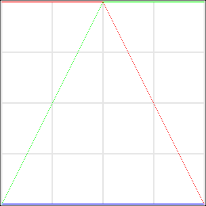


```json
{
    "colorRampFormula":
    {
        "name": "Red to Green (HSL)",
        "colorModel": "HSL",
        "components":
        [
            "(x / 255) * 120",
            "100",
            "50"
        ],
        "floatRange": false
    }
}
```

### Sinebow


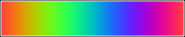

```json
{
    "colorRampFormula":
    {
        "name": "Sinebow",
        "colorModel": "RGB",
        "components":
        [
            "pow (cos ((x - 0) * PI), 2)",
            "pow (cos ((x - 1/3) * PI), 2)",
            "pow (cos ((x - 2/3) * PI), 2)"
        ],
        "floatRange": true
    }
}
```

### Sinebow 4 Cycles

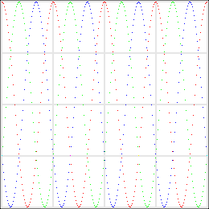

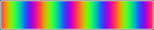

```json
{
    "colorRampFormula":
    {
        "name": "Sinebow 4 Cycles",
        "colorModel": "RGB",
        "components":
        [
            "pow (cos (((x * 4) - 0) * PI), 2)",
            "pow (cos (((x * 4) - 1/3) * PI), 2)",
            "pow (cos (((x * 4) - 2/3) * PI), 2)"
        ],
        "floatRange": true
    }
}
```

### Smoothie

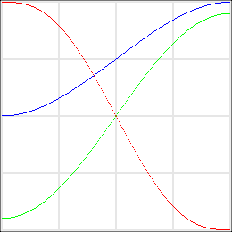


```json
{
    "colorRampFormula":
    {
        "name": "Smoothie",
        "colorModel": "RGB",
        "components":
        [
            "smootherstep (1, 0, x)",
            "coserp (0.05, 0.95, x)",
            "smoothstep (0.5, 1, x)"
        ],
        "floatRange": true
    }
}
```

### Swimming Pool

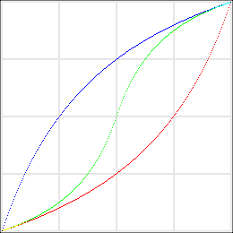


```json
{
    "colorRampFormula":
    {
        "name": "Swimming Pool",
        "colorModel": "RGB",
        "components":
        [
            "bias (x, 0.25)",
            "gain (x, 0.25)",
            "bias (x, 0.75)"
        ],
        "floatRange": true
    }
}
```

### Tutti Frutti (Lab)

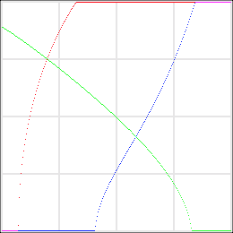


```json
{
    "colorRampFormula":
    {
        "name": "Tutti Frutti (Lab)",
        "colorModel": "Lab",
        "components":
        [
            "0.75",
            "bias (x, 0.75)",
            "1 - bias (x, 1 - 0.75)"
        ],
        "floatRange": true
    }
}
```

### Two-Sided Color Bar


```json
{
    "colorRampFormula":
    {
        "name": "Two-Sided Color Bar",
        "colorModel": "HSB",
        "components":
        [
            "x < 0.5 ? 2/3 - (x * 1/3) : 1/6 - ((x - 0.5) * 1/3)",
            "1",
            "1"
        ],
        "floatRange": true
    }
}
```

### Violet to Chartreuse

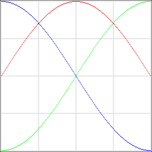


```json
{
    "colorRampFormula":
    {
        "name": "Violet to Chartreuse",
        "colorModel": "RGB",
        "components":
        [
            "pow (cos ((x - 1/2) * PI / 2), 2)",
            "pow (cos ((x - 1) * PI / 2), 2)",
            "pow (cos ((x - 0) * PI / 2), 2)"
        ],
        "floatRange": true
    }
}
```

### Visible Wavelengths

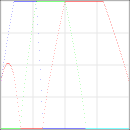


```json
{
    "colorRampFormula":
    {
        "name": "Visible Wavelengths",
        "colorModel": "RGB",
        "components":
        [
            "pow (interpolate ([ [ 380, 1.0 ], [ 440, 0.0 ], [ 490, 0.0 ], [ 510, 0.0 ], [ 580, 1.0 ], [ 645, 1.0 ], [ 780, 1.0 ] ], lerp (380, 780, x)) * interpolate ([ [ 380, 0.3 ], [ 420, 1.0 ], [ 700, 1.0 ], [ 780, 0.3 ] ], lerp (380, 780, x)), 0.8)",
            "pow (interpolate ([ [ 380, 0.0 ], [ 440, 0.0 ], [ 490, 1.0 ], [ 510, 1.0 ], [ 580, 1.0 ], [ 645, 0.0 ], [ 780, 0.0 ] ], lerp (380, 780, x)) * interpolate ([ [ 380, 0.3 ], [ 420, 1.0 ], [ 700, 1.0 ], [ 780, 0.3 ] ], lerp (380, 780, x)), 0.8)",
            "pow (interpolate ([ [ 380, 1.0 ], [ 440, 1.0 ], [ 490, 1.0 ], [ 510, 0.0 ], [ 580, 0.0 ], [ 645, 0.0 ], [ 780, 0.0 ] ], lerp (380, 780, x)) * interpolate ([ [ 380, 0.3 ], [ 420, 1.0 ], [ 700, 1.0 ], [ 780, 0.3 ] ], lerp (380, 780, x)), 0.8)"
        ],
        "floatRange": true
    }
}
```

### Yellow to Blue (HCL)

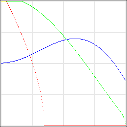


```json
{
    "colorRampFormula":
    {
        "name": "Yellow to Blue (HCL)",
        "colorModel": "HCL",
        "components":
        [
            "1/9 + 1/6 + (x / 2)",
            "0.5",
            "1 - pow (x, 1.5)"
        ],
        "floatRange": true
    }
}
```

## Indexed colors formulas

### Divergent (Discrete)

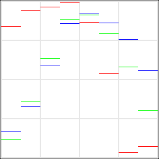


```json
{
    "colorRampFormula":
    {
        "name": "Divergent (Discrete)",
        "indexedColors": "distributeColors ([ \"#d61d2a\", \"#f05c53\", \"#f6a297\", \"#fde2db\", \"#dde9ec\", \"#89cbdc\", \"#0894c1\", \"#124d8e\" ], [ 0, 255 ], x, \"rgb\")",
        "steps": 8,
        "alignment": "fill"
    }
}
```

### Dracula

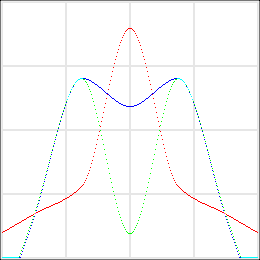


```json
{
    "colorRampFormula":
    {
        "name": "Dracula",
        "indexedColors": "distributeColors ([ \"#2B2926\", \"#47B3B3\", \"#E51897\", \"#47B3B3\", \"#2B2926\" ], [ 31, 255 - 31 ], x, \"rgb\", 100)"
    }
}
```

### Dracula (Shifted)

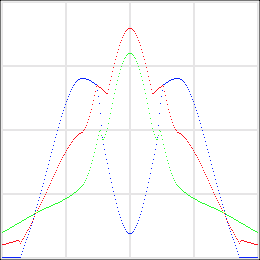


```json
{
    "colorRampFormula":
    {
        "name": "Dracula (Shifted)",
        "indexedColors": "shiftHue (distributeColors ([ \"#2B2926\", \"#47B3B3\", \"#E51897\", \"#47B3B3\", \"#2B2926\" ], [ 31, 255 - 31 ], x, \"rgb\", 100), 90)"
    }
}
```

### Dracula Fluo

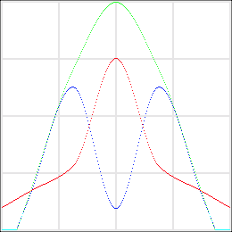


```json
{
    "colorRampFormula":
    {
        "name": "Dracula Fluo",
        "indexedColors": "distributeColors ([ \"#2B2926\", \"#47B3A0\", \"#C0FF18\", \"#47B3A0\", \"#2B2926\" ], [ 31, 255 - 31 ], x, \"rgb\", 100)"
    }
}
```

### Green Sequential (Smooth)

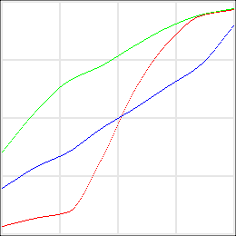


```json
{
    "colorRampFormula":
    {
        "name": "Green Sequential (Smooth)",
        "indexedColors": "distributeColors ([ \"#085a32\", \"#118649\", \"#18a85a\", \"#52b974\", \"#9ecf8a\", \"#d2e3a2\", \"#f0f1ba\", \"#f7f8e5\" ], [ 0, 255 ], x, \"rgb\", 100)"
    }
}
```

### Heightmap (HCL)

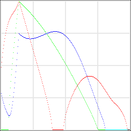


```json
{
    "colorRampFormula":
    {
        "name": "Heightmap (HCL)",
        "indexedColors": "interpolateColors ([ [ 15, \"#d7191c\" ], [ 35, \"#ffffbf\" ], [ 132, \"#2c7bb6\" ] ], x, \"hcl\")"
    }
}
```

### Iron (Color Table)


```json
{
    "colorRampFormula":
    {
        "name": "Iron (Color Table)",
        "indexedColors": "[ [ 0, 19, 42 ], [ 0, 19, 44 ], [ 0, 19, 49 ], [ 0, 20, 53 ], [ 0, 20, 58 ], [ 0, 21, 63 ], [ 0, 21, 68 ], [ 0, 21, 72 ], [ 0, 21, 77 ], [ 3, 20, 81 ], [ 6, 19, 85 ], [ 10, 19, 90 ], [ 13, 18, 94 ], [ 16, 17, 98 ], [ 19, 16, 101 ], [ 22, 15, 104 ], [ 25, 14, 108 ], [ 28, 13, 112 ], [ 31, 12, 115 ], [ 34, 12, 118 ], [ 37, 11, 122 ], [ 40, 10, 124 ], [ 43, 10, 127 ], [ 46, 9, 129 ], [ 49, 9, 133 ], [ 52, 8, 136 ], [ 56, 7, 138 ], [ 59, 7, 141 ], [ 61, 6, 143 ], [ 64, 6, 145 ], [ 67, 6, 147 ], [ 69, 5, 149 ], [ 72, 5, 151 ], [ 74, 4, 153 ], [ 77, 4, 154 ], [ 79, 3, 156 ], [ 82, 3, 158 ], [ 85, 2, 159 ], [ 88, 2, 161 ], [ 90, 2, 162 ], [ 93, 2, 163 ], [ 95, 2, 164 ], [ 97, 2, 165 ], [ 100, 2, 166 ], [ 102, 2, 167 ], [ 105, 2, 168 ], [ 107, 2, 169 ], [ 110, 2, 170 ], [ 112, 2, 171 ], [ 115, 2, 171 ], [ 118, 2, 172 ], [ 120, 2, 173 ], [ 122, 3, 173 ], [ 124, 3, 174 ], [ 126, 3, 174 ], [ 128, 4, 174 ], [ 130, 4, 174 ], [ 132, 4, 174 ], [ 134, 4, 174 ], [ 136, 5, 174 ], [ 139, 5, 174 ], [ 141, 5, 174 ], [ 143, 6, 173 ], [ 145, 6, 173 ], [ 146, 7, 173 ], [ 148, 7, 172 ], [ 150, 8, 172 ], [ 152, 8, 171 ], [ 154, 9, 171 ], [ 157, 9, 170 ], [ 159, 10, 169 ], [ 160, 11, 168 ], [ 162, 11, 167 ], [ 164, 12, 167 ], [ 166, 13, 166 ], [ 167, 14, 165 ], [ 169, 15, 164 ], [ 171, 15, 163 ], [ 172, 16, 162 ], [ 174, 17, 161 ], [ 176, 18, 160 ], [ 177, 19, 158 ], [ 179, 19, 157 ], [ 181, 20, 156 ], [ 183, 21, 155 ], [ 184, 22, 153 ], [ 186, 23, 152 ], [ 187, 24, 150 ], [ 188, 25, 149 ], [ 190, 26, 148 ], [ 191, 27, 146 ], [ 193, 28, 144 ], [ 194, 29, 143 ], [ 196, 30, 141 ], [ 197, 31, 139 ], [ 199, 32, 137 ], [ 200, 33, 136 ], [ 201, 34, 134 ], [ 203, 35, 132 ], [ 204, 36, 130 ], [ 205, 37, 128 ], [ 206, 38, 126 ], [ 207, 39, 124 ], [ 208, 40, 123 ], [ 209, 41, 121 ], [ 211, 42, 119 ], [ 212, 43, 117 ], [ 213, 44, 115 ], [ 214, 46, 113 ], [ 216, 47, 110 ], [ 217, 49, 109 ], [ 218, 50, 107 ], [ 219, 51, 104 ], [ 219, 53, 102 ], [ 220, 54, 100 ], [ 221, 55, 99 ], [ 222, 56, 96 ], [ 223, 58, 94 ], [ 224, 59, 92 ], [ 225, 60, 90 ], [ 225, 62, 88 ], [ 226, 63, 86 ], [ 227, 65, 83 ], [ 228, 67, 81 ], [ 229, 68, 79 ], [ 230, 70, 77 ], [ 231, 71, 75 ], [ 231, 73, 72 ], [ 232, 74, 70 ], [ 233, 75, 69 ], [ 234, 77, 67 ], [ 235, 78, 65 ], [ 236, 79, 63 ], [ 237, 81, 60 ], [ 237, 82, 58 ], [ 238, 84, 56 ], [ 239, 85, 54 ], [ 240, 87, 52 ], [ 240, 88, 50 ], [ 241, 90, 48 ], [ 242, 91, 46 ], [ 242, 93, 45 ], [ 243, 94, 42 ], [ 243, 96, 40 ], [ 244, 97, 38 ], [ 244, 99, 36 ], [ 245, 101, 34 ], [ 245, 102, 32 ], [ 246, 104, 31 ], [ 246, 105, 29 ], [ 247, 106, 27 ], [ 247, 108, 25 ], [ 248, 110, 24 ], [ 248, 111, 22 ], [ 248, 113, 20 ], [ 249, 115, 19 ], [ 249, 116, 17 ], [ 249, 118, 15 ], [ 250, 119, 13 ], [ 250, 121, 12 ], [ 250, 122, 10 ], [ 251, 124, 9 ], [ 251, 126, 8 ], [ 251, 127, 7 ], [ 251, 128, 5 ], [ 252, 129, 4 ], [ 252, 130, 3 ], [ 252, 131, 1 ], [ 252, 133, 0 ], [ 252, 134, 0 ], [ 252, 135, 0 ], [ 252, 137, 0 ], [ 252, 138, 0 ], [ 253, 139, 0 ], [ 253, 141, 0 ], [ 253, 142, 0 ], [ 253, 144, 0 ], [ 253, 145, 0 ], [ 253, 147, 0 ], [ 253, 148, 0 ], [ 253, 150, 0 ], [ 253, 151, 0 ], [ 253, 152, 0 ], [ 253, 154, 0 ], [ 253, 155, 0 ], [ 253, 156, 0 ], [ 253, 158, 0 ], [ 253, 159, 0 ], [ 253, 161, 0 ], [ 253, 162, 0 ], [ 253, 164, 0 ], [ 253, 165, 0 ], [ 253, 167, 0 ], [ 253, 168, 0 ], [ 253, 170, 0 ], [ 252, 171, 0 ], [ 252, 173, 0 ], [ 252, 174, 0 ], [ 252, 176, 0 ], [ 252, 177, 0 ], [ 252, 179, 0 ], [ 252, 180, 0 ], [ 252, 182, 0 ], [ 251, 183, 0 ], [ 251, 185, 0 ], [ 250, 187, 0 ], [ 250, 188, 0 ], [ 250, 190, 1 ], [ 250, 191, 1 ], [ 250, 192, 2 ], [ 249, 194, 4 ], [ 249, 195, 5 ], [ 248, 196, 7 ], [ 248, 198, 9 ], [ 248, 199, 11 ], [ 248, 200, 13 ], [ 248, 201, 15 ], [ 247, 202, 18 ], [ 247, 203, 20 ], [ 246, 205, 23 ], [ 246, 206, 25 ], [ 245, 207, 28 ], [ 245, 208, 30 ], [ 245, 209, 33 ], [ 244, 210, 35 ], [ 244, 211, 38 ], [ 244, 212, 41 ], [ 244, 213, 45 ], [ 243, 214, 48 ], [ 243, 215, 51 ], [ 242, 216, 54 ], [ 241, 217, 58 ], [ 241, 218, 62 ], [ 240, 219, 66 ], [ 239, 219, 70 ], [ 239, 220, 74 ], [ 238, 221, 78 ], [ 238, 222, 82 ], [ 237, 222, 86 ], [ 237, 223, 90 ], [ 236, 224, 95 ], [ 236, 225, 99 ], [ 235, 226, 105 ], [ 235, 227, 110 ], [ 234, 227, 115 ], [ 234, 228, 120 ], [ 233, 229, 125 ], [ 233, 230, 130 ], [ 232, 230, 135 ], [ 231, 231, 141 ], [ 231, 232, 146 ], [ 230, 232, 152 ], [ 229, 233, 159 ], [ 228, 233, 165 ], [ 228, 234, 170 ], [ 227, 234, 174 ] ][round (x)]"
    }
}
```

### Light to Dark Blue (HCL)


```json
{
    "colorRampFormula":
    {
        "name": "Light to Dark Blue (HCL)",
        "indexedColors": "distributeColors ([ rgb (173, 216, 230), rgb (0, 0, 139) ], [ 0, 255 ], x, \"hcl\")"
    }
}
```

### Opalescent


```json
{
    "colorRampFormula":
    {
        "name": "Opalescent",
        "indexedColors": "distributeColors ([ \"lavender\", \"pink\", \"lavender\", ], [ 0, 255 ], x, \"hcl\", \"inc\")"
    }
}
```

### Romantic


```json
{
    "colorRampFormula":
    {
        "name": "Romantic",
        "indexedColors": "interpolateColors ([ [ 45 , \"hot pink\" ], [ 255, \"white\" ] ], x, \"hcl\", \"near\")"
    }
}
```

### Romantic (7 Steps)


```json
{
    "colorRampFormula":
    {
        "name": "Romantic (7 Steps)",
        "indexedColors": "interpolateColors ([ [ 45 , \"hot pink\" ], [ 255, \"white\" ] ], x, \"hcl\", \"near\")",
        "steps": 7,
        "alignment": "center"
    }
}
```

### Soft Primary


```json
{
    "colorRampFormula":
    {
        "name": "Soft Primary",
        "indexedColors": "distributeColors ([ hsl (0, 100, 50), hsl (240, 100, 75), hsl (120, 100, 50) ], [ 0, 255 ], x, \"rgb\", 100)"
    }
}
```

### Topography HSL (Continuous)


```json
{
    "colorRampFormula":
    {
        "name": "Topography HSL (Continuous)",
        "indexedColors": "distributeColors ([ hsl (80, 43, 1), hsl (60, 21, 17), hsl (146, 46, 17), hsl (140, 35, 31), hsl (141, 38, 39), hsl (112, 26, 51), hsl (77, 35, 58), hsl (50, 71, 69), hsl (42, 50, 57), hsl (32, 51, 46), hsl (25, 66, 55) ], [ 0, 255 ], x, \"rgb\")"
    }
}
```

### Topography HSL (Discrete)


```json
Topography HSL (Discrete)

{
    "colorRampFormula":
    {
        "name": "Topography HSL (Discrete)",
        "indexedColors": "distributeColors ([ hsl (80, 43, 1), hsl (60, 21, 17), hsl (146, 46, 17), hsl (140, 35, 31), hsl (141, 38, 39), hsl (112, 26, 51), hsl (77, 35, 58), hsl (50, 71, 69), hsl (42, 50, 57), hsl (32, 51, 46), hsl (25, 66, 55) ], [ 0, 255 ], x, \"rgb\")",
        "steps": 11,
        "alignment": "fill"
    }
}
```

### Topography HSL (Smooth)


```json
{
    "colorRampFormula":
    {
        "name": "Topography HSL (Smooth)",
        "indexedColors": "distributeColors ([ hsl (80, 43, 1), hsl (60, 21, 17), hsl (146, 46, 17), hsl (140, 35, 31), hsl (141, 38, 39), hsl (112, 26, 51), hsl (77, 35, 58), hsl (50, 71, 69), hsl (42, 50, 57), hsl (32, 51, 46), hsl (25, 66, 55) ], [ 0, 255 ], x, \"rgb\", 100)"
    }
}
```

### Topography (Transformed)


```json
{
    "colorRampFormula":
    {
        "name": "Topography (Transformed)",
        "indexedColors": "transformColor (distributeColors ([ \"#040502\", \"#363623\", \"#173E28\", \"#336945\", \"#3E8A59\", \"#6CA363\", \"#A5BA6F\", \"#E8D67A\", \"#C8A75C\", \"#B07839\", \"#D87F3F\" ], [ 0, 255 ], x, \"rgb\", 100), 30, 2, 0.9)"
    }
}
```

### Tropical Island (Lab)


```json
{
    "colorRampFormula":
    {
        "name": "Tropical Island (Lab)",
        "indexedColors": "transformColor (lab (75, lerp (-128, 64, x / 255), lerp (-64, 128, x / 255)), 0, 0.87, 1.1)"
    }
}
```

### Turquoise


```json
{
    "colorRampFormula":
    {
        "name": "Turquoise",
        "indexedColors": "distributeColors ([ [ 0, 0, 0 ], [ 0, 209, 232 ], [ 0, 0, 0 ] ], [ 0, 255 ], x, \"rgb\", 100)"
    }
}
```

### X11 Light Blues (HCL)


```json
{
    "colorRampFormula":
    {
        "name": "X11 Light Blues (HCL)",
        "indexedColors": "distributeColors ([ \"x11/light slate blue\", \"x11/light sky blue\", \"x11/light steel blue 1\" ], [ 0, 255 ], x, \"hcl\")"
    }
}
```

## Download

[Download Zip File](/Downloads/Examples-of-Color-Ramp-Formulas-2017-06-10.zip)

