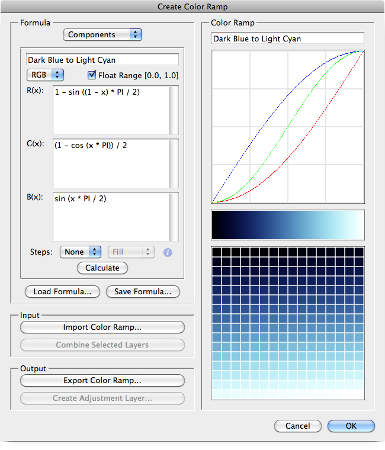
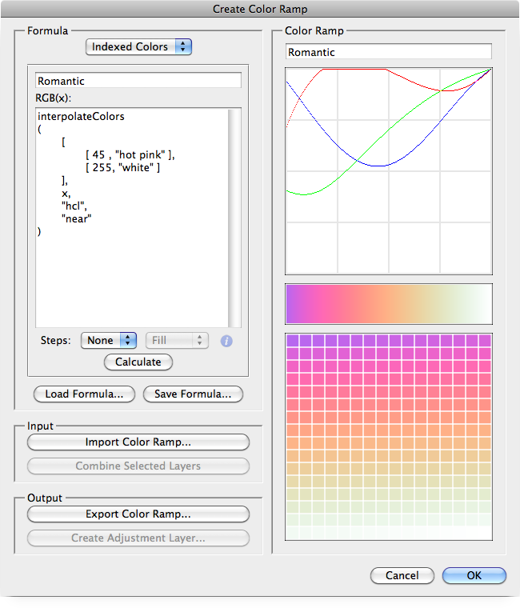
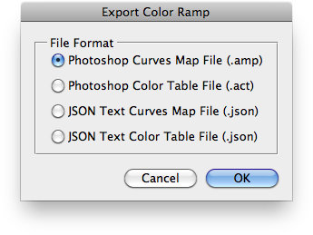
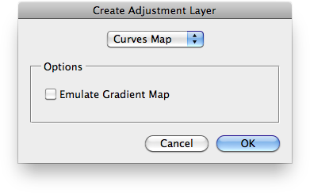
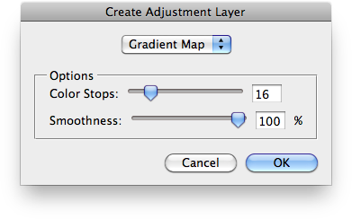
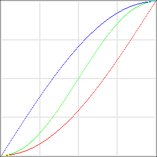
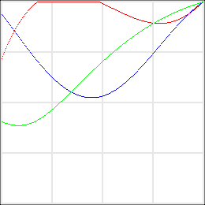

# Create Color Ramp

## Description

“Create Color Ramp” is a color ramps script using the [JSON Action Manager](/JSON-Action-Manager) scripting library.

This stand-alone script written in JavaScript is used to create a 256-color ramp programmatically.

Since a color ramp is assumed to be defined as an ordered set of 256 RGB colors, the data it represents can be displayed in three different ways (identical to the contents of the document created by the script [Visualize Adjustment Layers](/Creative-Scripts/Visualize-Adjustment-Layers)):

- as a curves map,
- as a gradient map,
- as a color table.

Please note that the color ramp data is always displayed as RGB in the preview area of the script’s main dialog, regardless of the color model used to generate it.

Alt-clicking on the curves map preview area toggles between simple and detailed grid.

Double-clicking on any part of the preview area reverses the ordering of colors in the color ramp.

A color ramp can be calculated from a formula made of mathematical expressions:

- as color **components**, in one color model among: RGB, HSB, HSL, HCL, Lab, XYZ, YCbCr;



- as **indexed colors**, always in RGB.



Formulas can be loaded from (and saved to) plain JSON text files. See: [Examples of Color Ramp Formulas](Examples-of-Color-Ramp-Formulas).

In input, a color ramp can be:

- imported from a curves map file (.amp or .json) or a color table file (.act or .lut or .json);

- combined from the selected layers of the currently open RGB document (same as the script [Combine Adjustment Layers](/Creative-Scripts/Combine-Adjustment-Layers)).

In ouput, a color ramp can be:

- exported to a curves map file (.amp or .json) or a color table file (.act or .json);



- created as a curves map adjustment layer or a (approximated) gradient map adjustment layer in the currently open RGB document.




## Components formula format

A components formula is made of three JavaScript expressions where (x) is a predefined local variable whose value varies within the selected range (integer: [0, 255] or float: [0.0, 1.0]). Each expression returns a value within the same range.

### Color models

Seven color models are supported:

- RGB: Red, Green, Blue
- HSB: Hue, Saturation, Brightness
- HSL: Hue, Saturation, Lightness
- HCL: Hue, Chroma, Luminance
- Lab: Luminance, A, B
- XYZ: X, Y, Z
- YCbCr: Y (Luma), Chroma Blue (Blue – Luma), Chroma Red (Red – Luma)

[RGB](https://en.wikipedia.org/wiki/RGB_color_model) and [HSB](https://en.wikipedia.org/wiki/HSL_and_HSV) (also called HSV) are color models natively handled by Photoshop, while [HSL](https://en.wikipedia.org/wiki/HSL_and_HSV) is extensively used in [CSS3](https://www.w3.org/TR/css3-color/#hsl-color).

[HCL](https://www.colourphil.co.uk/lab_lch_colour_space.shtml) stands for [CIE-LCH](https://en.wikipedia.org/wiki/Lab_color_space#Cylindrical_representation:_CIELCh_or_CIEHLC), which is a more intuitive color model than [CIE-LAB](https://en.wikipedia.org/wiki/CIE_LAB), usually simply called [Lab](https://www.colourphil.co.uk/lab_lch_colour_space.shtml). It uses the standard, widely-documented algorithm which assumes a 2° observer angle and a D65 illuminant, and applies a sRGB gamma correction. XYZ ([CIE-XYZ](https://en.wikipedia.org/wiki/CIE_XYZ)) is an intermediate color model used to convert from RGB to Lab.

[YCbCr](https://en.wikipedia.org/wiki/YCbCr) makes use of the full-range format used for [JPEG](https://en.wikipedia.org/wiki/YCbCr#JPEG_conversion) images.

### Ranges

<table>
<tr>
<th colspan="3">RGB</th>
</tr>
<tr>
<th></th>
<td>Float range: <code>false</code></td>
<td>Float range: <code>true</code></td>
</tr>
<tr>
<th>Red</th>
<td>x: [0, 255]<br />R(x): [0, 255] (clipped)</td>
<td>x: [0.0, 1.0]<br />R(x): [0.0, 1.0] (clipped)</td>
</tr>
<tr>
<th>Green</th>
<td>x: [0, 255]<br />G(x): [0, 255] (clipped)</td>
<td>x: [0.0, 1.0]<br />G(x): [0.0, 1.0] (clipped)</td>
</tr>
<tr>
<th>Blue</th>
<td>x: [0, 255]<br />B(x): [0, 255] (clipped)</td>
<td>x: [0.0, 1.0]<br />B(x): [0.0, 1.0] (clipped)</td>
</tr>
<tr>
<th colspan="3">HSB</th>
</tr>
<tr>
<th></th>
<td>Float range: <code>false</code></td>
<td>Float range: <code>true</code></td>
</tr>
<tr>
<th>Hue</th>
<td>x: [0, 255]<br />H(x): [0, 360] (wrapped)</td>
<td>x: [0.0, 1.0]<br />H(x): [0.0, 1.0] (wrapped)</td>
</tr>
<tr>
<th>Saturation</th>
<td>x: [0, 255]<br />S(x): [0, 100] (clipped)</td>
<td>x: [0.0, 1.0]<br />S(x): [0.0, 1.0] (clipped)</td>
</tr>
<tr>
<th>Brightness</th>
<td>x: [0, 255]<br />B(x): [0, 100] (clipped)</td>
<td>x: [0.0, 1.0]<br />B(x): [0.0, 1.0] (clipped)</td>
</tr>
<tr>
<th colspan="3">HSL</th>
</tr>
<tr>
<th></th>
<td>Float range: <code>false</code></td>
<td>Float range: <code>true</code></td>
</tr>
<tr>
<th>Hue</th>
<td>x: [0, 255]<br />H(x): [0, 360] (wrapped)</td>
<td>x: [0.0, 1.0]<br />H(x): [0.0, 1.0] (wrapped)</td>
</tr>
<tr>
<th>Saturation</th>
<td>x: [0, 255]<br />S(x): [0, 100] (clipped)</td>
<td>x: [0.0, 1.0]<br />S(x): [0.0, 1.0] (clipped)</td>
</tr>
<tr>
<th>Lightness</th>
<td>x: [0, 255]<br />L(x): [0, 100] (clipped)</td>
<td>x: [0.0, 1.0]<br />L(x): [0.0, 1.0] (clipped)</td>
</tr>
<tr>
<th colspan="3">HCL</th>
</tr>
<tr>
<th></th>
<td>Float range: <code>false</code></td>
<td>Float range: <code>true</code></td>
</tr>
<tr>
<th>Hue</th>
<td>x: [0, 255]<br />H(x): [0, 360] (wrapped)</td>
<td>x: [0.0, 1.0]<br />H(x): [0.0, 1.0] (wrapped)</td>
</tr>
<tr>
<th>Chroma</th>
<td>x: [0, 255]<br />C(x): [0, 128] (unrestricted)</td>
<td>x: [0.0, 1.0]<br />C(x): [0.0, 1.0] (unrestricted)</td>
</tr>
<tr>
<th>Luminance</th>
<td>x: [0, 255]<br />L(x): [0, 100] (unrestricted)</td>
<td>x: [0.0, 1.0]<br />L(x): [0.0, 1.0] (unrestricted)</td>
</tr>
<tr>
<th colspan="3">Lab</th>
</tr>
<tr>
<th></th>
<td>Float range: <code>false</code></td>
<td>Float range: <code>true</code></td>
</tr>
<tr>
<th>Luminance</th>
<td>x: [0, 255]<br />L(x): [0, 100] (unrestricted)</td>
<td>x: [0.0, 1.0]<br />L(x): [0.0, 1.0] (unrestricted)</td>
</tr>
<tr>
<th>A</th>
<td>x: [0, 255]<br />a(x): [-128, 128] (unrestricted)</td>
<td>x: [0.0, 1.0]<br />a(x): [0.0, 1.0] (unrestricted)</td>
</tr>
<tr>
<th>B</th>
<td>x: [0, 255]<br />b(x): [-128, 128] (unrestricted)</td>
<td>x: [0.0, 1.0]<br />b(x): [0.0, 1.0] (unrestricted)</td>
</tr>
<tr>
<th colspan="3">XYZ</th>
</tr>
<tr>
<th></th>
<td>Float range: <code>false</code></td>
<td>Float range: <code>true</code></td>
</tr>
<tr>
<th>X</th>
<td>x: [0, 255]<br />X(x): [0, 100] (unrestricted)</td>
<td>x: [0.0, 1.0]<br />X(x): [0.0, 1.0] (unrestricted)</td>
</tr>
<tr>
<th>Y</th>
<td>x: [0, 255]<br />Y(x): [0, 100] (unrestricted)</td>
<td>x: [0.0, 1.0]<br />Y(x): [0.0, 1.0] (unrestricted)</td>
</tr>
<tr>
<th>Z</th>
<td>x: [0, 255]<br />Z(x): [0, 100] (unrestricted)</td>
<td>x: [0.0, 1.0]<br />Z(x): [0.0, 1.0] (unrestricted)</td>
</tr>
<tr>
<th colspan="3">YCbCr</th>
</tr>
<tr>
<th></th>
<td>Float range: <code>false</code></td>
<td>Float range: <code>true</code></td>
</tr>
<tr>
<th>Y (Luma)</th>
<td>x: [0, 255]<br />Y(x): [0, 255] (unrestricted)</td>
<td>x: [0.0, 1.0]<br />Y(x): [0.0, 1.0] (unrestricted)</td>
</tr>
<tr>
<th>Chroma Blue<br />(Blue &#8211; Luma)</th>
<td>x: [0, 255]<br />Cb(x): [0, 255] (unrestricted)</td>
<td>x: [0.0, 1.0]<br />Cb(x): [0.0, 1.0] (unrestricted)</td>
</tr>
<tr>
<th>Chroma Red<br />(Red &#8211; Luma)</th>
<td>x: [0, 255]<br />Cr(x): [0, 255] (unrestricted)</td>
<td>x: [0.0, 1.0]<br />Cr(x): [0.0, 1.0] (unrestricted)</td>
</tr>
</table>

### Built-in constants & functions

Formulas can use JavaScript’s native properties and methods of the [Math](https://www.ecma-international.org/ecma-262/5.1/#sec-15.8) global object:

<table>
<tr>
<th>Constant</th>
<th>Value</th>
<th>Description</th>
</tr>
<tr>
<td><strong>E</strong></td>
<td>2.71828182845905</td>
<td>Euler&#8217;s constant, base of natural logarithms.</td>
</tr>
<tr>
<td><strong>LN2</strong></td>
<td>0.69314718055995</td>
<td>Natural logarithm of 2.</td>
</tr>
<tr>
<td><strong>LN10</strong></td>
<td>2.30258509299405</td>
<td>Natural logarithm of 10.</td>
</tr>
<tr>
<td><strong>LOG2E</strong></td>
<td>1.44269504088869</td>
<td>Base 2 logarithm of E.</td>
</tr>
<tr>
<td><strong>LOG10E</strong></td>
<td>0.43429448190325</td>
<td>Base 10 logarithm of E.</td>
</tr>
<tr>
<td><strong>PI</strong></td>
<td>3.14159265358979</td>
<td>π, the ratio of the circumference of a circle to its diameter.</td>
</tr>
<tr>
<td><strong>SQRT1_2</strong></td>
<td>0.70710678118655</td>
<td>Square root of 1/2; equivalently, 1 over the square root of 2.</td>
</tr>
<tr>
<td><strong>SQRT2</strong></td>
<td>1.41421356237310</td>
<td>Square root of 2.</td>
</tr>
</table>

<table>
<tr>
<th>Function</th>
<th>Parameters</th>
<th>Description</th>
</tr>
<tr>
<td style="white-space: nowrap;"><strong>abs</strong> (a)</td>
<td>a: number</td>
<td>Returns the absolute value of (a).</td>
</tr>
<tr>
<td style="white-space: nowrap;"><strong>acos</strong> (a)</td>
<td>a: number</td>
<td>Returns the arccosine of (a), from 0 to π.</td>
</tr>
<tr>
<td style="white-space: nowrap;"><strong>asin</strong> (a)</td>
<td>a: number</td>
<td>Returns the arcsine of (a), from −π/2 to π/2.</td>
</tr>
<tr>
<td style="white-space: nowrap;"><strong>atan</strong> (a)</td>
<td>a: number</td>
<td>Returns the arctangent of (a), from −π/2 to π/2.</td>
</tr>
<tr>
<td style="white-space: nowrap;"><strong>atan2</strong> (a, b)</td>
<td>a, b: numbers</td>
<td>Returns the arctangent of the quotient (a/b) of its arguments (a) and (b), from −π to π.</td>
</tr>
<tr>
<td style="white-space: nowrap;"><strong>ceil</strong> (a)</td>
<td>a: number</td>
<td>Returns the smallest integer greater than or equal to (a).</td>
</tr>
<tr>
<td style="white-space: nowrap;"><strong>cos</strong> (a)</td>
<td>a: number</td>
<td>Returns the cosine of (a).</td>
</tr>
<tr>
<td style="white-space: nowrap;"><strong>exp</strong> (a)</td>
<td>a: number</td>
<td>Returns E<sup>a</sup>, where E is Euler&#8217;s constant, the base of the natural logarithm.</td>
</tr>
<tr>
<td style="white-space: nowrap;"><strong>floor</strong> (a)</td>
<td>a: number</td>
<td>Returns the largest integer less than or equal to (a).</td>
</tr>
<tr>
<td style="white-space: nowrap;"><strong>log</strong> (a)</td>
<td>a: number</td>
<td>Returns the natural (base E) logarithm of (a).</td>
</tr>
<tr>
<td style="white-space: nowrap;"><strong>max</strong> (a, b)</td>
<td>a, b: numbers</td>
<td>Returns the largest of two numbers (a) and (b).</td>
</tr>
<tr>
<td style="white-space: nowrap;"><strong>min</strong> (a, b)</td>
<td>a, b: numbers</td>
<td>Returns the smallest of two numbers (a) and (b).</td>
</tr>
<tr>
<td style="white-space: nowrap;"><strong>pow</strong> (a, b)</td>
<td>a, b: numbers</td>
<td>Returns base to the exponent power, that is, a<sup>b</sup>.</td>
</tr>
<tr>
<td style="white-space: nowrap;"><strong>random</strong> ( )</td>
<td>&nbsp;</td>
<td>Returns a pseudo-random number between 0 (inclusive) and 1 (exclusive).</td>
</tr>
<tr>
<td style="white-space: nowrap;"><strong>round</strong> (a)</td>
<td>a: number</td>
<td>Returns the value of (a) rounded to the nearest integer.</td>
</tr>
<tr>
<td style="white-space: nowrap;"><strong>sin</strong> (a)</td>
<td>a: number</td>
<td>Returns the sine of (a).</td>
</tr>
<tr>
<td style="white-space: nowrap;"><strong>sqrt</strong> (a)</td>
<td>a: number</td>
<td>Returns the positive square root of (a).</td>
</tr>
<tr>
<td style="white-space: nowrap;"><strong>tan</strong> (a)</td>
<td>a: number</td>
<td>Returns the tangent of (a).</td>
</tr>
</table>

**Note**: shortened names (without `Math.`) are recommended.

Several convenient helper functions are available as well:

<table>
<tr>
<th>Function</th>
<th>Parameters</th>
<th>Description</th>
</tr>
<tr>
<td><strong>bias</strong> (t, b)</td>
<td>t, b: numbers</td>
<td>Returns a value in the interval [0.0, 1.0] for a parameter (t) in the same interval.<br /><em>bias</em> defines a kind of brightness curve controlled by the parameter (b) in the interval ]0.0, 1.0[.<br />For (b) equal to 0.5, <em>bias</em> is the identity function.</td>
</tr>
<tr>
<td><strong>coserp</strong> (a, b, t)</td>
<td>a, b, t: numbers</td>
<td>Returns a cosine interpolated value between two values (a) and (b) for a parameter (t) in the interval [0.0, 1.0].<br /><em>coserp</em> is a common function name for cosine interpolation.</td>
</tr>
<tr>
<td><strong>cubic</strong> (coeffs, x)</td>
<td>coeffs: JSON array of numbers [ a, b, c, d ]<br />x: number</td>
<td>Returns the value of the cubic function:<br />ax<sup>3</sup> + bx<sup>2</sup> + cx + d.</td>
</tr>
<tr>
<td><strong>distribute</strong><br />(values, bounds, position, smoothness)</td>
<td>values:&nbsp;array<br />bounds:&nbsp;array<br />position:&nbsp;number<br />smoothness:&nbsp;number</td>
<td>Returns an interpolated value at (position) from an array of (values) evenly distributed within (bounds).<br />The shape of the resulting interpolation curve is controlled by the optional parameter (smoothness) between 0 (by default) and 100: a value of 0 implies a linear interpolation, while 100 indicates a smooth <em>pchip</em> interpolation.</td>
</tr>
<tr>
<td><strong>gain</strong> (t, g)</td>
<td>t, g: numbers</td>
<td>Returns a value in the interval [0.0, 1.0] for a parameter (t) in the same interval.<br /><em>gain</em> defines a kind of contrast curve controlled by the parameter (g) in the interval ]0.0, 1.0[.<br />For (g) equal to 0.5, <em>gain</em> is the identity function.</td>
</tr>
<tr>
<td><strong>interpolate</strong><br />(points, position, smoothness)</td>
<td>points:&nbsp;array<br />position:&nbsp;number<br />smoothness:&nbsp;number</td>
<td>Returns an interpolated value at (position) from an array of (points) in ascending order, each point being defined as an array of two numbers: [&nbsp;position, value&nbsp;].<br />The shape of the resulting interpolation curve is controlled by the optional parameter (smoothness) between 0 (by default) and 100: a value of 0 implies a linear interpolation, while 100 indicates a smooth <em>pchip</em> interpolation.</td>
</tr>
<tr>
<td><strong>lerp</strong> (a, b, t)</td>
<td>a, b, t: numbers</td>
<td>Returns a linearly interpolated value between two values (a) and (b) for a parameter (t) in the interval [0.0, 1.0].<br /><em>lerp</em> is a common function name for <a href="https://en.wikipedia.org/wiki/Linear_interpolation">linear interpolation</a>.</td>
</tr>
<tr>
<td><strong>linear</strong> (coeffs, x)</td>
<td>coeffs: JSON array of numbers [ a, b ]<br />x: number</td>
<td>Returns the value of the linear function:<br />ax + b.</td>
</tr>
<tr>
<td><strong>pchip</strong><br />(points, position)</td>
<td>points:&nbsp;array<br />position:&nbsp;number</td>
<td>Returns a shape-preserving interpolated value at (position) from an array of (points) in strict ascending order, each point being defined as an array of two numbers: [&nbsp;position, value&nbsp;].<br />PCHIP stands for &#8220;Piecewise Cubic Hermite Interpolation Polynomial&#8221;.</td>
</tr>
<tr>
<td><strong>polynomial</strong> (coeffs, x)</td>
<td>coeffs: JSON array of n numbers<br />x: number</td>
<td>Returns the value of a generic polynomial function of degree n.</td>
</tr>
<tr>
<td><strong>quadratic</strong><br />(coeffs, x)</td>
<td>coeffs: JSON array of numbers [ a, b, c ]<br />x: number</td>
<td>Returns the value of the quadratic function:<br />ax<sup>2</sup> + bx + c.</td>
</tr>
<tr>
<td><strong>smootherstep</strong><br />(a, b, t)</td>
<td>a, b, t: numbers</td>
<td>Returns a <a href="https://en.wikipedia.org/wiki/Smoothstep#Variations">smootherstep</a> interpolated value between two values (a) and (b) for a parameter (t) in the interval [0.0, 1.0].</td>
</tr>
<tr>
<td><strong>smoothstep</strong><br />(a, b, t)</td>
<td>a, b, t: numbers</td>
<td>Returns a <a href="https://en.wikipedia.org/wiki/Smoothstep">smoothstep</a> interpolated value between two values (a) and (b) for a parameter (t) in the interval [0.0, 1.0].</td>
</tr>
<tr>
<td><strong>spline</strong><br />(points, position, compatible)</td>
<td>points:&nbsp;array<br />position:&nbsp;number<br />compatible:&nbsp;boolean</td>
<td>Returns an interpolated value at (position) from a natural cubic spline passing through an array of (points) in ascending order, each point being defined as an array of two numbers: [&nbsp;position, value&nbsp;].<br />In Photoshop-compatible mode (true), extrapolated values are set to the endpoint values.</td>
</tr>
</table>

**Notes**:

The *bias* and *gain* functions were first described by Ken Perlin and Eric M. Hoffert ([Hypertexture](https://www.cs.jhu.edu/~subodh/458/p253-perlin.pdf)). This script makes use of the faster alternative method designed by Christophe Schlick ([Fast Alternatives to Perlin’s Bias and Gain Functions](http://dept-info.labri.fr/~schlick/DOC/gem2.html)).

The code for the shape-preserving *pchip* function is based on [Piecewise Cubic Hermite Interpolation](https://www.mathworks.com/content/dam/mathworks/mathworks-dot-com/moler/interp.pdf) and [Monotone cubic interpolation](https://en.wikipedia.org/wiki/Monotone_cubic_interpolation).

The code for [spline interpolation](https://en.wikipedia.org/wiki/Spline_interpolation) is adapted from [CSPL.js](http://www.ivank.net/blogspot/cspline/CSPL.js) by [Ivan Kuckir](http://blog.ivank.net/interpolation-with-cubic-splines.html) ([Github repository](https://github.com/kuckir/CSPL.js)).

### Example

**Dark Blue to Light Cyan**




```json
{
    "colorRampFormula":
    {
        "name": "Dark Blue to Light Cyan",
        "colorModel": "RGB",
        "components":
        [
            "1 - sin ((1 - x) * PI / 2)",
            "(1 - cos (x * PI)) / 2",
            "sin (x * PI / 2)"
        ],
        "floatRange": true
    }
}
```

More examples of components formulas are provided on the dedicated page: [Examples of Color Ramp Formulas](Examples-of-Color-Ramp-Formulas).

## Indexed colors formula format

An indexed colors formula is only one JavaScript expression where (x) is a predefined local variable whose value varies between 0 and 255, and which returns a RGB color as an array of three values between 0 and 255: [ red, green, blue ].

### Built-in functions

Although the indexed colors formula format can make use of the functions intended for the components formula format, the following high-level helper functions will be the most convenient, since they all directly return a RGB color array:

<table>
<tr>
<th>Function</th>
<th>Parameters</th>
<th>Description</th>
</tr>
<tr>
<td><strong>distributeColors</strong> (colors, bounds, location, colorModel, option)</td>
<td style="white-space: nowrap;">colors:&nbsp;array<br />bounds:&nbsp;array<br />location:&nbsp;number<br />colorModel:&nbsp;string<br />option:&nbsp;number or string</td>
<td>Returns an interpolated color at (location) from an array of (colors) evenly distributed within (bounds), according to (colorModel) among <code>"rgb"</code>, <code>"hsb"</code>, <code>"hsl"</code> or <code>"hcl"</code>.<br />In <code>"rgb"</code> color model, the optional parameter (option) represents a smoothness value between 0 (by default) and 100: a value of 0 implies a linear interpolation, while 100 indicates a <em>pchip</em> interpolation.<br />In <code>"hsb"</code>, <code>"hsl"</code> or <code>"hcl"</code> color models, the optional parameter (option) represents the hue mode, among <code>"desc"</code> or <code>"dec"</code>, <code>"asc"</code> or <code>"inc"</code>, <code>"far"</code> or <code>"long"</code>, <code>"near"</code> or <code>"short"</code>, or <code>"none"</code>.</td>
</tr>
<tr>
<td><strong>interpolateColors</strong> (stops, location, colorModel, option)</td>
<td style="white-space: nowrap;">stops:&nbsp;array<br />location:&nbsp;number<br />colorModel:&nbsp;string<br />option:&nbsp;number or string</td>
<td>Returns an interpolated color at (location) from an array of (stops) in ascending order, each stop being defined as an array of two elements: [&nbsp;position, color&nbsp;], according to (colorModel) among <code>"rgb"</code>, <code>"hsb"</code>, <code>"hsl"</code> or <code>"hcl"</code>.<br />In <code>"rgb"</code> color model, the optional parameter (option) represents a smoothness value between 0 (by default) and 100: a value of 0 implies a linear interpolation, while 100 indicates a <em>pchip</em> interpolation.<br />In <code>"hsb"</code>, <code>"hsl"</code> or <code>"hcl"</code> color models, the optional parameter (option) represents the hue mode, among <code>"desc"</code> or <code>"dec"</code>, <code>"asc"</code> or <code>"inc"</code>, <code>"far"</code> or <code>"long"</code>, <code>"near"</code> or <code>"short"</code>, or <code>"none"</code>.</td>
</tr>
<tr>
<td><strong>shiftHue</strong> (rgb, shift)</td>
<td style="white-space: nowrap;">rgb:&nbsp;array<br />shift:&nbsp;number</td>
<td>Returns a hue-shifted color.<br />(shift) is expressed in degrees (0 by default).</td>
</tr>
<tr>
<td><strong>transformColor</strong> (rgb, hueShift, saturationMultiplier, brightnessMultiplier)</td>
<td style="white-space: nowrap;">rgb:&nbsp;array<br />hueShift:&nbsp;number<br />saturationMultiplier:&nbsp;number<br />brightnessMultiplier:&nbsp;number</td>
<td>Returns a transformed color.<br />(hueShift) is expressed in degrees (0 by default); (saturationMultiplier) and (brightnessMultiplier) represent a scalar value (1 by default).</td>
</tr>
</table>

**Note**:

When calling the functions *interpolateColors* and *distributeColors*, each RGB color can be defined in several ways:

- as a RGB color array; ex: `[ 0, 255, 0 ]`,
- as a color string in HTML/CSS hexadecimal notation; ex: `"#00FF00"` or `"#0F0"`,
- as a CSS/SVG/W3C or X11 color name; ex: `"lime"` or `"svg/lime"` or `"x11/green"`.

See the [Color Names](http://www.tonton-pixel.com/goodies/color-names/index.html) page for a list of available W3C and X11 color names, sorted alphabetically.

A RGB color can also be obtained by using one of the built-in color conversion functions:

<table>
<tr>
<th>Function</th>
<th>Parameters</th>
<th>Description</th>
</tr>
<tr>
<td style="white-space: nowrap;"><strong>rgb</strong> (red, green, blue)</td>
<td style="white-space: nowrap;">red:&nbsp;number<br />green:&nbsp;number<br />blue:&nbsp;number</td>
<td>Returns a RGB color array.<br />Ex: <code>rgb (0, 255, 0)</code></td>
</tr>
<tr>
<td style="white-space: nowrap;"><strong>hsb</strong> (hue, saturation, brightness)</td>
<td style="white-space: nowrap;">hue:&nbsp;number<br />saturation:&nbsp;number<br />brightness:&nbsp;number</td>
<td>Returns a RGB color array.<br />Ex: <code>hsb (120, 100, 100)</code></td>
</tr>
<tr>
<td style="white-space: nowrap;"><strong>hsl</strong> (hue, saturation, lightness)</td>
<td style="white-space: nowrap;">hue:&nbsp;number<br />saturation:&nbsp;number<br />lightness:&nbsp;number</td>
<td>Returns a RGB color array.<br />Ex: <code>hsl (120, 100, 50)</code></td>
</tr>
<tr>
<td style="white-space: nowrap;"><strong>hcl</strong> (hue, chroma, luminance)</td>
<td style="white-space: nowrap;">hue:&nbsp;number<br />chroma:&nbsp;number<br />luminance:&nbsp;number</td>
<td>Returns a RGB color array.<br />Ex: <code>hcl (136, 119.8, 87.7)</code></td>
</tr>
<tr>
<td style="white-space: nowrap;"><strong>lab</strong> (luminance, a, b)</td>
<td style="white-space: nowrap;">luminance:&nbsp;number<br />a:&nbsp;number<br />b:&nbsp;number</td>
<td>Returns a RGB color array.<br />Ex: <code>lab (100, 0, 0)</code></td>
</tr>
<tr>
<td style="white-space: nowrap;"><strong>xyz</strong> (x, y, z)</td>
<td style="white-space: nowrap;">x:&nbsp;number<br />y:&nbsp;number<br />z:&nbsp;number</td>
<td>Returns a RGB color array.<br />Ex: <code>xyz (0, 0, 0)</code></td>
</tr>
<tr>
<td style="white-space: nowrap;"><strong>ycbcr</strong> (y, cb, cr)</td>
<td style="white-space: nowrap;">y:&nbsp;number<br />cb:&nbsp;number<br />cr:&nbsp;number</td>
<td>Returns a RGB color array.<br />Ex: <code>ycbcr (149.7, 43.5, 21.2)</code></td>
</tr>
</table>

### Example

**Romantic**




```json
{
    "colorRampFormula":
    {
        "name": "Romantic",
        "indexedColors": "interpolateColors ([ [ 45 , \"hot pink\" ], [ 255, \"white\" ] ], x, \"hcl\", \"near\")"
    }
}
```

More examples of indexed colors formulas are provided on the dedicated page: [Examples of Color Ramp Formulas](Examples-of-Color-Ramp-Formulas).

## Requirements

This script can be used in Adobe Photoshop CS4 or later. It has been successfully tested in CS4 on Mac OS X, but should be platform agnostic.

## Copyright

This Software is copyright © 2014-2016 by Michel MARIANI.

## License

This Software is licensed under the [GNU General Public License (GPL) v3](https://www.gnu.org/licenses/gpl.html).

## Download

[Download Zip File](/Downloads/Create-Color-Ramp-4.1.zip)

## Installation

Download the Zip file and unzip it.

Move the script to the `Presets/Scripts` folder in the default preset location of the Adobe Photoshop application. On next launch, the script will appear in the File>Automate submenu.
