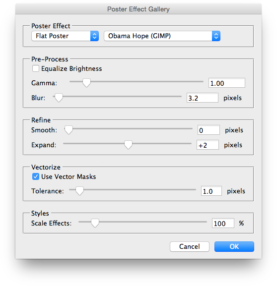
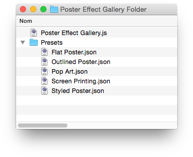
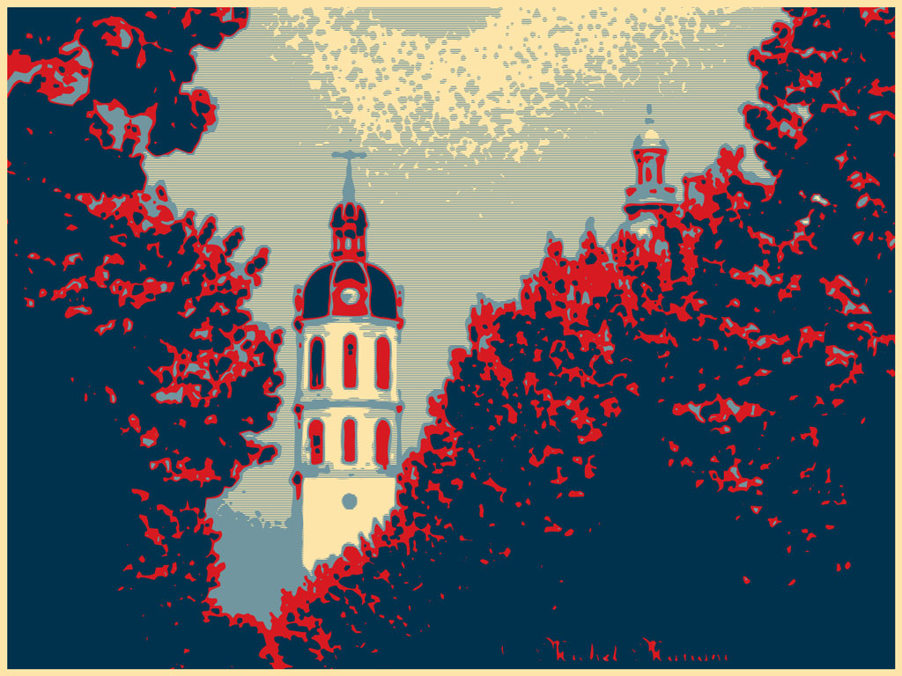
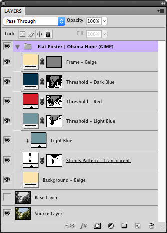
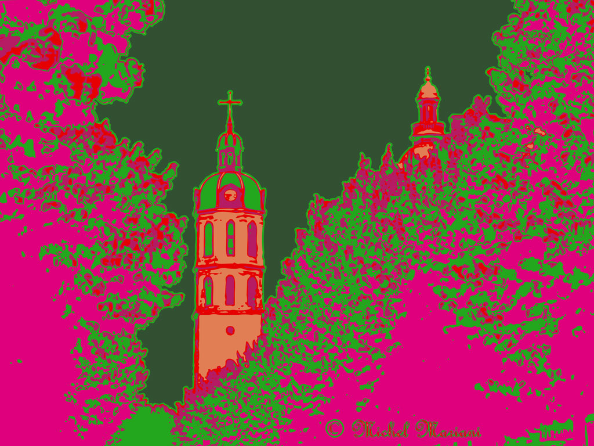
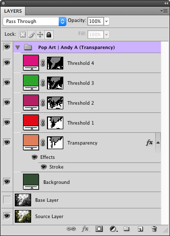
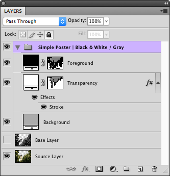
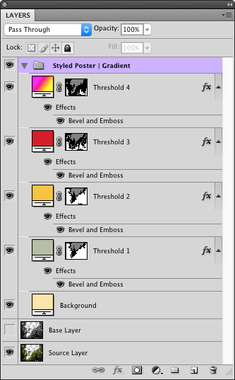
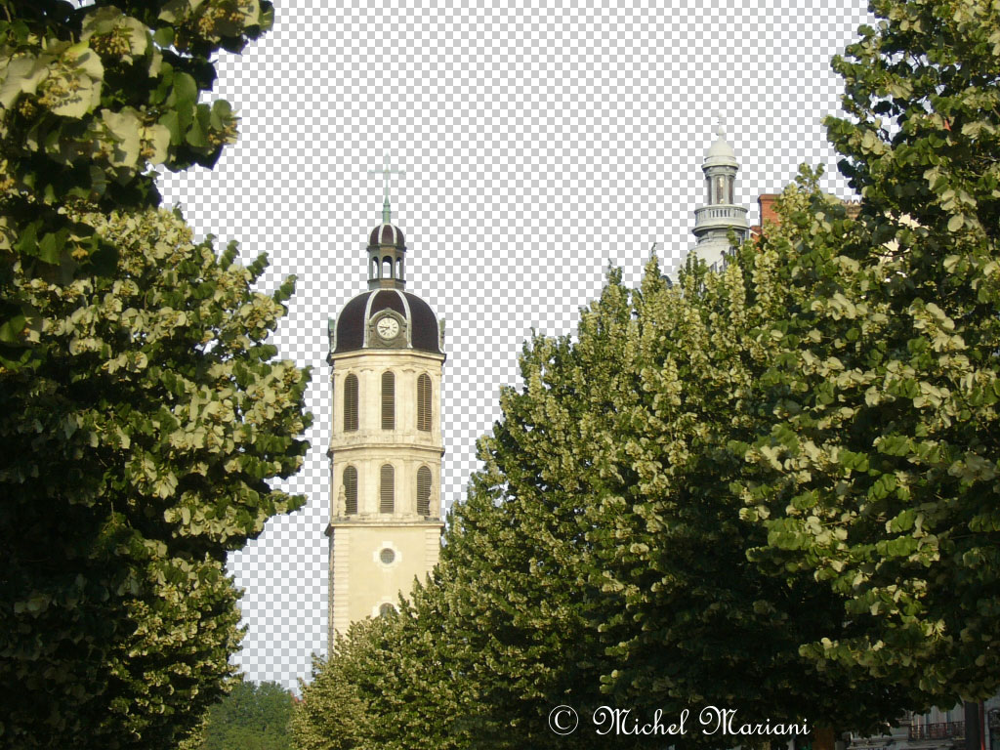

# Poster Effect Gallery

## Description

“Poster Effect Gallery” is a special effects script using the [JSON Action Manager](/JSON-Action-Manager) scripting library.

This stand-alone script written in JavaScript applies on an existing RGB image a preset color posterization effect, made of a stack of fill layers associated with masks corresponding to different levels of threshold. The original image is not modified.

Images created with this script can be edited later on; for instance, it is possible to use the script [Change Layer Content](/Creative-Scripts/Change-Layer-Content) to modify the content of the fill layers (among: solid color, gradient or pattern).

In the “Poster Effect” dialog panel, use the left menu to select the set of effects, then use the right menu to select the effect you want to apply; if you choose the last item named “\*Every Effect\*”, then each effect of the set will be applied on a new copy of the image, giving you the opportunity to compare between them.

As a convenience, double-clicking on any slider’s label (on its left side) resets it to its default value.



All the options set in the dialog are also recorded in the generated image document’s `Description` field, which can be accessed from the `File>File Info...` submenu.

```json
{ "set": "Flat Poster", "effect": "Obama Hope (GIMP)", "equalize": false, "gamma": 1, "blur": 3.2, "smooth": 0, "expand": 2, "useVectorMasks": true, "tolerance": 1, "scaleEffects": 100 }
```

## Presets

### Overview

Presets are actually plain JSON text files, found in the Presets folder located at the same level than the script:



Each preset file contains a JSON object of poster effects usually made of sequences of fill layers, as documented in the [Layer Object Simplified Format](/JSON-Simplified-Formats/Layer-Object-Simplified-Format) page:

- Gradient fill
- Pattern fill
- Solid color fill

However, there is no restriction on the use of adjustment layers as well:

- Black & white adjustment
- Brightness/contrast adjustment
- Channel mixer adjustment
- Color balance adjustment
- Curves adjustment
- Exposure adjustment
- Gradient map adjustment
- Hue/saturation adjustment
- Invert adjustment
- Levels adjustment
- Photo filter adjustment
- Posterize adjustment
- Selective color adjustment
- Threshold adjustment
- Vibrance adjustment

Each layer may have a mask, usually obtained from various image thresholds or from image transparency.

And finally, it is possible to apply a local or global style to each layer, each style being made of layer effects (in [Layer Effects Object Simplified Format](/JSON-Simplified-Formats/Layer-Effects-Object-Simplified-Format)) and blending options (in [Blending Options Object Simplified Format](/JSON-Simplified-Formats/Blending-Options-Object-Simplified-Format)).

### Preset file format

A preset file is made of a JSON object:

<pre>
{
    "posterEffects": <em>posterEffects</em>,
    "patternsFileBinary": <em>patternsFileBinary</em>
}
</pre>

> *posterEffects* : JSON object made of several members, one for each poster effect; each key is the effect name, and each associated value is a JSON object in **Poster effect** format
> <br>
> *patternsFileBinary* : [optional] string (binary data of the patterns file containing all the patterns referenced by name and ID in the preset file)

### Poster effect

<pre>
    "layers": <em>layers</em>,
    "grayscale": <em>grayscale</em>,
    "style": <em>style</em>
}
</pre>

> *layers* : JSON array of JSON objects in **Layer data** format
> <br>
> *grayscale* : [optional] string, among "legacy", "maxRGB", "minRGB", "luma" (by default)
> <br>
> *style* : [optional] JSON object in **Layer style** format (global style applied to each layer with mask, provided no local style is already defined)

### Layer data

<pre>
{
    "layer": <em>layer</em>,
    "mask": <em>mask</em>,
    "style": <em>style</em>
}
</pre>

> *layer* : JSON object in [Layer Object Simplified Format](/JSON-Simplified-Formats/Layer-Object-Simplified-Format)
> <br>
> *mask* : [optional] JSON object in **Mask** format
> <br>
> *style* : [optional] JSON object in **Layer style** format (local style applied to the layer)

### Mask

<pre>
{
    "type": <em>type</em>,
    "inverse": <em>inverse</em>
}
</pre>

> *type* : JSON object in **Mask type** format
> *inverse* : [optional] boolean (`false` by default; if `true`, mask is inverted)

### Mask type

<pre>
{  "imageThreshold": <em>imageThreshold</em> }
</pre>
or
<pre>
{ "imageTransparency": <em>imageTransparency</em> }
</pre>
or
<pre>
{ "pattern": <em>pattern</em> }
</pre>
or
<pre>
{ "frame": <em>frame</em> }
</pre>
or
<pre>
{ "rectangularSelection": <em>rectangularSelection</em> }
</pre>
or
<pre>
{ "ellipticalSelection": <em>ellipticalSelection</em> }
</pre>
or
<pre>
{ "polygonalSelection": <em>polygonalSelection</em> }
</pre>

> *imageThreshold* : number (threshold value, from 1 to 255)
> <br>
> *imageTransparency* : `null`, or number (expand value, from -100 to +100 pixels), or JSON array of two numbers (low and high expand values, from -100 to +100 pixels)
> <br>
> *pattern* : JSON object in **Pattern** format
> <br>
> *frame* : number (thickness of frame, in pixels)
> <br>
> *rectangularSelection* : JSON array in [Rectangle Object Simplified Format](/JSON-Simplified-Formats/Rectangle-Object-Simplified-Format)
> <br>
> *ellipticalSelection* : JSON array in [Ellipse Object Simplified Format](/JSON-Simplified-Formats/Ellipse-Object-Simplified-Format)
> <br>
> *polygonalSelection* : JSON array in [Point List Simplified Format](/JSON-Simplified-Formats/Point-List-Simplified-Format)

### Layer style

<pre>
{
    "blendOptions": <em>blendOptions</em>,
    "layerEffects": <em>layerEffects</em>
}
</pre>

> *blendOptions* : [optional] JSON object in [Blending Options Object Simplified Format](/JSON-Simplified-Formats/Blending-Options-Object-Simplified-Format)
> <br>
> *layerEffects* : [optional] JSON object in [Layer Effects Object Simplified Format](/JSON-Simplified-Formats/Layer-Effects-Object-Simplified-Format))

### Pattern

<pre>
{
    "name": <em>name</em>,
    "ID": <em>ID</em>
}
</pre>

> *name* : string
> <br>
> *ID* : string ([UUID](https://en.wikipedia.org/wiki/UUID))

## Examples

### Flat Poster | Obama Hope (GIMP)



```json
{
    "set": "Flat Poster",
    "effect": "Obama Hope (GIMP)",
    "equalize": false,
    "gamma": 1,
    "blur": 3.2,
    "smooth": 0,
    "expand": 2,
    "useVectorMasks": true,
    "tolerance": 1,
    "scaleEffects": 100
}
```



### Pop Art | Andy A (Transparency)



```json
{
    "set": "Pop Art",
    "effect": "Andy A (Transparency)",
    "equalize": false,
    "gamma": 1,
    "blur": 2,
    "smooth": 0,
    "expand": 0,
    "useVectorMasks": true,
    "tolerance": 1,
    "scaleEffects": 100
}
```



### Simple Poster | Black & White / Gray


```json
{
    "set": "Simple Poster",
    "effect": "Black & White / Gray",
    "equalize": false,
    "gamma": 0.85,
    "blur": 0,
    "smooth": 2,
    "expand": 0,
    "useVectorMasks": true,
    "tolerance": 1,
    "scaleEffects": 100
}
```



### Styled Poster | Gradient


```json
{
    "set": "Styled Poster",
    "effect": "Gradient",
    "equalize": false,
    "gamma": 1,
    "blur": 2,
    "smooth": 0,
    "expand": 0,
    "useVectorMasks": true,
    "tolerance": 1,
    "scaleEffects": 100
}
```



### Original Test Images




## Requirements

This script can be used in Adobe Photoshop CS4 or later. It has been successfully tested in CS4 on Mac OS X, but should be platform agnostic.

## Copyright

This Software is copyright © 2015-2016 by Michel MARIANI.

## License

This Software is licensed under the [GNU General Public License (GPL) v3](https://www.gnu.org/licenses/gpl.html).

## Download

[Download Zip File](/Downloads/Poster-Effect-Gallery-1.4.zip)

## Installation

Download the Zip file and unzip it.

Move the entire script *FOLDER* (`Poster Effect Gallery Folder`) with its contents into the Presets/Scripts folder in the default preset location of the Adobe Photoshop application. On next launch, the script will appear in the File>Automate submenu.
