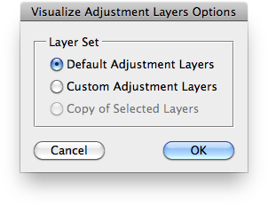
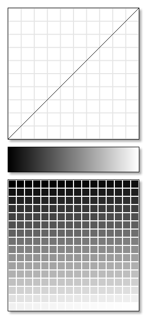
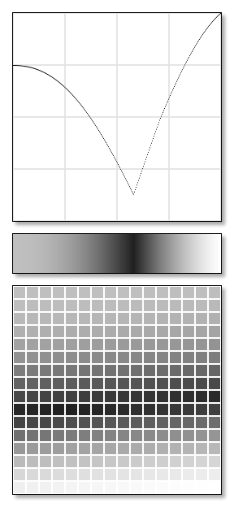
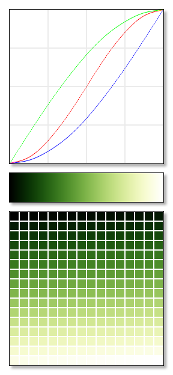
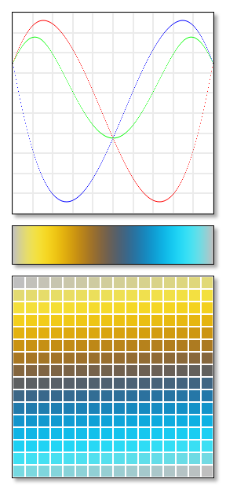
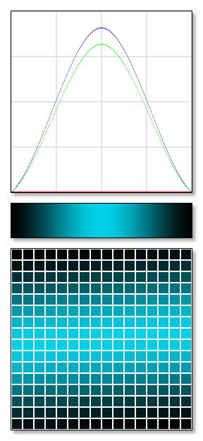
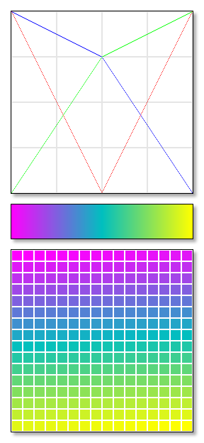
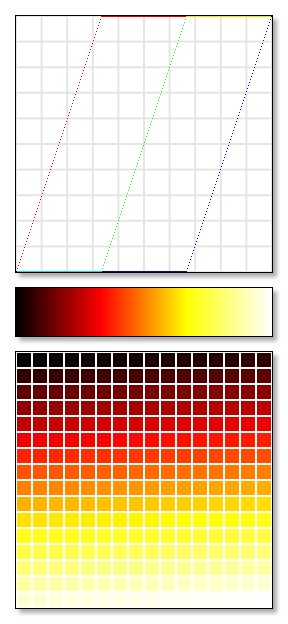
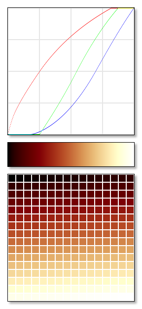

# Visualize Adjustment Layers

## Description

“Visualize Adjustment Layers” is a color ramps script using the [JSON Action Manager](/JSON-Action-Manager) scripting library.

This stand-alone script written in JavaScript allows you to create a specialized RGB document used to interactively visualize (as curves map, gradient map and color table) the effect of cumulated adjustment layers.

It is inspired by the impressive work done by Greg Apodaca, especially by the carefully crafted Photoshop files he has designed, called [Inspectors](http://www.gregapodaca.com/photoshopmechanics/inspectors/).

For more information about visualizing adjustment layers, please refer to: [007 Adjustment Layer Inspector | Adjustment Layers](http://www.gregapodaca.com/photoshopmechanics/files/007.html), part of the video tutorials available on [Photoshop Mechanics](http://www.gregapodaca.com/photoshopmechanics/).

## Examples

&nbsp;&nbsp;&nbsp;&nbsp;

&nbsp;&nbsp;&nbsp;&nbsp;

&nbsp;&nbsp;&nbsp;&nbsp;

&nbsp;&nbsp;&nbsp;&nbsp;

[Examples Zip Archive](/Downloads/Visualize-Adjustment-Layers-Examples.zip)

## Requirements

This script can be used in Adobe Photoshop CS or later. It has been successfully tested in CS and CS4 on Mac OS X, but should be platform agnostic.

## Copyright

This Software is copyright © 2014-2015 by Michel MARIANI.

## License

This Software is licensed under the [GNU General Public License (GPL) v3](https://www.gnu.org/licenses/gpl.html).

## Download

[Download Zip File](/Downloads/Visualize-Adjustment-Layers-1.8.zip)

## Installation

Download the Zip file and unzip it.

Move the script to the `Presets/Scripts` folder in the default preset location of the Adobe Photoshop application. On next launch, the script will get directly accessible from Photoshop’s File menu: in Photoshop CS or CS2, it will appear in the File>Scripts submenu, among all other scripts sorted by lexical order; from Photoshop CS3, it will appear grouped by category in the File>Automate submenu.
