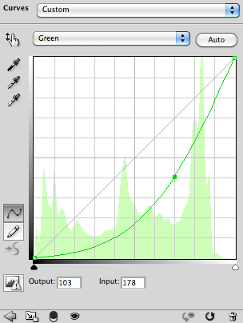
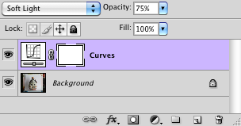

# JSON Project Introduction

## Are you listening?

JavaScript scripting was officially introduced in Photoshop CS, although some experimental support was already available back from Photoshop 7.0 by downloading and installing an optional plug-in. Compared to AppleScript or VBScript, JavaScript has the advantage of being a cross-platform, OS-independent language which is also extensively used in other applications such as Web browsers.

Adobe company has done a great job at defining a consistent, language-independent DOM (Document Object Model) which allows access to most features and properties of Photoshop; still, some rather common functionalities (such as handling adjustment layers, multi-style text layers, layer effects, lens correction, lighting effects, polygonal selections, gradients, to name a few) are not readily available and have to be implemented “by hand” using a set of three JavaScript object classes: ActionDescriptor, ActionList and ActionReference (related to the original Photoshop SDK interface), with the extra help of an automation plug-in named “ScriptingListener”.

Once the ScriptingListener is active (by installing its file in a proper folder location and restarting Photoshop), the plug-in generates on the user’s Desktop a text file named “ScriptingListenerJS.log” which records all events as a series of calls to JavaScript functions which build and “play” ActionDescriptor objects. Part of these calls can later be adapted and included in new scripts to provide missing functionalities.

This way of programming is most efficient but can also be baffling since the generated source code is quite difficult to read, especially when dealing with complex ActionDescriptor objets made of ActionList, ActionReference and other further nested ActionDescriptor objects. Moreover, in contrast with runtime IDs which are always StringIDs, predefined IDs are systematically displayed as CharIDs (four-letter “mnemonic” strings) even when more meaningful equivalent StringIDs exist, which adds to the lack of readability.

Here is an example of such output:

```javascript
// =======================================================
var id33 = charIDToTypeID( "Mk  " );
    var desc8 = new ActionDescriptor();
    var id34 = charIDToTypeID( "null" );
        var ref2 = new ActionReference();
        var id35 = charIDToTypeID( "AdjL" );
        ref2.putClass( id35 );
    desc8.putReference( id34, ref2 );
    var id36 = charIDToTypeID( "Usng" );
        var desc9 = new ActionDescriptor();
        var id37 = charIDToTypeID( "Nm  " );
        desc9.putString( id37, "Curves" );
        var id38 = charIDToTypeID( "Opct" );
        var id39 = charIDToTypeID( "#Prc" );
        desc9.putUnitDouble( id38, id39, 75.000000 );
        var id40 = charIDToTypeID( "Md  " );
        var id41 = charIDToTypeID( "BlnM" );
        var id42 = charIDToTypeID( "SftL" );
        desc9.putEnumerated( id40, id41, id42 );
        var id43 = charIDToTypeID( "Type" );
            var desc10 = new ActionDescriptor();
            var id44 = charIDToTypeID( "Adjs" );
                var list2 = new ActionList();
                    var desc11 = new ActionDescriptor();
                    var id45 = charIDToTypeID( "Chnl" );
                        var ref3 = new ActionReference();
                        var id46 = charIDToTypeID( "Chnl" );
                        var id47 = charIDToTypeID( "Chnl" );
                        var id48 = charIDToTypeID( "Grn " );
                        ref3.putEnumerated( id46, id47, id48 );
                    desc11.putReference( id45, ref3 );
                    var id49 = charIDToTypeID( "Crv " );
                        var list3 = new ActionList();
                            var desc12 = new ActionDescriptor();
                            var id50 = charIDToTypeID( "Hrzn" );
                            desc12.putDouble( id50, 0.000000 );
                            var id51 = charIDToTypeID( "Vrtc" );
                            desc12.putDouble( id51, 0.000000 );
                        var id52 = charIDToTypeID( "Pnt " );
                        list3.putObject( id52, desc12 );
                            var desc13 = new ActionDescriptor();
                            var id53 = charIDToTypeID( "Hrzn" );
                            desc13.putDouble( id53, 178.000000 );
                            var id54 = charIDToTypeID( "Vrtc" );
                            desc13.putDouble( id54, 103.000000 );
                        var id55 = charIDToTypeID( "Pnt " );
                        list3.putObject( id55, desc13 );
                            var desc14 = new ActionDescriptor();
                            var id56 = charIDToTypeID( "Hrzn" );
                            desc14.putDouble( id56, 255.000000 );
                            var id57 = charIDToTypeID( "Vrtc" );
                            desc14.putDouble( id57, 255.000000 );
                        var id58 = charIDToTypeID( "Pnt " );
                        list3.putObject( id58, desc14 );
                    desc11.putList( id49, list3 );
                var id59 = charIDToTypeID( "CrvA" );
                list2.putObject( id59, desc11 );
            desc10.putList( id44, list2 );
        var id60 = charIDToTypeID( "Crvs" );
        desc9.putObject( id43, id60, desc10 );
    var id61 = charIDToTypeID( "AdjL" );
    desc8.putObject( id36, id61, desc9 );
executeAction( id33, desc8, DialogModes.NO );
```

**Note**: just in case you wonder what it is all about, it should be fairly obvious for a well-trained eye that the above code snippet creates a new curves adjustment layer named “Curves” with a 75% opacity, a soft light blending mode, and one adjustment curve made of three control points: (0, 0), (178, 103), (255, 255) applied to the green channel!




## Here comes JSON

Since Action Manager objects are basically *data* in the first place, it appears that it should be possible to describe them as “class-less” JavaScript objects (expressed in literal notation or created programmatically, or both) and leave the awkward and error-prone task of building, modifying and executing such complex elements to some library of dedicated JavaScript functions. This data-driven programming model will be introduced here; we’ll define an alternative way of programming (scripting) Photoshop in Javascript, using a different approach based on a more convenient, human-readable *data format* expressed in [JSON](https://www.json.org/) (JavaScript Object Notation). Since JSON is *de facto* a simple, clean, [well-documented](http://www.ietf.org/rfc/rfc4627.txt) subset of JavaScript, it can be directly included “as is” in any script, and it can also benefit from existing tools such as syntax validating programs available online: [JSLint](https://www.jslint.com/), [JSONLint](https://jsonlint.com/), etc.

Please note that this new approach is not intended to replace the already existing way of programming Photoshop in JavaScript, but should be considered instead as a useful complementary method when no “official” way is available. Also, you should be aware that the terminology defined by the low-level API (Application Programming Interface) is sometimes different from the vocabulary used in the DOM or even the words displayed at the user interface level in Photoshop dialogs, palettes and menus; on occasions, this discrepancy can be quite confusing indeed…

The first part of the project consists in defining a [JSON AM Data Format](/JSON-AM-Data-Format) for any kind of descriptor, list, or reference, so that it would be an accurate representation of their inner data. Functions manipulating this kind of data extensively use the fact that such Javascript objects are essentially associative arrays (also called hashes, or hash tables, in some programming languages such as AWK, Perl, and PHP).

## In search of meaning

All instances of ActionDescriptor, ActionList and ActionReference objects make an extensive use of IDs, which can be represented either by CharIDs (four-letter “mnemonic” strings originating from C language character constants used to represent 32-bit integers) or StringIDs (plain human-readable strings).

In JSON syntax, since all strings must be enclosed in *double* quotation marks, it is therefore possible to define a new format named “Unified ID String” to automatically distinguish between CharIDs and StringIDs: as a convention, CharIDs (represented by their four-letter “mnemonic”) must be surrounded by *single* quotation marks, while StringIDs are just kept unmodified. Obviously, it is assumed that no StringID will *ever* exhibit such a CharID pattern, which has been the case until now.

Example: `"axis"` is a StringID while `"'Axis'"` represents its equivalent CharID.

This important feature allows the possibility to use any kind of ID wherever one is expected; by convention, the style of having CharIDs preferred over StringIDs will be referred as “canonic IDs”, while StringIDs preferred over CharIDs will be called “meaningful IDs”.

## A call for action

The second part of the project is about writing in JavaScript a scripting library called [JSON Action Manager](/JSON-Action-Manager). Its most important method `jamEngine.jsonPlay` is a substitute to the original Application method `executeAction` (or `app.executeAction`); as such, it takes three parameters: the first parameter is the event unified ID string, the second parameter is optional and represents the associated descriptor in [JSON AM Data Format](/JSON-AM-Data-Format); as for the third parameter, it is also optional and indicates how dialogs should be displayed at run-time: `DialogModes.ERROR` (show dialogs on error only), `DialogModes.ALL` (show all dialogs), or `DialogModes.NO` (show no dialogs).

The previous example would then get “translated” as follows:

```javascript
//@includepath "~/JSON Action Manager/"
//@include "jamEngine.jsxinc"
 
jamEngine.jsonPlay
(
    "make",
    {
        "target":
        {
            "<reference>":
            [
                {
                    "adjustmentLayer":
                    {
                        "<class>": null
                    }
                }
            ]
        },
        "using":
        {
            "<object>":
            {
                "adjustmentLayer":
                {
                    "name":
                    {
                        "<string>": "Curves"
                    },
                    "opacity":
                    {
                        "<unitDouble>":
                        {
                            "percentUnit": 75
                        }
                    },
                    "mode":
                    {
                        "<enumerated>":
                        {
                            "blendMode": "softLight"
                        }
                    },
                    "type":
                    {
                        "<object>":
                        {
                            "curves":
                            {
                                "adjustment":
                                {
                                    "<list>":
                                    [
                                        {
                                            "<object>":
                                            {
                                                "curvesAdjustment":
                                                {
                                                    "channel":
                                                    {
                                                        "<reference>":
                                                        [
                                                            {
                                                                "channel":
                                                                {
                                                                    "<enumerated>":
                                                                    {
                                                                        "channel": "green"
                                                                    }
                                                                }
                                                            }
                                                        ]
                                                    },
                                                    "curve":
                                                    {
                                                        "<list>":
                                                        [
                                                            {
                                                                "<object>":
                                                                {
                                                                    "point":
                                                                    {
                                                                        "horizontal":
                                                                        {
                                                                            "<double>": 0
                                                                        },
                                                                        "vertical":
                                                                        {
                                                                            "<double>": 0
                                                                        }
                                                                    }
                                                                }
                                                            },
                                                            {
                                                                "<object>":
                                                                {
                                                                    "point":
                                                                    {
                                                                        "horizontal":
                                                                        {
                                                                            "<double>": 178
                                                                        },
                                                                        "vertical":
                                                                        {
                                                                            "<double>": 103
                                                                        }
                                                                    }
                                                                }
                                                            },
                                                            {
                                                                "<object>":
                                                                {
                                                                    "point":
                                                                    {
                                                                        "horizontal":
                                                                        {
                                                                            "<double>": 255
                                                                        },
                                                                        "vertical":
                                                                        {
                                                                            "<double>": 255
                                                                        }
                                                                    }
                                                                }
                                                            }
                                                        ]
                                                    }
                                                }
                                            }
                                        }
                                    ]
                                }
                            }
                        }
                    }
                }
            }
        }
    },
    DialogModes.NO
);
```

The above code is actually an excerpt from a log file generated by the utility script [Convert AM Code to JSON](/Utility-Scripts/Convert-AM-Code-to-JSON). Displaying meaningful IDs is the selected option, and contextual rules are used to resolve potential conflicts as much as possible. For instance, both `"grain"` and `"green"` do indeed map to `"'Grn '"`, but `"green"` is the only possibility here in this context, because it represents an enumeration value.

For more information, please refer to the following page: [Photoshop StringIDs and CharIDs](/Documentation/Photoshop-StringIDs-and-CharIDs).

By the way, you may have noticed that this generated code adopts a strict hierarchical display model making a systematic use of indenting so that pairs of brackets { } and [ ] are always aligned on the same vertical position. This is arguably not the most common indenting style in JavaScript (or JSON) but it is just the best way to ensure maximum readability… Still, it is possible and even desirable to group several lines together wherever it makes sense:

```javascript
//@includepath "~/JSON Action Manager/"
//@include "jamEngine.jsxinc"
 
jamEngine.jsonPlay
(
    "make",
    {
        "target": { "<reference>": [ { "adjustmentLayer": { "<class>": null } } ] },
        "using":
        {
            "<object>":
            {
                "adjustmentLayer":
                {
                    "name": { "<string>": "Curves" },
                    "opacity": { "<unitDouble>": { "percentUnit": 75 } },
                    "mode": { "<enumerated>": { "blendMode": "softLight" } },
                    "type":
                    {
                        "<object>":
                        {
                            "curves":
                            {
                                "adjustment":
                                {
                                    "<list>":
                                    [
                                        {
                                            "<object>":
                                            {
                                                "curvesAdjustment":
                                                {
                                                    "channel": { "<reference>": [ { "channel": { "<enumerated>": { "channel": "green" } } } ] },
                                                    "curve":
                                                    {
                                                        "<list>":
                                                        [
                                                            { "<object>": { "point": { "horizontal": { "<double>": 0 }, "vertical": { "<double>": 0 } } } },
                                                            { "<object>": { "point": { "horizontal": { "<double>": 178 }, "vertical": { "<double>": 103 } } } },
                                                            { "<object>": { "point": { "horizontal": { "<double>": 255 }, "vertical": { "<double>": 255 } } } }
                                                        ]
                                                    }
                                                }
                                            }
                                        }
                                    ]
                                }
                            }
                        }
                    }
                }
            }
        }
    }
);
```

Of course, you do not really have to use a single “monolithic” JavaScript literal object as second parameter to `jamEngine.jsonPlay`, you can pass a variable or the result of a function call, and you may also rely on different ways of computing intermediate values if you need to create a more generic function.

For instance, the previous example could be rewritten so that it makes use of the `jamHelpers.toCurvesAdjustmentList` function, which is part of the `jamHelpers` module, providing several useful “helper” functions that you can use in your own scripts, making use of various [JSON Simplified Formats](/JSON-Simplified-Formats).

```javascript
//@includepath "~/JSON Action Manager/"
//@include "jamEngine.jsxinc"
 
function makeCurvesAdjustmentLayer (name, opacity, mode, curves)
{
    var target = { "<reference>": [ { "adjustmentLayer": { "<class>": null } } ] };
    var using =
    {
        "<object>":
        {
            "adjustmentLayer":
            {
                "name": { "<string>": name },
                "opacity": { "<unitDouble>": { "percentUnit": opacity } },
                "mode": { "<enumerated>": { "blendMode": mode } },
                "type": { "<object>": { "curves": { "adjustment": jamHelpers.toCurvesAdjustmentList (curves) } } }
            }
        }
    };
    jamEngine.jsonPlay ("make", { "target": target, "using": using });
}
var sampleCurves =
[
    [ "green", [ "curve", [ [ 0, 0 ], [ 178, 103 ], [ 255, 255 ] ] ] ]
];
makeCurvesAdjustmentLayer ("Curves", 75, "softLight", sampleCurves);
```

## For the sake of simplicity

In some cases, it is even possible to go one step further and define specialized, high-level JSON simplified formats, hiding all the types of data an Action Manager object or list normally deals with. For instance, the `jamLayers` module introduces a `jamLayers.makeLayer` function expecting as unique parameter a JSON object expressed in [Layer Object Simplified Format](/JSON-Simplified-Formats/Layer-Object-Simplified-Format).

```javascript
//@includepath "~/JSON Action Manager/"
//@include "jamEngine.jsxinc"
//@include "jamLayers.jsxinc"
 
jamLayers.makeLayer
(
    {
        "adjustmentLayer":
        {
            "name": "Curves",
            "opacity": 75,
            "mode": "softLight",
            "type":
            {
                "curves":
                {
                    "adjustment":
                    [
                        {
                            "channel": "green",
                            "curve":
                            [
                                { "horizontal": 0, "vertical": 0 },
                                { "horizontal": 178, "vertical": 103 },
                                { "horizontal": 255, "vertical": 255 }
                            ]
                        }
                    ]
                }
            }
        }
    }
);
```
