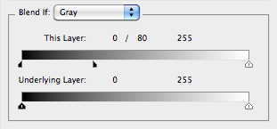
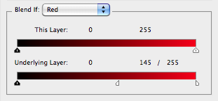

# Blend Range List Simplified Format

- Input format of `jamHelpers.toBlendRangeList`.
- Output format of `jamHelpers.fromBlendRangeList`.

## Explicit format

Defined as a JSON array of blend ranges, each one being a JSON object:

<pre>
{
    "channel": <em>channel</em>,
    "srcBlackMin": <em>srcBlackMin</em>,
    "srcBlackMax": <em>srcBlackMax</em>,
    "srcWhiteMin": <em>srcWhiteMin</em>,
    "srcWhiteMax": <em>srcWhiteMax</em>,
    "destBlackMin": <em>destBlackMin</em>,
    "destBlackMax": <em>destBlackMax</em>,
    "destWhiteMin": <em>destWhiteMin</em>,
    "destWhiteMax": <em>destWhiteMax</em>
}
</pre>

> *channel* : string
> <br>
> *srcBlackMin* : number (0 to 255)
> <br>
> *srcBlackMax* : number (0 to 255)
> <br>
> *srcWhiteMin* : number (0 to 255)
> <br>
> *srcWhiteMax* : number (0 to 255)
> <br>
> *destBlackMin* : number (0 to 255)
> <br>
> *destBlackMax* : number (0 to 255)
> <br>
> *destWhiteMin* : number (0 to 255)
> <br>
> *destWhiteMax* : number (0 to 255)

## Minimal format

Defined as a JSON array of blend ranges, each one being a nine-element JSON array:

<pre>
[
    <em>channel</em>,
    <em>srcBlackMin</em>,
    <em>srcBlackMax</em>,
    <em>srcWhiteMin</em>,
    <em>srcWhiteMax</em>,
    <em>destBlackMin</em>,
    <em>destBlackMax</em>,
    <em>destWhiteMin</em>,
    <em>destWhiteMax</em>
]
</pre>

> *channel* : string
> <br>
> *srcBlackMin* : number (0 to 255)
> <br>
> *srcBlackMax* : number (0 to 255)
> <br>
> *srcWhiteMin* : number (0 to 255)
> <br>
> *srcWhiteMax* : number (0 to 255)
> <br>
> *destBlackMin* : number (0 to 255)
> <br>
> *destBlackMax* : number (0 to 255)
> <br>
> *destWhiteMin* : number (0 to 255)
> <br>
> *destWhiteMax* : number (0 to 255)

## Example

```json
[
    {
        "channel": "gray",
        "srcBlackMin": 0,
        "srcBlackMax": 80,
        "srcWhiteMin": 255,
        "srcWhiteMax": 255,
        "destBlackMin": 0,
        "destBlackMax": 0,
        "destWhiteMin": 255,
        "destWhiteMax": 255
    },
    {
        "channel": "red",
        "srcBlackMin": 0,
        "srcBlackMax": 0,
        "srcWhiteMin": 255,
        "srcWhiteMax": 255,
        "destBlackMin": 0,
        "destBlackMax": 0,
        "destWhiteMin": 145,
        "destWhiteMax": 255
    }
]
```

```json
[
    [ "gray", 0, 80, 255, 255, 0, 0, 255, 255 ],
    [ "red", 0, 0, 255, 255, 0, 0, 145, 255 ]
]
```




