# Blending Options Object Simplified Format

- Input format of `jamStyles.toBlendOptionsObject`.
- Output format of `jamStyles.fromBlendOptionsObject`.

Used by the following utility scripts:

- [Get Layer Style](/Utility-Scripts/Get-Layer-Style)
- [Parse Styles File](/Utility-Scripts/Parse-Styles-File)

Used also by the creative script:

- [Poster Effect Gallery](/Creative-Scripts/Poster-Effect-Gallery)

## Simplified format

Defined as a JSON object:
<pre>
{
    "mode": <em>mode</em>,
    "opacity": <em>opacity</em>,
    "fillOpacity": <em>fillOpacity</em>,
    "channelRestrictions": <em>channelRestrictions</em>,
    "knockout": <em>knockout</em>,
    "blendInterior": <em>blendInterior</em>,
    "blendClipped": <em>blendClipped</em>,
    "transparencyShapesLayer": <em>transparencyShapesLayer</em>,
    "layerMaskAsGlobalMask": <em>layerMaskAsGlobalMask</em>,
    "vectorMaskAsGlobalMask": <em>vectorMaskAsGlobalMask</em>,
    "blendRange": <em>blendRange</em>
}
</pre>

> *mode* : [optional] string (among **Blend modes**)
> <br>
> *opacity* : [optional] number (percentage; 0% to 100%)
> <br>
> *fillOpacity* : [optional] number (percentage; 0% to 100%)
> <br>
> *channelRestrictions* : [optional] JSON array of strings (among **Channels**)
> <br>
> *knockout* : [optional; `"none"` by default] string (among `"none"`, `"shallow"`, `"deep"`)
> <br>
> *blendInterior* : [optional] boolean
> <br>
> *blendClipped* : [optional; `true` by default] boolean
> <br>
> *transparencyShapesLayer* : [optional; `true` by default] boolean
> <br>
> *layerMaskAsGlobalMask* : [optional] boolean
> <br>
> *vectorMaskAsGlobalMask* : [optional] boolean
> <br>
> *blendRange* : [optional] JSON array of JSON objects in **Blend range** format

## Blend modes

- `"normal"`
- `"dissolve"`
- `"darken"`
- `"multiply"`
- `"colorBurn"`
- `"linearBurn"`
- `"darkerColor"`
- `"lighten"`
- `"screen"`
- `"colorDodge"`
- `"linearDodge"`
- `"lighterColor"`
- `"overlay"`
- `"softLight"`
- `"hardLight"`
- `"vividLight"`
- `"linearLight"`
- `"pinLight"`
- `"hardMix"`
- `"difference"`
- `"exclusion"`
- `"subtract"`
- `"divide"`
- `"hue"`
- `"saturation"`
- `"color"`
- `"luminosity"`

## Blend range

<pre>
{
    "channel": <em>channel</em>,
    "srcBlackMin": <em>srcBlackMin</em>,
    "srcBlackMax": <em>srcBlackMax</em>,
    "srcWhiteMin": <em>srcWhiteMin</em>,
    "srcWhiteMax": <em>srcWhiteMax</em>,
    "destBlackMin": <em>destBlackMin</em>,
    "destBlackMax": <em>destBlackMax</em>,
    "destWhiteMin": <em>destWhiteMin</em>,
    "destWhiteMax": <em>destWhiteMax</em>
}
</pre>

> *channel* : string (among **Channels**)
> <br>
> *srcBlackMin* : number (0 to 255)
> <br>
> *srcBlackMax* : number (0 to 255)
> <br>
> *srcWhiteMin* : number (0 to 255)
> <br>
> *srcWhiteMax* : number (0 to 255)
> <br>
> *destBlackMin* : number (0 to 255)
> <br>
> *destBlackMax* : number (0 to 255)
> <br>
> *destWhiteMin* : number (0 to 255)
> <br>
> *destWhiteMax* : number (0 to 255)

## Channels

- `"a"`
- `"b"`
- `"black"`
- `"blue"`
- `"cyan"`
- `"duotone"`
- `"gray"`
- `"green"`
- `"lightness"`
- `"magenta"`
- `"monotone"`
- `"quadtone"`
- `"red"`
- `"tritone"`
- `"yellow"`

## Default values

Whenever a blending option is not defined, a default value is always assumed, in input as well as in output.
Default values related to channels, i.e., `"channelRestrictions"` and `"blendRange"`, are specific to the document’s color space (among: CMYK, Duotone, Grayscale, Lab, RGB):

### CMYK document

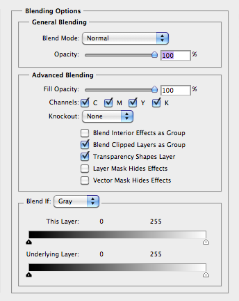

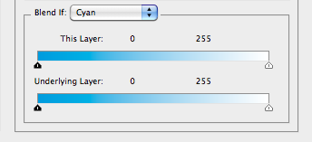

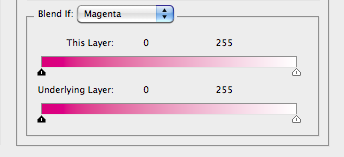

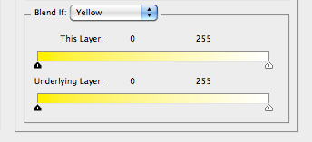

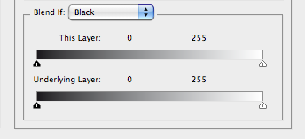

```json
{
    "mode": "normal",
    "opacity": 100,
    "fillOpacity": 100,
    "channelRestrictions":
    [
        "cyan",
        "magenta",
        "yellow",
        "black"
    ],
    "knockout": "none",
    "blendInterior": false,
    "blendClipped": true,
    "transparencyShapesLayer": true,
    "layerMaskAsGlobalMask": false,
    "vectorMaskAsGlobalMask": false,
    "blendRange":
    [
        {
            "channel": "gray",
            "srcBlackMin": 0,
            "srcBlackMax": 0,
            "srcWhiteMin": 255,
            "srcWhiteMax": 255,
            "destBlackMin": 0,
            "destBlackMax": 0,
            "destWhiteMin": 255,
            "destWhiteMax": 255
        },
        {
            "channel": "cyan",
            "srcBlackMin": 0,
            "srcBlackMax": 0,
            "srcWhiteMin": 255,
            "srcWhiteMax": 255,
            "destBlackMin": 0,
            "destBlackMax": 0,
            "destWhiteMin": 255,
            "destWhiteMax": 255
        },
        {
            "channel": "magenta",
            "srcBlackMin": 0,
            "srcBlackMax": 0,
            "srcWhiteMin": 255,
            "srcWhiteMax": 255,
            "destBlackMin": 0,
            "destBlackMax": 0,
            "destWhiteMin": 255,
            "destWhiteMax": 255
        },
        {
            "channel": "yellow",
            "srcBlackMin": 0,
            "srcBlackMax": 0,
            "srcWhiteMin": 255,
            "srcWhiteMax": 255,
            "destBlackMin": 0,
            "destBlackMax": 0,
            "destWhiteMin": 255,
            "destWhiteMax": 255
        },
        {
            "channel": "black",
            "srcBlackMin": 0,
            "srcBlackMax": 0,
            "srcWhiteMin": 255,
            "srcWhiteMax": 255,
            "destBlackMin": 0,
            "destBlackMax": 0,
            "destWhiteMin": 255,
            "destWhiteMax": 255
        }
    ]
}
```

### Duotone document

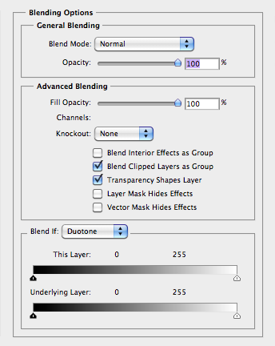

```json
{
    "mode": "normal",
    "opacity": 100,
    "fillOpacity": 100,
    "channelRestrictions":
    [
        "black"
    ],
    "knockout": "none",
    "blendInterior": false,
    "blendClipped": true,
    "transparencyShapesLayer": true,
    "layerMaskAsGlobalMask": false,
    "vectorMaskAsGlobalMask": false,
    "blendRange":
    [
        {
            "channel": "black",
            "srcBlackMin": 0,
            "srcBlackMax": 0,
            "srcWhiteMin": 255,
            "srcWhiteMax": 255,
            "destBlackMin": 0,
            "destBlackMax": 0,
            "destWhiteMin": 255,
            "destWhiteMax": 255
        }
    ]
}
```

### Grayscale document

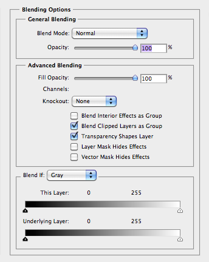

```json
{
    "mode": "normal",
    "opacity": 100,
    "fillOpacity": 100,
    "channelRestrictions":
    [
        "black"
    ],
    "knockout": "none",
    "blendInterior": false,
    "blendClipped": true,
    "transparencyShapesLayer": true,
    "layerMaskAsGlobalMask": false,
    "vectorMaskAsGlobalMask": false,
    "blendRange":
    [
        {
            "channel": "black",
            "srcBlackMin": 0,
            "srcBlackMax": 0,
            "srcWhiteMin": 255,
            "srcWhiteMax": 255,
            "destBlackMin": 0,
            "destBlackMax": 0,
            "destWhiteMin": 255,
            "destWhiteMax": 255
        }
    ]
}
```

### Lab document

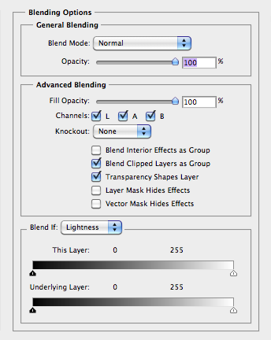

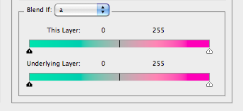

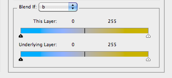

```json
{
    "mode": "normal",
    "opacity": 100,
    "fillOpacity": 100,
    "channelRestrictions":
    [
        "lightness",
        "a",
        "b"
    ],
    "knockout": "none",
    "blendInterior": false,
    "blendClipped": true,
    "transparencyShapesLayer": true,
    "layerMaskAsGlobalMask": false,
    "vectorMaskAsGlobalMask": false,
    "blendRange":
    [
        {
            "channel": "lightness",
            "srcBlackMin": 0,
            "srcBlackMax": 0,
            "srcWhiteMin": 255,
            "srcWhiteMax": 255,
            "destBlackMin": 0,
            "destBlackMax": 0,
            "destWhiteMin": 255,
            "destWhiteMax": 255
        },
        {
            "channel": "a",
            "srcBlackMin": 0,
            "srcBlackMax": 0,
            "srcWhiteMin": 255,
            "srcWhiteMax": 255,
            "destBlackMin": 0,
            "destBlackMax": 0,
            "destWhiteMin": 255,
            "destWhiteMax": 255
        },
        {
            "channel": "b",
            "srcBlackMin": 0,
            "srcBlackMax": 0,
            "srcWhiteMin": 255,
            "srcWhiteMax": 255,
            "destBlackMin": 0,
            "destBlackMax": 0,
            "destWhiteMin": 255,
            "destWhiteMax": 255
        }
    ]
}
```

### RGB document

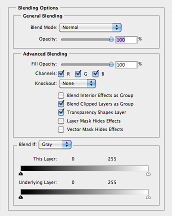

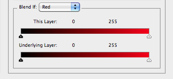

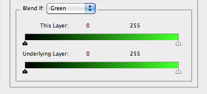

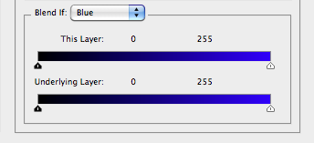

```json
{
    "mode": "normal",
    "opacity": 100,
    "fillOpacity": 100,
    "channelRestrictions":
    [
        "red",
        "green",
        "blue"
    ],
    "knockout": "none",
    "blendInterior": false,
    "blendClipped": true,
    "transparencyShapesLayer": true,
    "layerMaskAsGlobalMask": false,
    "vectorMaskAsGlobalMask": false,
    "blendRange":
    [
        {
            "channel": "gray",
            "srcBlackMin": 0,
            "srcBlackMax": 0,
            "srcWhiteMin": 255,
            "srcWhiteMax": 255,
            "destBlackMin": 0,
            "destBlackMax": 0,
            "destWhiteMin": 255,
            "destWhiteMax": 255
        },
        {
            "channel": "red",
            "srcBlackMin": 0,
            "srcBlackMax": 0,
            "srcWhiteMin": 255,
            "srcWhiteMax": 255,
            "destBlackMin": 0,
            "destBlackMax": 0,
            "destWhiteMin": 255,
            "destWhiteMax": 255
        },
        {
            "channel": "green",
            "srcBlackMin": 0,
            "srcBlackMax": 0,
            "srcWhiteMin": 255,
            "srcWhiteMax": 255,
            "destBlackMin": 0,
            "destBlackMax": 0,
            "destWhiteMin": 255,
            "destWhiteMax": 255
        },
        {
            "channel": "blue",
            "srcBlackMin": 0,
            "srcBlackMax": 0,
            "srcWhiteMin": 255,
            "srcWhiteMax": 255,
            "destBlackMin": 0,
            "destBlackMax": 0,
            "destWhiteMin": 255,
            "destWhiteMax": 255
        }
    ]
}
```

## Examples

```json
{
    "fillOpacity": 70,
    "blendInterior": true
}
```

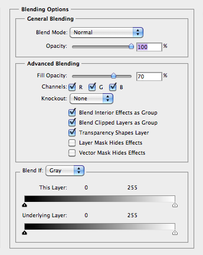

```json
{
    "mode": "colorDodge",
    "opacity": 75,
    "fillOpacity": 50,
    "channelRestrictions":
    [
        "red",
        "blue"
    ],
    "knockout": "shallow",
    "blendInterior": true,
    "blendClipped": false,
    "transparencyShapesLayer": false,
    "layerMaskAsGlobalMask": true,
    "vectorMaskAsGlobalMask": true,
    "blendRange":
    [
        {
            "channel": "gray",
            "srcBlackMin": 10,
            "srcBlackMax": 20,
            "srcWhiteMin": 255,
            "srcWhiteMax": 255,
            "destBlackMin": 0,
            "destBlackMax": 0,
            "destWhiteMin": 235,
            "destWhiteMax": 245
        },
        {
            "channel": "red",
            "srcBlackMin": 80,
            "srcBlackMax": 80,
            "srcWhiteMin": 255,
            "srcWhiteMax": 255,
            "destBlackMin": 0,
            "destBlackMax": 0,
            "destWhiteMin": 255,
            "destWhiteMax": 255
        },
        {
            "channel": "green",
            "srcBlackMin": 0,
            "srcBlackMax": 0,
            "srcWhiteMin": 255,
            "srcWhiteMax": 255,
            "destBlackMin": 0,
            "destBlackMax": 0,
            "destWhiteMin": 160,
            "destWhiteMax": 255
        },
        {
            "channel": "blue",
            "srcBlackMin": 0,
            "srcBlackMax": 0,
            "srcWhiteMin": 255,
            "srcWhiteMax": 255,
            "destBlackMin": 80,
            "destBlackMax": 80,
            "destWhiteMin": 255,
            "destWhiteMax": 255
        }
    ]
}
```

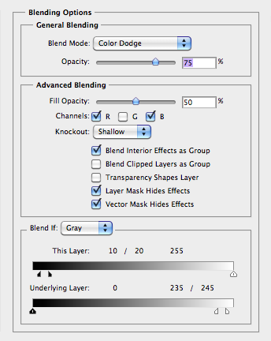

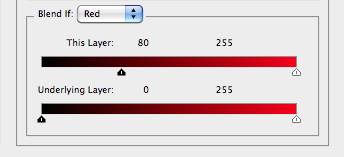

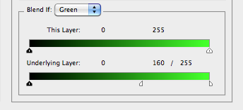

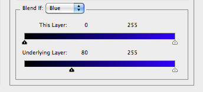
