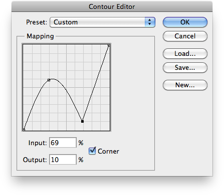

# Curve Point List Simplified Format

- Input format of `jamHelpers.toCurvePointList`.
- Output format of `jamHelpers.fromCurvePointList`.

## Explicit format

Defined as a JSON array of curve points, each one being a JSON object:

<pre>
{
    "horizontal": <em>horizontal</em>,
    "vertical": <em>vertical</em>,
    "continuity": <em>continuity</em>
}
</pre>

> *horizontal* : number (0 to 255)
> <br>
> *vertical* : number (0 to 255)
> <br>
> *continuity* : boolean (optional, `true` by default)

## Minimal format

Defined as a JSON array of curve points, each one being a three-element JSON array:

<pre>
[ <em>horizontal</em>, <em>vertical</em>, <em>continuity</em> ]
</pre>

> *horizontal* : number (0 to 255)
> <br>
> *vertical* : number (0 to 255)
> <br>
> *continuity* : boolean (optional, `true` by default)

## Example

```json
[
    { "horizontal": 0, "vertical": 0 },
    { "horizontal": 75, "vertical": 150 },
    { "horizontal": 175, "vertical": 25, "continuity": false },
    { "horizontal": 255, "vertical": 255 }
]
```

```json
[ [ 0, 0 ], [ 75, 150 ], [ 175, 25, false ], [ 255, 255 ] ]
```


