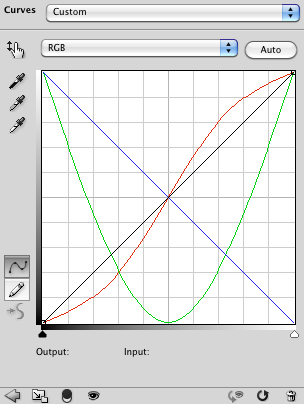
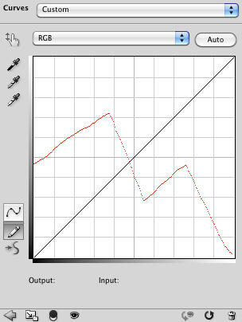

# Curves Adjustment List Simplified Format

- Input format of `jamHelpers.toCurvesAdjustmentList`.

## Simplified format

Defined as a JSON array of curves adjustments, each one being a two-element JSON array:

<pre>
[ <em>channel</em>, <em>curve</em> ]
</pre>

> *channel* : string
> <br>
> *curve* : two-element JSON array: <code>[ <em>curveType</em>, <em>curveValue</em> ]</code>

> > *curveType* : string (either `"curve"` or `"mapping"`)
> > <br>
> > *curveValue* : JSON array whose length and contents depend on *curveType* :

*curveType* | *curveValue*
------------|-------------
`"curve"` | JSON array of points, each one being a two-element JSON array: <code>[ <em>horizontal</em>, <em>vertical</em> ]</code>
`"mapping"` | JSON array of 256 numbers (0 to 255)

> *horizontal* : number (0 to 255)
> <br>
> *vertical* : number (0 to 255)

## Examples

```json
[
    [ "red", [ "curve", [ [ 0, 0 ], [ 77, 51 ], [ 178, 204 ], [ 255, 255 ] ] ] ],
    [ "green", [ "curve", [ [ 0, 255 ], [ 127, 0 ], [ 255, 255 ] ] ] ],
    [ "blue", [ "curve", [ [ 0, 255 ], [ 255, 0 ] ] ] ]
]
```



```json
[
    [
        "red",
        [
            "mapping",
            [
                120, 121, 121, 122, 122, 123, 124, 124,
                125, 126, 126, 127, 128, 128, 129, 130,
                131, 131, 132, 133, 134, 135, 136, 136,
                137, 138, 139, 140, 141, 142, 143, 143,
                144, 145, 146, 147, 148, 148, 149, 150,
                151, 151, 152, 153, 154, 154, 155, 155,
                156, 157, 157, 158, 158, 159, 160, 160,
                161, 162, 162, 163, 164, 164, 165, 165,
                166, 166, 167, 167, 167, 168, 168, 169,
                169, 170, 171, 172, 172, 173, 173, 173,
                174, 175, 176, 177, 178, 179, 180, 180,
                181, 182, 183, 183, 183, 184, 185, 185,
                186, 186, 186, 183, 182, 180, 177, 175,
                171, 168, 163, 162, 160, 158, 156, 153,
                152, 149, 147, 144, 143, 140, 138, 135,
                133, 130, 127, 124, 121, 117, 116, 114,
                112, 109, 105, 103, 101,  99,  97,  94,
                 93,  90,  87,  83,  81,  76,  74,  74,
                 75,  76,  77,  78,  79,  80,  81,  82, 
                 82,  83,  84,  85,  86,  87,  88,  90,
                 91,  92,  93,  94,  95,  96,  96,  97, 
                 98,  99,  99, 100, 101, 102, 103, 104,
                104, 105, 106, 107, 108, 109, 110, 111,
                112, 113, 114, 114, 115, 115, 116, 116,
                117, 117, 118, 119, 119, 118, 116, 112, 
                111, 109, 107, 106, 103, 101,  99,  97,
                 94,  91,  90,  87,  85,  83,  80,  77, 
                 76,  74,  72,  71,  69,  66,  65,  63,
                 60,  58,  56,  53,  52,  50,  49,  47, 
                 45,  44,  41,  39,  37,  34,  31,  30,
                 28,  26,  23,  22,  20,  17,  15,  15, 
                 14,  12,  11,  10,   8,   8,   7,   6
            ]
        ]
    ]
]
```


