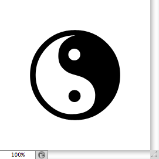

# Custom Shape Object Simplified Format

- Input format of `jamHelpers.toCustomShapeObject`.

## Simplified format

Defined as a two-element JSON array: <code>[ <em>customShape</em>, <em>unit</em> ]</code>

> *customShape* : five-element JSON array: <code>[ <em>name</em>, <em>left</em>, <em>top</em>, <em>right</em>, <em>bottom</em> ]</code>
> <br>
> *unit* : string (among `"distanceUnit"`, `"percentUnit"`, `"pixelsUnit"`)

> > *name* : string
> > <br>
> > *left* : number
> > <br>
> > *top* : number
> > <br>
> > *right* : number
> > <br>
> > *bottom* : number

## Example

```json
[ [ "Yin Yang", 20, 20, 80, 80 ], "percentUnit" ]
```


