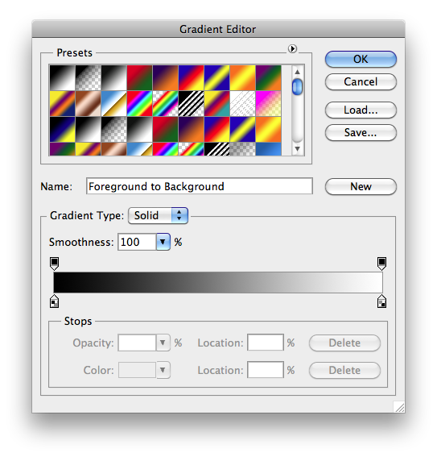
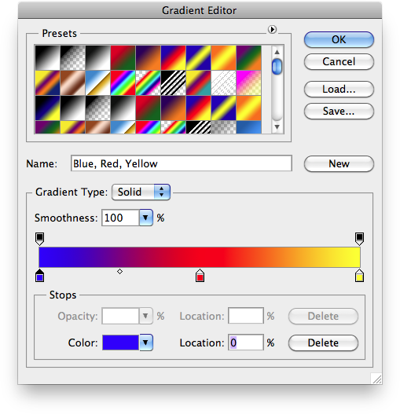
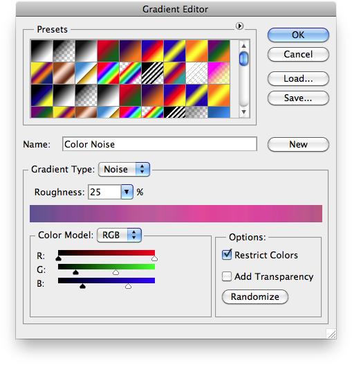

# Gradient Object Simplified Format

- Input format of `jamHelpers.toGradientObject`.
- Output format of `jamHelpers.fromGradientObject`.

Used by the following utility scripts:

- [Generate Gradients File](/Utility-Scripts/Generate-Gradients-File)
- [Get Current Gradient](/Utility-Scripts/Get-Current-Gradient)
- [Parse Gradients File](/Utility-Scripts/Parse-Gradients-File)

## Explicit format

### Solid gradient

Defined as a JSON object:

<pre>
{
    "name": <em>name</em>,
    "gradientForm": "customStops",
    "interpolation": <em>interpolation</em>,
    "colors": <em>colors</em>,
    "transparency": <em>transparency</em>
}
</pre>

> *name* : string (or `null` in input)
> <br>
> *interpolation* : number (0 to 4096)
> <br>
> *colors* : JSON array of JSON objects in **Color stop** format
> <br>
> *transparency*: [optional in input] JSON array of JSON objects in **Transparency stop** format

#### Color stop

<pre>
{
    "location": <em>location</em>,
    "midpoint": <em>midpoint</em>,
    "type": <em>type</em>,
    "color": <em>color</em>
}
</pre>

> *location* : number (0 to 4096)
> <br>
> *midpoint* : number (percentage; 0% to 100%)
> <br>
> *type* : string (among `"foregroundColor"`, `"backgroundColor"`, `"userStop"`)
> <br>
> *color* : [optional, only if *type* is `"userStop"`] JSON object in [Color Object Simplified Format](/JSON-Simplified-Formats/Color-Object-Simplified-Format)

#### Transparency stop

<pre>
{
    "location": <em>location</em>,
    "midpoint": <em>midpoint</em>,
    "opacity": <em>opacity</em>
}
</pre>

> *location* : number (0 to 4096)
> <br>
> *midpoint* : number (percentage; 0% to 100%)
> <br>
> *opacity* : number (percentage; 0% to 100%)

### Noise gradient

Defined as a JSON object:

<pre>
{
    "name": <em>name</em>,
    "gradientForm": "colorNoise",
    "randomSeed": <em>randomSeed</em>,
    "showTransparency": <em>showTransparency</em>,
    "vectorColor": <em>vectorColor</em>,
    "smoothness": <em>smoothness</em>,
    "colorSpace": <em>colorSpace</em>,
    "minimum": <em>minimum</em>,
    "maximum": <em>maximum</em>
}
</pre>

> *name* : string (or `null` in input)
> <br>
> *randomSeed* : number
> <br>
> *showTransparency* : boolean
> <br>
> *vectorColor* : boolean
> <br>
> *smoothness* : number (0 to 4096)
> <br>
> *colorSpace* : string (`"RGBColor"` or `"HSBColorEnum"` or `"labColor"`)
> <br>
> *minimum* : JSON array of four numbers, i.e., three color components (0 to 100) + transparency (0)
> <br>
> *maximum* : JSON array of four numbers, i.e., three color components (0 to 100) + transparency (100)

## Minimal format

### Solid gradient

Defined as a five-element JSON array:

<pre>
[
    <em>name</em>,
    "customStops",
    <em>interpolation</em>,
    <em>colors</em>,
    <em>transparency</em>
]
</pre>

> *name* : string (or `null` in input)
> <br>
> *interpolation* : number (0 to 4096)
> <br>
> *colors* : JSON array of **Color stops**
> <br>
> *transparency* : [optional in input] JSON array of **Transparency stops**

A **Color stop** is defined as a JSON array of three or four elements:

*type* | value
-------|------
`"foregroundColor"`<br>`"backgroundColor"`| <code>[ <em>location</em>, <em>midpoint</em>, <em>type</em> ]</code>
`"userStop"` | <code>[ <em>location</em>, <em>midpoint</em>, <em>type</em>, <em>color</em> ]</code>

> *location* : number (0 to 4096)
> <br>
> *midpoint* : number (percentage; 0% to 100%)
> <br>
> *type* : string (among `"foregroundColor"`, `"backgroundColor"`, `"userStop"`)
> <br>
> *color* : [optional, only if *type* is `"userStop"`] JSON array in [Color Object Simplified Format](/JSON-Simplified-Formats/Color-Object-Simplified-Format)

A **Transparency stop** is defined as a JSON array of three elements:

<pre>
[ <em>location</em>, <em>midpoint</em>, <em>opacity </em>]
</pre>

> *location* : number (0 to 4096)
> <br>
> *midpoint* : number (percentage; 0% to 100%)
> <br>
> *opacity* : number (percentage; 0% to 100%)

### Noise gradient

Defined as a nine-element JSON array:

<pre>
[
    <em>name</em>,
    "colorNoise",
    <em>randomSeed</em>,
    <em>showTransparency</em>,
    <em>vectorColor</em>,
    <em>smoothness</em>,
    <em>colorSpace</em>,
    <em>minimum</em>,
    <em>maximum</em>
]
</pre>

> *name* : string (or `null` in input)
> <br>
> *randomSeed* : number
> <br>
> *showTransparency* : boolean
> <br>
> *vectorColor* : boolean
> <br>
> *smoothness* : number (0 to 4096)
> <br>
> *colorSpace* : string (`"RGBColor"` or `"HSBColorEnum"` or `"labColor"`)
> <br>
> *minimum* : JSON array of four numbers, i.e., three color components (0 to 100) + transparency (0)
> <br>
> *maximum* : JSON array of four numbers, i.e., three color components (0 to 100) + transparency (100)

## Notes

- The two different kinds of gradients (and their corresponding format) are automatically discriminated based on the value of the element *gradientForm*: either `"customStops"` or `"colorNoise"`.

- *interpolation*, *location* and *smoothness* have values between 0 and 4096 whereas they are expressed as percentages (0% to 100%) in the gradient editor dialog.

## Examples

```json
{
    "name": "Foreground to Background",
    "gradientForm": "customStops",
    "interpolation": 4096,
    "colors":
    [
        { "location": 0, "midpoint": 50, "type": "foregroundColor" },
        { "location": 4096, "midpoint": 50, "type": "backgroundColor" }
    ],
    "transparency":
    [
        { "location": 0, "midpoint": 50, "opacity": 100 },
        { "location": 4096, "midpoint": 50, "opacity": 100 }
    ]
}
```

```json
[
    "Foreground to Background",
    "customStops",
    4096,
    [
        [ 0, 50, "foregroundColor" ],
        [ 4096, 50, "backgroundColor" ]
    ],
    [
        [ 0, 50, 100 ],
        [ 4096, 50, 100 ]
    ]
]
```



```json
{
    "name": "Blue, Red, Yellow",
    "gradientForm": "customStops",
    "interpolation": 4096,
    "colors":
    [
        {
            "location": 0, "midpoint": 50, "type": "userStop",
            "color": { "hue": 240, "saturation": 100, "brightness": 100 }
        },
        {
            "location": 2048, "midpoint": 50, "type": "userStop",
            "color": { "hue": 0, "saturation": 100, "brightness": 100 }
        },
        {
            "location": 4096, "midpoint": 50, "type": "userStop",
            "color": { "hue": 60, "saturation": 100, "brightness": 100 }
        }
    ],
    "transparency":
    [
        { "location": 0, "midpoint": 50, "opacity": 100 },
        { "location": 4096, "midpoint": 50, "opacity": 100 }
    ]
}
```

```json
[
    "Blue, Red, Yellow",
    "customStops",
    4096,
    [
        [ 0, 50, "userStop", [ "HSBColorClass", [ 240, 100, 100 ] ] ],
        [ 2048, 50, "userStop", [ "HSBColorClass", [ 0, 100, 100 ] ] ],
        [ 4096, 50, "userStop", [ "HSBColorClass", [ 60, 100, 100 ] ] ]
    ],
    [
        [ 0, 50, 100 ],
        [ 4096, 50, 100 ]
    ]
]
```



```json
{
    "name": "Color Noise",
    "gradientForm": "colorNoise",
    "randomSeed": 345807450,
    "showTransparency": false,
    "vectorColor": true,
    "smoothness": 1024,
    "colorSpace": "RGBColor",
    "minimum": [ 0, 18, 25, 0 ],
    "maximum": [ 100, 60, 73, 100 ]
}
```

```json
[
    "Color Noise",
    "colorNoise",
    345807450,
    false,
    true,
    1024,
    "RGBColor",
    [ 0, 18, 25, 0 ],
    [ 100, 60, 73, 100 ]
]
```


