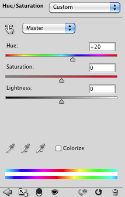
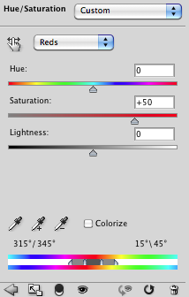
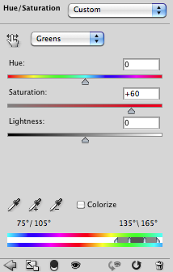

# Hue/Saturation Adjustment List Simplified Format

- Input format of `jamHelpers.toHueSatAdjustmentV2List`.

## Simplified format

Defined as a JSON array of hue/saturation adjustments, each one being a JSON array of three or eight elements:

type | value
-----|------
**master** | <code>[ <em>hue</em>, <em>saturation</em>, <em>lightness</em> ]</code>
**local&nbsp;range** | <code>[ <em>localRange</em>, <em>beginRamp</em>, <em>beginSustain</em>, <em>endSustain</em>, <em>endRamp</em>, <em>hue</em>, <em>saturation</em>, <em>lightness</em> ]</code>

> *hue* : number (-180 to 180, or 0 to 360 if *colorize*)
> <br>
> *saturation* : number (-100 to 100, or 0 to 100 if *colorize*)
> <br>
> *lightness* : number (-100 to 100)

> *localRange* : number (1 for reds, 2 for yellows, 3 for greens, 4 for cyans, 5 for blues, 6 for magentas)
> <br>
> *beginRamp* : number (0 to 360)
> <br>
> *beginSustain* : number (0 to 360)
> <br>
> *endSustain* : number (0 to 360)
> <br>
> *endRamp* : number (0 to 360)

## Example

```json
[
    [ 20, 0, 0 ],
    [ 1, 315, 345, 15, 45, 0, 50, 0 ],
    [ 3, 75, 105, 135, 165, 0, 60, 0 ]
]
```




