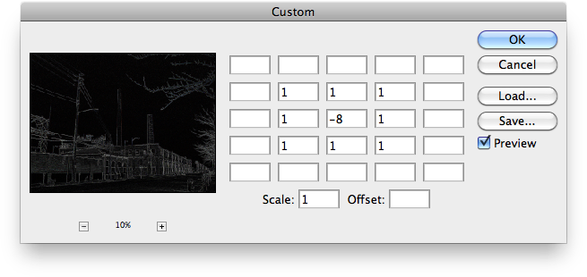

# Integer List Simplified Format

- Input format of `jamHelpers.toIntegerList`.
- Output format of `jamHelpers.fromIntegerList`.

## Simplified format

Defined as a JSON array of numbers (integers).

## Example

```json
[
    0,  0,  0,  0,  0,
    0,  1,  1,  1,  0,
    0,  1, -8,  1,  0,
    0,  1,  1,  1,  0,
    0,  0,  0,  0,  0
]
```


