# Layer Effects Object Simplified Format

- Input format of `jamStyles.toLayerEffectsObject`.
- Output format of `jamStyles.fromLayerEffectsObject`.

Used by the following utility scripts:

- [Get Layer Style](/Utility-Scripts/Get-Layer-Style)
- [Parse Styles File](/Utility-Scripts/Parse-Styles-File)

Used also by the creative script:

- [Poster Effect Gallery](/Creative-Scripts/Poster-Effect-Gallery)

## Simplified format

Defined as a JSON object:

<pre>
{
    "scale": <em>scale</em>,
    "bevelEmboss": <em>bevelEmboss</em>,
    "frameFX": <em>frameFX</em>,
    "innerShadow": <em>innerShadow</em>,
    "innerGlow": <em>innerGlow</em>,
    "chromeFX": <em>chromeFX</em>,
    "solidFill": <em>solidFill</em>,
    "gradientFill": <em>gradientFill</em>,
    "patternFill": <em>patternFill</em>,
    "outerGlow": <em>outerGlow</em>,
    "dropShadow": <em>dropShadow</em>
}
</pre>

> *scale* : number (percentage)

> *bevelEmboss* : [optional] JSON object in **Bevel and emboss** format
> <br>
> *frameFX* : [optional] JSON object in **Stroke** format
> <br>
> *innerShadow* : [optional] JSON object in **Inner shadow** format
> <br>
> *innerGlow* : [optional] JSON object in **Inner glow** format
> <br>
> *chromeFX* : [optional] JSON object in **Satin** format
> <br>
> *solidFill* : [optional] JSON object in **Color overlay** format
> <br>
> *gradientFill* : [optional] JSON object in **Gradient overlay** format
> <br>
> *patternFill* : [optional] JSON object in **Pattern overlay** format
> <br>
> *outerGlow* : [optional] JSON object in **Outer glow** format
> <br>
> *dropShadow* : [optional] JSON object in **Drop shadow** format

## Bevel and emboss

<pre>
{
    "enabled": <em>enabled</em>,
    "bevelStyle": <em>bevelStyle</em>,
    "bevelTechnique": <em>bevelTechnique</em>,
    "strengthRatio": <em>strengthRatio</em>,
    "bevelDirection": <em>bevelDirection</em>,
    "blur": <em>blur</em>,
    "softness": <em>softness</em>,
    "localLightingAngle": <em>localLightingAngle</em>,
    "useGlobalAngle": <em>useGlobalAngle</em>,
    "localLightingAltitude": <em>localLightingAltitude</em>,
    "transparencyShape": <em>transparencyShape</em>,
    "antialiasGloss": <em>antialiasGloss</em>,
    "highlightMode": <em>highlightMode</em>,
    "highlightColor": <em>highlightColor</em>,
    "highlightOpacity": <em>highlightOpacity</em>,
    "shadowMode": <em>shadowMode</em>,
    "shadowColor": <em>shadowColor</em>,
    "shadowOpacity": <em>shadowOpacity</em>,
    "useShape": <em>useShape</em>,
    "mappingShape": <em>mappingShape</em>,
    "antiAlias": <em>antiAlias</em>,
    "inputRange": <em>inputRange</em>,
    "useTexture": <em>useTexture</em>,
    "pattern": <em>pattern</em>,
    "phase": <em>phase</em>,
    "scale": <em>scale</em>,
    "textureDepth": <em>textureDepth</em>,
    "invertTexture": <em>invertTexture</em>,
    "align": <em>align</em>
}
</pre>

> *enabled* : boolean (optional in input; `true` by default)

> *bevelStyle* : string (among `"outerBevel"`, `"innerBevel"`, `"emboss"`, `"pillowEmboss"`, `"strokeEmboss"`)
> <br>
> *bevelTechnique* : string (among `"softMatte"`, `"preciseMatte"`, `"slopeLimitMatte"`)
> <br>
> *strengthRatio* : number (percentage; 1% to 1000%)
> <br>
> *bevelDirection* : string (either `"stampIn"` or `"stampOut"`)
> <br>
> *blur* : number (0 to 250 pixels)
> <br>
> *softness* : number (0 to 16 pixels)
> <br>
> *localLightingAngle* : number (-180° to 180°)
> <br>
> *useGlobalAngle* : boolean
> <br>
> *localLightingAltitude* : number (0° to 90°)
> <br>
> *transparencyShape* : JSON object in **Shaping curve** format
> <br>
> *antialiasGloss* : boolean
> <br>
> *highlightMode* : string (among **Blend modes**)
> <br>
> *highlightColor* : JSON object in **Color** format
> <br>
> *highlightOpacity* : number (percentage; 0% to 100%)
> <br>
> *shadowMode* : string (among **Blend** modes)
> <br>
> *shadowColor* : JSON object in **Color** format
> <br>
> *shadowOpacity* : number (percentage; 0% to 100%)

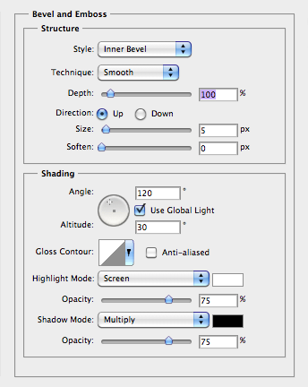

> *useShape* : boolean
> <br>
> *mappingShape* : [optional; only if *useShape* is `true`] JSON object in **Shaping curve** format
> <br>
> *antiAlias* : [optional; only if *useShape* is `true`] boolean
> <br>
> *inputRange* : [optional; only if *useShape* is `true`] number (percentage; 0% to 100%)

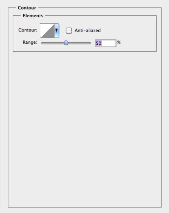

> *useTexture* : boolean
> <br>
> *pattern* : [optional; only if *useTexture* is `true`] JSON object in **Pattern** format
> <br>
> *phase* : [optional; only if *useTexture* is `true`] JSON object in **Point** format
> <br>
> *scale* : [optional; only if *useTexture* is `true`] number (percentage; 1% to 1000%)
> <br>
> *textureDepth* : [optional; only if *useTexture* is `true`] number (percentage; -1000% to +1000%)
> <br>
> *invertTexture* : [optional; only if *useTexture* is `true`] boolean
> <br>
> *align* : [optional; only if *useTexture* is `true`] boolean

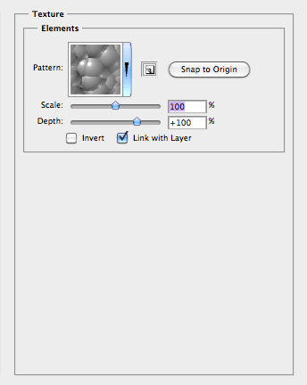

## Stroke

<pre>
{
    "enabled": <em>enabled</em>,
    "size": <em>size</em>,
    "style": <em>style</em>,
    "mode": <em>mode</em>,
    "opacity": <em>opacity</em>,
    "paintType": <em>paintType</em>,
    "color": <em>color</em>,
    "gradient": <em>gradient</em>,
    "reverse": <em>reverse</em>,
    "type": <em>type</em>,
    "align": <em>align</em>,
    "angle": <em>angle</em>,
    "dither": <em>dither</em>,
    "scale": <em>scale</em>,
    "offset": <em>offset</em>,
    "pattern": <em>pattern</em>,
    "phase": <em>phase</em>,
    <s>"scale": <em>scale</em>,</s>
    "linked": <em>linked</em>
}
</pre>

> *enabled* : boolean (optional in input; `true` by default)

> *size* : number (1 to 250 pixels)
> <br>
> *style* : string (among `"outsetFrame"`, `"insetFrame"`, `"centeredFrame"`)
> <br>
> *mode* : string (among **Blend modes**)
> <br>
> *opacity* : number (percentage; 0% to 100%)
> <br>
> *paintType* : string (among `"solidColor"`, `"gradientFill"`, `"pattern"`)

> *color* : [optional; only if *paintType* is `"solidColor"`] JSON object in **Color** format

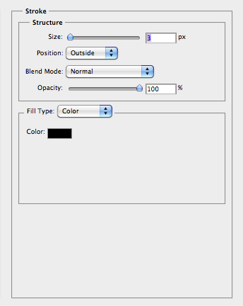

> *gradient* : [optional; only if *paintType* is `"gradientFill"`] JSON object in **Gradient** format
> <br>
> *reverse* : [optional; only if *paintType* is `"gradientFill"`] boolean
> <br>
> *type* : [optional; only if *paintType* is `"gradientFill"`] string (among `"linear"`, `"radial"`, `"angle"`, `"reflected"`, `"diamond"`, `"shapeburst"`)
> <br>
> *align* : [optional; only if *paintType* is `"gradientFill"`] boolean
> <br>
> *angle* : [optional; only if *paintType* is `"gradientFill"`] number (-180° to 180°)
> <br>
> *dither* : [optional; only from CS6; only if *paintType* is `"gradientFill"`] boolean
> <br>
> *scale* : [optional; only if *paintType* is `"gradientFill"`] number (percentage; 10% to 150%)
> <br>
> *offset* : [optional; only if *paintType* is `"gradientFill"`] JSON object in **Point** format

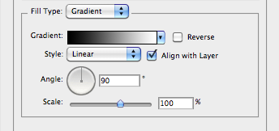

> *pattern* : [optional; only if *paintType* is `"pattern"`] JSON object in **Pattern** format
> <br>
> *phase* : [optional; only if *paintType* is `"pattern"`] JSON object in **Point** format
> <br>
> *scale* : [optional; only if *paintType* is `"pattern"`] number (percentage; 1% to 1000%)
> <br>
> *linked* : [optional; only if *paintType* is `"pattern"`] boolean

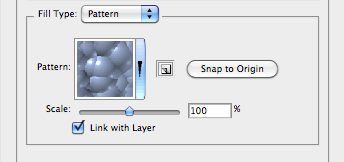

## Inner shadow

<pre>
{
    "enabled": <em>enabled</em>,
    "mode": <em>mode</em>,
    "color": <em>color</em>,
    "opacity": <em>opacit</em>,
    "localLightingAngle": <em>localLightingAngle</em>,
    "useGlobalAngle": <em>useGlobalAngle</em>,
    "distance": <em>distance</em>,
    "chokeMatte": <em>chokeMatte</em>,
    "blur": <em>blur</em>,
    "transparencyShape": <em>transparencyShape</em>,
    "antiAlias": <em>antiAlias</em>,
    "noise": <em>noise</em>
}
</pre>

> *enabled* : boolean (optional in input; `true` by default)

> *mode* : string (among **Blend modes**)
> <br>
> *color* : JSON object in **Color** format
> <br>
> *opacity* : number (percentage; 0% to 100%)
> <br>
> *localLightingAngle* : number (-180° to 180°)
> <br>
> *useGlobalAngle* : boolean
> <br>
> *distance* : number (0 to 30000 pixels)
> <br>
> *chokeMatte* : number (percentage; 0% to 100%)
> <br>
> *blur* : number (0 to 250 pixels)
> <br>
> *transparencyShape* : JSON object in **Shaping curve** format
> <br>
> *antiAlias* : boolean
> <br>
> *noise* : number (percentage; 0% to 100%)


## Inner glow

<pre>
{
    "enabled": <em>enabled</em>,
    "mode": <em>mode</em>,
    "opacity": <em>opacity</em>,
    "noise": <em>noise</em>,
    "color": <em>color</em>,
    "gradient": <em>gradient</em>,
    "glowTechnique": <em>glowTechnique</em>,
    "innerGlowSource": <em>innerGlowSource</em>,
    "chokeMatte": <em>chokeMatte</em>,
    "blur": <em>blur</em>,
    "transparencyShape": <em>transparencyShape</em>,
    "antiAlias": <em>antiAlias</em>,
    "inputRange": <em>inputRange</em>,
    "shadingNoise": <em>shadingNoise</em>
}
</pre>

> *enabled* : boolean (optional in input; `true` by default)

> *mode* : string (among **Blend modes**)
> <br>
> *opacity* : number (percentage; 0% to 100%)
> <br>
> *noise* : number (percentage; 0% to 100%)
> <br>
> *color* : [optional; only if *gradient* is not defined] JSON object in **Color** format
> <br>
> *gradient* : [optional; only if *color* is not defined] JSON object in **Gradient** format
> <br>
> *glowTechnique* : string (either `"softMatte"` or `"preciseMatte"`)
> <br>
> *innerGlowSource* : string (either `"centerGlow"` or `"edgeGlow"`)
> <br>
> *chokeMatte* : number (percentage; 0% to 100%)
> <br>
> *blur* : number (0 to 250 pixels)
> <br>
> *transparencyShape* : JSON object in **Shaping curve** format
> <br>
> *antiAlias* : boolean
> <br>
> *inputRange* : number (percentage; 1% to 100%)
> <br>
> *shadingNoise* : number (percentage; 0% to 100%)

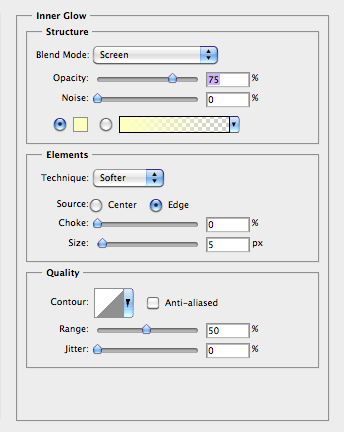

## Satin

<pre>
{
    "enabled": <em>enabled</em>,
    "mode": <em>mode</em>,
    "color": <em>color</em>,
    "opacity": <em>opacity</em>,
    "localLightingAngle": <em>localLightingAngle</em>,
    "distance": <em>distance</em>,
    "blur": <em>blur</em>,
    "mappingShape": <em>mappingShape</em>,
    "antiAlias": <em>antiAlias</em>,
    "invert": <em>invert</em>
}
</pre>

> *enabled* : boolean (optional in input; `true` by default)

> *mode* : string (among **Blend modes**)
> <br>
> *color* : JSON object in **Color** format
> <br>
> *opacity* : number (percentage; 0% to 100%)
> <br>
> *localLightingAngle* : number (-180° to 180°)
> <br>
> *distance* : number (1 to 250 pixels)
> <br>
> *blur* : number (0 to 250 pixels)
> <br>
> *mappingShape* : JSON object in **Shaping curve** format
> <br>
> *antiAlias* : boolean
> <br>
> *invert* : boolean

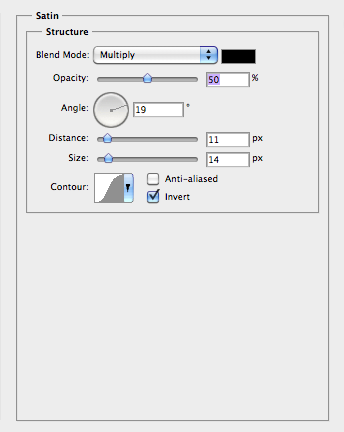

## Color overlay

<pre>
{
    "enabled": <em>enabled</em>,
    "mode": <em>mode</em>,
    "color": <em>color</em>,
    "opacity": <em>opacity</em>
}
</pre>

> *enabled* : boolean (optional in input; `true` by default)

> *mode* : string (among **Blend modes**)
> <br>
> *color* : JSON object in **Color** format
> <br>
> *opacity* : number (percentage; 0% to 100%)

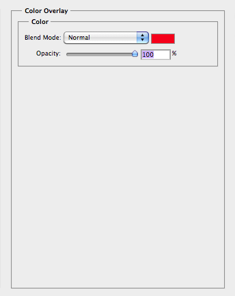

## Gradient overlay

<pre>
{
    "enabled": <em>enabled</em>,
    "mode": <em>mode</em>,
    "dither": <em>dither</em>,
    "opacity": <em>opacity</em>,
    "gradient": <em>gradient</em>,
    "reverse": <em>reverse</em>,
    "type": <em>type</em>,
    "align": <em>align</em>,
    "angle": <em>angle</em>,
    "scale": <em>scale</em>,
    "offset": <em>offset</em>
}
</pre>

> *enabled* : boolean (optional in input; `true` by default)

> *mode* : string (among **Blend modes**)
> <br>
> *dither* : [optional; only from CS6] boolean
> <br>
> *opacity* : number (percentage; 0% to 100%)
> <br>
> *gradient* : JSON object in **Gradient** format
> <br>
> *reverse* : boolean
> <br>
> *type* : string (among `"linear"`, `"radial"`, `"angle"`, `"reflected"`, `"diamond"`)
> <br>
> *align* : boolean
> <br>
> *angle* : number (-180° to 180°)
> <br>
> *scale* : number (percentage; 10% to 150%)
> <br>
> *offset* : JSON object in **Point** format

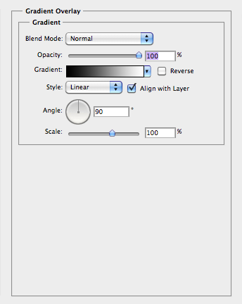

## Pattern overlay

<pre>
{
    "enabled": <em>enabled</em>,
    "mode": <em>mode</em>,
    "opacity": <em>opacity</em>,
    "pattern": <em>pattern</em>,
    "phase": <em>phase</em>,
    "scale": <em>scale</em>,
    "align": <em>align</em>
}
</pre>

> *enabled* : boolean (optional in input; `true` by default)

> *mode* : string (among **Blend modes**)
> <br>
> *opacity* : number (percentage; 0% to 100%)
> <br>
> *pattern* : JSON object in **Pattern** format
> <br>
> *phase* : JSON object in **Point** format
> <br>
> *scale* : number (percentage; 1% to 1000%)
> <br>
> *align* : boolean

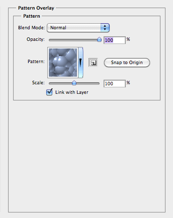

## Outer glow

<pre>
{
    "enabled": <em>enabled</em>,
    "mode": <em>mode</em>,
    "opacity": <em>opacity</em>,
    "noise": <em>noise</em>,
    "color": <em>color</em>,
    "gradient": <em>gradient</em>,
    "glowTechnique": <em>glowTechnique</em>,
    "chokeMatte": <em>chokeMatte</em>,
    "blur": <em>blur</em>,
    "transparencyShape": <em>transparencyShape</em>,
    "antiAlias": <em>antiAlias</em>,
    "inputRange": <em>inputRange</em>,
    "shadingNoise": <em>shadingNoise</em>
}
</pre>

> *enabled* : boolean (optional in input; `true` by default)

> *mode* : string (among **Blend modes**)
> <br>
> *opacity* : number (percentage; 0% to 100%)
> <br>
> *noise* : number (percentage; 0% to 100%)
> <br>
> *color* : [optional; only if *gradient* is not defined] JSON object in **Color** format
> <br>
> *gradient* : [optional; only if *color* is not defined] JSON object in **Gradient** format
> <br>
> *glowTechnique* : string (either `"softMatte"` or `"preciseMatte"`)
> <br>
> *chokeMatte* : number (percentage; 0% to 100%)
> <br>
> *blur* : number (0 to 250 pixels)
> <br>
> *transparencyShape* : JSON object in **Shaping curve** format
> <br>
> *antiAlias* : boolean
> <br>
> *inputRange* : number (percentage; 1% to 100%)
> <br>
> *shadingNoise* : number (percentage; 0% to 100%)

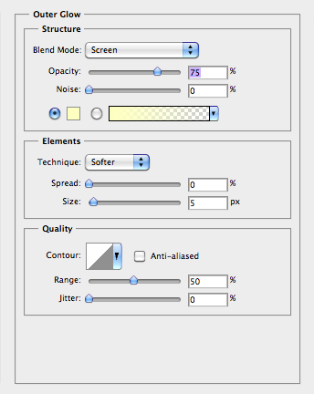

## Drop shadow

<pre>
{
    "enabled": <em>enabled</em>,
    "mode": <em>mode</em>,
    "color": <em>color</em>,
    "opacity": <em>opacity</em>,
    "localLightingAngle": <em>localLightingAngle</em>,
    "useGlobalAngle": <em>useGlobalAngle</em>,
    "distance": <em>distance</em>,
    "chokeMatte": <em>chokeMatte</em>,
    "blur": <em>blur</em>,
    "transparencyShape": <em>transparencyShape</em>,
    "antiAlias": <em>antiAlias</em>,
    "noise": <em>noise</em>,
    "layerConceals": <em>layerConceals</em>
}
</pre>

> *enabled* : boolean (optional in input; `true` by default)

> *mode* : string (among **Blend modes**)
> <br>
> *color* : JSON object in **Color** format
> <br>
> *opacity* : number (percentage; 0% to 100%)
> <br>
> *localLightingAngle* : number (-180° to 180°)
> <br>
> *useGlobalAngle* : boolean
> <br>
> *distance* : number (0 to 30000 pixels)
> <br>
> *chokeMatte* : number (percentage; 0% to 100%)
> <br>
> *blur* : number (0 to 250 pixels)
> <br>
> *transparencyShape* : JSON object in **Shaping curve** format
> <br>
> *antiAlias* : boolean
> <br>
> *noise* : number (percentage; 0% to 100%)
> <br>
> *layerConceals* : boolean

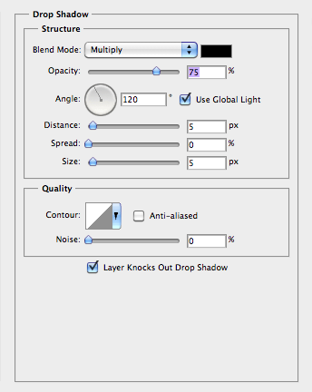

## Color

A color can be one of the following:

- **Book color**
- **CMYK color**
- **Grayscale**
- **HSB color**
- **Lab color**
- **RGB color**

### Book color

<pre>
{
    "book": <em>book</em>,
    "name": <em>name</em>,
    "bookID": <em>bookID</em>,
    "bookKey": <em>bookKey</em>
}
</pre>
or
<pre>
{
    "book": <em>book</em>,
    "name": <em>name</em>
}
</pre>
or
<pre>
{
    "bookID": <em>bookID</em>,
    "bookKey": <em>bookKey</em>
}
</pre>

> *book* : string
> <br>
> *name* : string
> <br>
> *bookID* : number
> <br>
> *bookKey* : string

### CMYK color

<pre>
{
    "cyan": <em>cyan</em>,
    "magenta": <em>magenta</em>,
    "yellowColor": <em>yellowColor</em>,
    "black": <em>black</em>
}
</pre>

> *cyan* : number (percentage; 0% to 100%)
> <br>
> *magenta* : number (percentage; 0% to 100%)
> <br>
> *yellowColor* : number (percentage; 0% to 100%)
> <br>
> *black* : number (percentage; 0% to 100%)

### Grayscale

<pre>
{
    "gray": <em>gray</em>
}
</pre>

> *gray* : number (percentage; 0% to 100%)

### HSB color

<pre>
{
    "hue": <em>hue</em>,
    "saturation": <em>saturation</em>,
    "brightness": <em>brightness</em>
}
</pre>

> *hue* : number (0° to 360°)
> <br>
> *saturation* : number (percentage; 0% to 100%)
> <br>
> *brightness* : number (percentage; 0% to 100%)

### Lab color

<pre>
{
    "luminance": <em>luminance</em>,
    "a": <em>a</em>,
    "b": <em>b</em>
}
</pre>

> *luminance* : number (0 to 100)
> <br>
> *a* : number (-128 to 127)
> <br>
> *b* : number (-128 to 127)

### RGB color

<pre>
{
    "red": <em>red</em>,
    "green": <em>green</em>,
    "blue": <em>blue</em>
}
</pre>

> *red* : number (0 to 255)
> <br>
> *green* : number (0 to 255)
> <br>
> *blue* : number (0 to 255)

## Gradient

A gradient can be either a **Solid gradient** or a **Noise gradient**.

### Solid gradient

<pre>
{
    "name": <em>name</em>,
    "gradientForm": "customStops",
    "interpolation": <em>interpolation</em>,
    "colors": <em>colors</em>,
    "transparency": <em>transparency</em>
}
</pre>

> *name* : string (gradient name) or `null` (in input)
> <br>
> *interpolation* : number (0 to 4096)
> <br>
> *colors* : JSON array of JSON objects in **Color stop** format
> <br>
> *transparency* : JSON array of JSON objects in **Transparency stop** format

#### Color stop

<pre>
{
    "location": <em>location</em>,
    "midpoint": <em>midpoint</em>,
    "type": <em>type</em>,
    "color": <em>color</em>
}
</pre>

> *location* : number (0 to 4096)
> <br>
> *midpoint* : number (percentage; 0% to 100%)
> <br>
> *type* : string (among `"foregroundColor"`, `"backgroundColor"`, `"userStop"`)
> <br>
> *color* : [optional; only if *type* is `"userStop"`] JSON object in **Color** format

#### Transparency stop

<pre>
{
    "location": <em>location</em>,
    "midpoint": <em>midpoint</em>,
    "opacity": <em>opacity</em>
}
</pre>

> *location* : number (0 to 4096)
> <br>
> *midpoint* : number (percentage: 0% to 100%)
> <br>
> *opacity* : number (percentage: 0% to 100%) 

### Noise gradient

<pre>
{
    "name": <em>name</em>,
    "gradientForm": "colorNoise",
    "smoothness": <em>smoothness</em>,
    "colorSpace": <em>colorSpace</em>,
    "minimum": <em>minimum</em>,
    "maximum": <em>maximum</em>,
    "vectorColor": <em>vectorColor</em>,
    "showTransparency": <em>showTransparency</em>,
    "randomSeed": <em>randomSeed</em>
}
</pre>

> *name* : string (gradient name) or `null` (in input)
> <br>
> *smoothness* : number (0 to 4096)
> <br>
> *colorSpace* : string (among `"RGBColor"`, `"HSBColorEnum"`, `"labColor"`)
> <br>
> *minimum* : JSON array of 4 numbers, i.e., three color components (0 to 100) + transparency (0)
> <br>
> *maximum* : JSON array of 4 numbers, i.e., three color components (0 to 100) + transparency (100)
> <br>
> *vectorColor* : boolean
> <br>
> *showTransparency* : boolean
> <br>
> *randomSeed* : number

## Pattern

<pre>
{
    "name": <em>name</em>,
    "ID": <em>ID</em>
}
</pre>

> *name* : string
> <br>
> *ID* : string ([UUID](https://en.wikipedia.org/wiki/UUID))

## Point

<pre>
{
    "horizontal": <em>horizontal</em>,
    "vertical": <em>vertical</em>
}
</pre>

> *horizontal* : number
> <br>
> *vertical* : number

## Shaping curve

<pre>
{
    "name": <em>name</em>,
    "curve": <em>curve</em>
}
</pre>

> *name* : [optional; can be omitted if *curve* is also defined] string
> <br>
> *curve* : [optional] JSON array of JSON objects in **Curve point** format

### Curve point

<pre>
{
    "horizontal": <em>horizontal</em>,
    "vertical": <em>vertical</em>,
    "continuity": <em>continuity</em>
}
</pre>

> *horizontal* : number (0 to 255)
> <br>
> *vertical* : number (0 to 255)
> <br>
> *continuity* : boolean (optional; `true` by default)

## Blend modes

- `"normal"`
- `"dissolve"`
- `"darken"`
- `"multiply"`
- `"colorBurn"`
- `"linearBurn"`
- `"darkerColor"`
- `"lighten"`
- `"screen"`
- `"colorDodge"`
- `"linearDodge"`
- `"lighterColor"`
- `"overlay"`
- `"softLight"`
- `"hardLight"`
- `"vividLight"`
- `"linearLight"`
- `"pinLight"`
- `"hardMix"`
- `"difference"`
- `"exclusion"`
- `"subtract"`
- `"divide"`
- `"hue"`
- `"saturation"`
- `"color"`
- `"luminosity"`

## Example

```json
{
    "scale": 100,
    "dropShadow":
    {
        "enabled": true,
        "mode": "multiply",
        "color":
        {
            "red": 0,
            "green": 0,
            "blue": 0
        },
        "opacity": 75,
        "localLightingAngle": 135,
        "useGlobalAngle": false,
        "distance": 10,
        "chokeMatte": 5,
        "blur": 15,
        "transparencyShape":
        {
            "name": "Linear",
            "curve":
            [
                {
                    "horizontal": 0,
                    "vertical": 0
                },
                {
                    "horizontal": 255,
                    "vertical": 255
                }
            ]
        },
        "antiAlias": false,
        "noise": 0,
        "layerConceals": true
    },
    "solidFill":
    {
        "enabled": true,
        "mode": "normal",
        "opacity": 100,
        "color":
        {
            "hue": 270,
            "saturation": 100,
            "brightness": 90
        }
    }
}
```
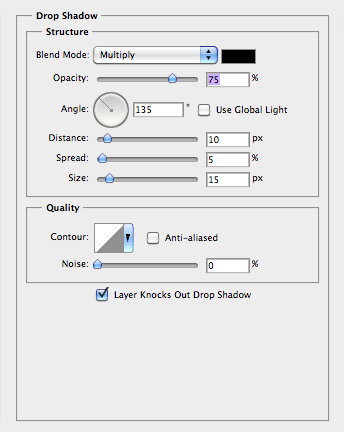


