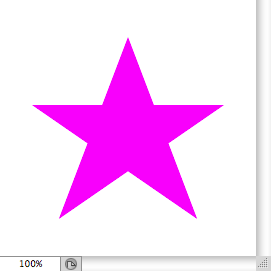
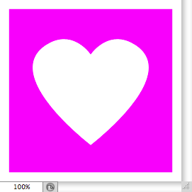

# Path Component List Simplified Format

- Input format of `jamHelpers.toPathComponentList`.
- Output format of `jamHelpers.fromPathComponentList`.

## Explicit format

Defined as a JSON object:

<pre>
{
    "pathComponents": <em>pathComponents</em>,
    "unit": <em>unit</em>
}
</pre>

> *pathComponents* : JSON array of JSON objects in **Path component** format
> <br>
> *unit* : string (among `"distanceUnit"`, `"percentUnit"`, `"pixelsUnit"`)

### Path component

<pre>
{
    "shapeOperation": <em>shapeOperation</em>,
    "subpathListKey": <em>subpathListKey</em>,
    "windingFill": <em>windingFill</em>
}
</pre>

> *shapeOperation* : string (among `"add"`, `"intersect"`, `"subtract"`, `"xor"`)
> <br>
> *subpathListKey* : JSON array of JSON objects in **Subpath** format
> <br>
> *windingFill* : boolean (optional, `false` by default)

### Subpath

<pre>
{
    "points": <em>points</em>,
    "closedSubpath": <em>closedSubpath</em>
}
</pre>

> *points* : JSON array of JSON objects in **Path point** format
> <br>
> *closedSubpath* : boolean (optional, `false` by default)

### Path point

Either a corner point:

<pre>
{
    "anchor": <em>anchor</em>
}
</pre>

or a smooth point:

<pre>
{
    "anchor": <em>anchor</em>,
    "forward": <em>forward</em>,
    "backward": <em>backward</em>,
    "smooth": <em>smooth</em>
}
</pre>

> *anchor* : JSON object in **Point** format

> *forward* : JSON object in **Point** format
> <br>
> *backward* : JSON object in **Point** format
> <br>
> *smooth* : boolean (optional, `false` by default)

### Point

<pre>
{
    "horizontal": <em>horizontal</em>,
    "vertical": <em>vertical</em>
}
</pre>

> *horizontal*: number
> <br>
> *vertical*: number

## Minimal format

Defined as a two-element JSON array: <code>[ <em>pathComponents</em>, <em>unit</em> ]</code>

> *pathComponents* : JSON array of path components, each one being in **Path component** format
> <br>
> *unit* : string (among `"distanceUnit"`, `"percentUnit"`, `"pixelsUnit"`)

### Path component

Defined as a three-element JSON array: <code>[ <em>shapeOperation</em>, <em>subpathListKey</em>, <em>windingFill</em> ]</code>

> *shapeOperatio*n : string (among `"add"`, `"intersect"`, `"subtract"`, `"xor"`)
> <br>
> *subpathListKey* : JSON array of subpaths, each one being in **Subpath** format
> <br>
> *windingFill* : boolean (optional, `false` by default)

### Subpath

Defined as a two-element JSON array: <code>[ <em>points</em>, <em>closedSubpath</em> ]</code>

> *points* : JSON array of path points, each one being in **Path point** format
> <br>
> *closedSubpath* : boolean (optional, `false` by default)

### Path point

Defined as a JSON array of one or four elements:

- Corner point: <code>[ <em>anchor</em> ]</code>

- Smooth point: <code>[ <em>anchor</em>, <em>forward</em>, <em>backward</em>, <em>smooth</em> ]</code>

> *anchor* : JSON array of two coordinates: <code>[ <em>horizontal</em>, <em>vertical</em> ]</code>
> <br>
> *forward* : JSON array of two coordinates: <code>[ <em>horizontal</em>, <em>vertical</em> ]</code>
> <br>
> *backward* : JSON array of two coordinates: <code>[ <em>horizontal</em>, <em>vertical</em> ]</code>
> <br>
> *smooth* : boolean (optional, `false` by default)

> > *horizontal* : number
> > <br>
> > *vertical* : number

## Examples

```json
{
    "pathComponents":
    [
        {
            "shapeOperation": "add",
            "windingFill": true,
            "subpathListKey":
            [
                {
                    "closedSubpath": true,
                    "points":
                    [
                        { "anchor": { "horizontal": 12.5, "vertical": 41 } },
                        { "anchor": { "horizontal": 87.5, "vertical": 41 } },
                        { "anchor": { "horizontal": 23, "vertical": 85.5 } },
                        { "anchor": { "horizontal": 50, "vertical": 14.5 } },
                        { "anchor": { "horizontal": 77, "vertical": 85.5 } }
                    ]
                }
            ]
        }
    ],
    "unit": "percentUnit"
}
```

```json
[
    [
        [
            "add",
            [
                [
                    [
                        [ [ 12.5, 41 ] ],
                        [ [ 87.5, 41 ] ],
                        [ [ 23, 85.5 ] ],
                        [ [ 50, 14.5 ] ],
                        [ [ 77, 85.5 ] ]
                    ],
                    true
                ]
            ],
            true
        ]
    ],
    "percentUnit"
]
```



```json
{
    "pathComponents":
    [
        {
            "shapeOperation": "add",
            "subpathListKey":
            [
                {
                    "closedSubpath": true,
                    "points":
                    [
                        {
                            "anchor": { "horizontal": 5, "vertical": 5 }
                        },
                        {
                            "anchor": { "horizontal": 95, "vertical": 5 }
                        },
                        {
                            "anchor": { "horizontal": 95, "vertical": 95 }
                        },
                        {
                            "anchor": { "horizontal": 5, "vertical": 95 }
                        }
                    ]
                }
            ]
        },
        {
            "shapeOperation": "subtract",
            "subpathListKey":
            [
                {
                    "closedSubpath": true,
                    "points":
                    [
                        {
                            "anchor": { "horizontal": 50, "vertical": 80 }
                        },
                        {
                            "anchor": { "horizontal": 25, "vertical": 25 },
                            "forward": { "horizontal": 40, "vertical": 15 },
                            "backward": { "horizontal": 0, "vertical": 42 },
                            "smooth": true
                        },
                        {
                            "anchor": { "horizontal": 50, "vertical": 30 }
                        },
                        {
                            "anchor": { "horizontal": 75, "vertical": 25 },
                            "forward": { "horizontal": 100, "vertical": 42 },
                            "backward": { "horizontal": 60, "vertical": 15 },
                            "smooth": true
                        }
                    ]
                }
            ]
        }
    ],
    "unit": "percentUnit"
}
```

```json
[
    [
        [
            "add",
            [
                [
                    [
                    	[ [ 5, 5 ] ],
                    	[ [ 95, 5 ] ],
                    	[ [ 95, 95 ] ],
                    	[ [ 5, 95 ] ]
                    ],
                    true
                ]
            ]
        ],
        [
            "subtract",
            [
                [
                    [
                        [ [ 50, 80 ] ],
                        [ [ 25, 25 ], [ 40, 15 ], [ 0, 42 ], true ],
                        [ [ 50, 30 ] ],
                        [ [ 75, 25 ], [ 100, 42 ], [ 60, 15 ], true ]
                    ],
                    true
                ]
            ]
        ]
    ],
    "percentUnit"
]
```



