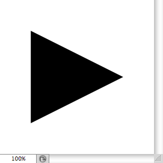

# Point List Simplified Format

- Input format of `jamHelpers.toPointList`.
- Output format of `jamHelpers.fromPointList`.

## Simplified format

Defined as a two-element JSON array: <code>[ <em>points</em>, <em>unit</em> ]</code>

> *points* : JSON array of points, each one being a two-element JSON array: <code>[ <em>horizontal</em>, <em>vertical</em> ]</code>
> <br>
> *unit* : string (among `"distanceUnit"`, `"percentUnit"`, `"pixelsUnit"`)

> > *horizontal* : number
> > <br>
> > *vertical* : number

## Example

```json
[ [ [ 80, 50 ], [ 20, 20 ], [ 20, 80 ] ], "percentUnit" ]
```


