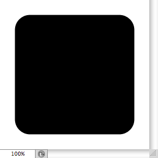

# Rectangle Object Simplified Format

- Input format of `jamHelpers.toRectangleObject`.

## Simplified format

Defined as a two-element JSON array: <code>[ <em>rectangle</em>, <em>unit</em> ]</code>

> *rectangle* : four or five-element JSON array: <code>[ <em>left</em>, <em>top</em>, <em>right</em>, <em>bottom</em> ]</code> or <code>[ <em>left</em>, <em>top</em>, <em>right</em>, <em>bottom</em>, <em>radius</em> ]</code>
> <br>
> *unit* : string (among `"distanceUnit"`, `"percentUnit"`, `"pixelsUnit"`)

> > *left* : number
> > <br>
> > *top* : number
> > <br>
> > *right* : number
> > <br>
> > *bottom* : number

> > *radius* : [optional] number (radius of rounded corners)

## Example

```json
[ [ 10, 10, 90, 90, 10 ], "percentUnit" ]
```


