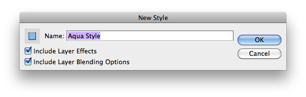
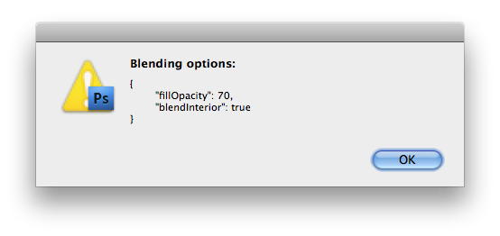
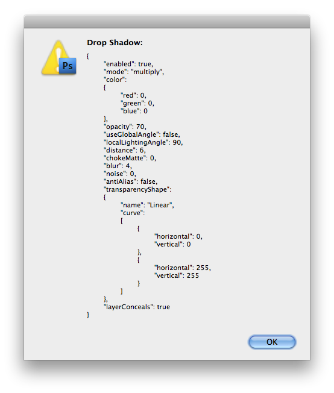

# Layer Styles Quick Tutorial

## Contents

This quick tutorial is intended to explain how to add support for Photoshop layer styles in your own scripts, using the dedicated `jamStyles` module of the [JSON Action Manager](/JSON-Action-Manager) scripting library.

## Definition

It is important to note that, in Photoshop, a layer style is made of two parts: **layer effects** and **layer blending options**, each being optional.

For example, in the default Styles palette, the preset style “1 Px Stroke 0% Fill Opacity” defines both blending options and layer effects, while the preset style “Basic Drop Shadow” defines only layer effects, which means that already existing blending options remain unchanged when the style is applied to the layer.

What should be included in a layer style is a matter of choice; for a preset style, for instance, it can be decided at the time a new style is defined:



## Installation

In order to use the `jamStyles` module, download first the [JSON Action Manager](/JSON-Action-Manager) scripting library archive from the [Downloads](/Downloads) page, uncompress the Zip file and move the entire “JSON Action Manager” folder to the intended location (user’s Home directory), then add the following statements at the beginning of your own script:

```javascript
//@includepath "~/JSON Action Manager/"
//@include "jamActions.jsxinc"
//@include "jamEngine.jsxinc"
//@include "jamJSON.jsxinc"
//@include "jamStyles.jsxinc"
//@include "jamUtils.jsxinc"
```

Alternatively, you can directly embed the contents of the compact one-line versions of the include files located in the `minified` subfolder. This is the way to go if you intend to produce stand-alone scripts.

From the same [Downloads](/Downloads) page, you can also download a related script called [Get Layer Style](/Utility-Scripts/Get-Layer-Style) which is much useful for getting and setting layer styles.

## Directions for use

If your goal is to set a layer style programmatically, it is well advised that you work on an appropriate layer of your document, and use Photoshop’s Layer Style dialog to define your own style by setting one by one all the necessary blending options and layer effects, or apply an existing preset style from the Styles palette; then, run the provided script [Get Layer Style](/Utility-Scripts/Get-Layer-Style), which is merely a convenient UI “wrapper” around the fonction `jamStyles.getLayerStyle`, in order to get the text of a JSON object that you’ll be able to pass “as is” (or modified in any way you wish) to the function `jamStyles.setLayerStyle` in your own script.

With enough experience, of course, you should be able to build the entire JSON object from scratch, using the thoroughly documented [Blending Options Object Simplified Format](/JSON-Simplified-Formats/Blending-Options-Object-Simplified-Format) and [Layer Effects Object Simplified Format](/JSON-Simplified-Formats/Layer-Effects-Object-Simplified-Format), but this may prove difficult for at least two reasons:

- the number of different parameters can be quite important, especially for some complex effects (such as “Bevel and Emboss” with “Contour and “Texture”), or if you have many layer effects (up to ten different kinds); besides, for each layer effect, most parameters cannot be omitted, i.e., they have no default values (contrary to the blending options);

- the programming terminology (all the strings contained in the JSON object) can be, at times, quite different from the vocabulary used in the Layer Style dialog box, and difficult to guess anyway; for instance, in the different layer effects dialogs, `"blur"` corresponds to Size, and `"chokeMatte"` to either Choke or Spread…

Please note the following points:

- the two main functions `jamStyles.getLayerStyle` and `jamStyles.setLayerStyle` only apply to the currently active (selected) layer in Photoshop’s Layers palette;

- the function `jamStyles.getLayerStyle` is only available from Photoshop CS2;

- to get its results, the function `jamStyles.getLayerStyle` makes use of a temporary styles file; the main benefit of this method is that contours (shaping curves) are also expressed as arrays of curve points, removing the risk of missing named contours; however, one possible shortcoming lies in the fact that disabled effects are not listed, but still this can be taken advantage of to easily remove unused layer effects.

## “How-to” code examples

### Set a layer style

```javascript
var layerStyleObj =
{
    "blendOptions":
    {
        "fillOpacity": 70,
        "blendInterior": true
    },
    "layerEffects":
    {
        "scale": 100,
        "dropShadow":
        {
            "enabled": true,
            "mode": "multiply",
            "color":
            {
                "red": 0,
                "green": 0,
                "blue": 0
            },
            "opacity": 70,
            "useGlobalAngle": false,
            "localLightingAngle": 90,
            "distance": 6,
            "chokeMatte": 0,
            "blur": 4,
            "noise": 0,
            "antiAlias": false,
            "transparencyShape":
            {
                "name": "Linear",
                "curve":
                [
                    {
                        "horizontal": 0,
                        "vertical": 0
                    },
                    {
                        "horizontal": 255,
                        "vertical": 255
                    }
                ]
            },
            "layerConceals": true
        },
        "innerShadow":
        {
            "enabled": true,
            "mode": "multiply",
            "color":
            {
                "red": 0,
                "green": 0,
                "blue": 0
            },
            "opacity": 70,
            "useGlobalAngle": false,
            "localLightingAngle": 90,
            "distance": 10,
            "chokeMatte": 15,
            "blur": 20,
            "noise": 0,
            "antiAlias": false,
            "transparencyShape":
            {
                "name": "Linear",
                "curve":
                [
                    {
                        "horizontal": 0,
                        "vertical": 0
                    },
                    {
                        "horizontal": 255,
                        "vertical": 255
                    }
                ]
            }
        },
        "innerGlow":
        {
            "enabled": true,
            "mode": "linearDodge",
            "color":
            {
                "red": 255,
                "green": 246,
                "blue": 168
            },
            "opacity": 31,
            "glowTechnique": "preciseMatte",
            "chokeMatte": 0,
            "blur": 20,
            "shadingNoise": 0,
            "noise": 0,
            "antiAlias": true,
            "innerGlowSource": "centerGlow",
            "transparencyShape":
            {
                "name": "Half Round",
                "curve":
                [
                    {
                        "horizontal": 0,
                        "vertical": 0
                    },
                    {
                        "horizontal": 29,
                        "vertical": 71
                    },
                    {
                        "horizontal": 87,
                        "vertical": 167
                    },
                    {
                        "horizontal": 195,
                        "vertical": 240
                    },
                    {
                        "horizontal": 255,
                        "vertical": 255
                    }
                ]
            },
            "inputRange": 43
        },
        "bevelEmboss":
        {
            "enabled": true,
            "highlightMode": "screen",
            "highlightColor":
            {
                "red": 255,
                "green": 255,
                "blue": 255
            },
            "highlightOpacity": 100,
            "shadowMode": "multiply",
            "shadowColor":
            {
                "red": 0,
                "green": 0,
                "blue": 0
            },
            "shadowOpacity": 100,
            "bevelTechnique": "softMatte",
            "bevelStyle": "innerBevel",
            "useGlobalAngle": false,
            "localLightingAngle": 90,
            "localLightingAltitude": 75,
            "strengthRatio": 80,
            "blur": 16,
            "bevelDirection": "stampIn",
            "transparencyShape":
            {
                "name": "Linear",
                "curve":
                [
                    {
                        "horizontal": 0,
                        "vertical": 0
                    },
                    {
                        "horizontal": 255,
                        "vertical": 255
                    }
                ]
            },
            "antialiasGloss": false,
            "softness": 0,
            "useShape": true,
            "mappingShape":
            {
                "name": "Half Round",
                "curve":
                [
                    {
                        "horizontal": 0,
                        "vertical": 0
                    },
                    {
                        "horizontal": 29,
                        "vertical": 71
                    },
                    {
                        "horizontal": 87,
                        "vertical": 167
                    },
                    {
                        "horizontal": 195,
                        "vertical": 240
                    },
                    {
                        "horizontal": 255,
                        "vertical": 255
                    }
                ]
            },
            "antiAlias": true,
            "inputRange": 70,
            "useTexture": false
        },
        "solidFill":
        {
            "enabled": true,
            "mode": "normal",
            "opacity": 100,
            "color":
            {
                "red": 0,
                "green": 102,
                "blue": 255
            }
        }
    }
};
jamStyles.setLayerStyle (layerStyleObj);
```

### Clear a layer style

```javascript
jamStyles.setLayerStyle (null);
```

or

```javascript
jamStyles.clearLayerStyle ();
```

### Set blending options

```javascript
var layerStyleObj =
{
    "blendOptions":
    {
        "fillOpacity": 70,
        "blendInterior": true
    }
};
jamStyles.setLayerStyle (layerStyleObj);
```

### Display blending options

```javascript
var layerStyleObj = jamStyles.getLayerStyle ();
if (layerStyleObj)
{
    if ("blendOptions" in layerStyleObj)
    {
        var blendOptionsObj = layerStyleObj["blendOptions"];
        alert ("Blending options:\r" + jamJSON.stringify (blendOptionsObj, '\t'));
    }
}
```



### Reset blending options

```javascript
var layerStyleObj =
{
    "blendOptions":
    {
        // Empty -> all default values
    }
};
jamStyles.setLayerStyle (layerStyleObj);
```

### Check if a layer has effects

```javascript
var layerStyleObj = jamStyles.getLayerStyle ();
if (layerStyleObj)
{
    if ("layerEffects" in layerStyleObj)
    {
        alert ("Has layer effects.");
    }
    else
    {
        alert ("No layer effects.");
    }
}
else
{
    alert ("No layer selected.");
}
```

### Check if a layer effect exists

```javascript
var layerStyleObj = jamStyles.getLayerStyle ();
if (layerStyleObj)
{
    if ("layerEffects" in layerStyleObj)
    {
        var layerEffectsObj = layerStyleObj["layerEffects"];
        if ("dropShadow" in layerEffectsObj)
        {
            alert ("Has drop shadow effect.");
        }
        else
        {
            alert ("No drop shadow effect.");
        }
    }
}
```

### Display layer effect parameters

```javascript
var layerStyleObj = jamStyles.getLayerStyle ();
if (layerStyleObj)
{
    if ("layerEffects" in layerStyleObj)
    {
        var layerEffectsObj = layerStyleObj["layerEffects"];
        if ("dropShadow" in layerEffectsObj)
        {
            var dropShadowObj = layerEffectsObj["dropShadow"];
            alert ("Drop Shadow:\r" + jamJSON.stringify (dropShadowObj, '\t'));
        }
    }
}
```



### Obtain a layer effect parameter

```javascript
var layerStyleObj = jamStyles.getLayerStyle ();
if (layerStyleObj)
{
    if ("layerEffects" in layerStyleObj)
    {
        var layerEffectsObj = layerStyleObj["layerEffects"];
        if ("dropShadow" in layerEffectsObj)
        {
            var dropShadowObj = layerEffectsObj["dropShadow"];
            var dropShadowDistance = dropShadowObj["distance"];
            alert ("Drop shadow distance: " + dropShadowDistance);
        }
    }
}
```

### Modify a layer effect parameter

```javascript
var layerStyleObj = jamStyles.getLayerStyle ();
if (layerStyleObj)
{
    if ("layerEffects" in layerStyleObj)
    {
        var layerEffectsObj = layerStyleObj["layerEffects"];
        if ("dropShadow" in layerEffectsObj)
        {
            var dropShadowObj = layerEffectsObj["dropShadow"];
            if (!dropShadowObj["useGlobalAngle"])
            {
                // Invert direction of drop shadow's light source
                var localLightingAngle = dropShadowObj["localLightingAngle"];
                localLightingAngle += (localLightingAngle > 0) ? -180 : 180;
                dropShadowObj["localLightingAngle"] = localLightingAngle;
                jamStyles.setLayerStyle (layerStyleObj);
            }
        }
    }
}
```

### Remove a layer effect

```javascript
jamStyles.removeLayerEffect ("dropShadow");
```

### Remove several layer effects

```javascript
jamStyles.removeLayerEffects ([ "dropShadow", "solidFill" ]);
```

### Remove all layer effects

```javascript
jamStyles.removeAllLayerEffects ();
```

### Remove unused layer effects

```javascript
jamStyles.setLayerStyle (jamStyles.getLayerStyle ());
```

## Using dot notation

Instead of accessing each value of a JavaScript literal object using an associative array syntax (the “JSON way”), it is possible to use the more common dot notation to ease the writing of scripts.

For instance, let’s take a look at the code mentioned above which lets you read out the drop shadow distance:

```javascript
var layerStyleObj = jamStyles.getLayerStyle ();
if (layerStyleObj)
{
    if ("layerEffects" in layerStyleObj)
    {
        var layerEffectsObj = layerStyleObj["layerEffects"];
        if ("dropShadow" in layerEffectsObj)
        {
            var dropShadowObj = layerEffectsObj["dropShadow"];
            var dropShadowDistance = dropShadowObj["distance"];
            alert ("Drop shadow distance: " + dropShadowDistance);
        }
    }
}
```

If you know for sure that the current layer you’re working on has layer effects, including a drop shadow effect, the code can be rewritten as simply as:

```javascript
var layerStyleObj = jamStyles.getLayerStyle ();
var dropShadowDistance = layerStyleObj["layerEffects"]["dropShadow"]["distance"];
alert ("Drop shadow distance: " + dropShadowDistance);
```

Or, even shorter, using dot notation:

```javascript
var dropShadowDistance = jamStyles.getLayerStyle ().layerEffects.dropShadow.distance;
alert ("Drop shadow distance: " + dropShadowDistance);
```

Here is another example of modification of an existing style; it assumes that the current layer style contains a color overlay effect and changes its color to yellow:

```javascript
var layerStyleObj = jamStyles.getLayerStyle ();
layerStyleObj.layerEffects.solidFill.color = { "red": 255, "green": 255, "blue": 0 };
jamStyles.setLayerStyle (layerStyleObj);
```
