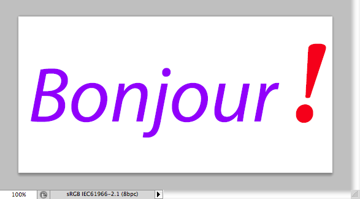
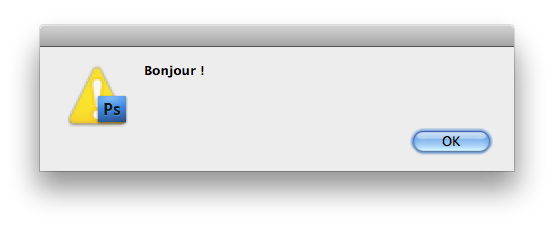

# Layer Text Quick Tutorial

## Contents

This quick tutorial is intended to explain how to add support for Photoshop text layers in your own scripts, using the dedicated `jamText` module of the [JSON Action Manager](/JSON-Action-Manager) scripting library.

## Installation

In order to use the `jamText` module, download first the [JSON Action Manager](/JSON-Action-Manager) scripting library archive from the [Downloads page](/Downloads), uncompress the Zip file and move the entire “JSON Action Manager” folder to the intended location (user’s Home directory), then add the following statements at the beginning of your own script:

```javascript
//@includepath "~/JSON Action Manager/"
//@include "jamEngine.jsxinc"
//@include "jamHelpers.jsxinc"
//@include "jamJSON.jsxinc"
//@include "jamText.jsxinc"
//@include "jamUtils.jsxinc"
```

Alternatively, you can directly embed the contents of the compact one-line versions of the include files located in the `minified` subfolder. This is the way to go if you intend to produce stand-alone scripts.

From the same [Downloads](/Downloads) page, you can also download a related script called [Get Layer Text](/Utility-Scripts/Get-Layer-Text) which is much useful for getting and setting layer text.

## Directions for use

To set a layer text programmatically, the best is to use a text layer which has been already set using the Type tool and the Character and Paragraph palettes, then run the provided script [Get Layer Text](/Utility-Scripts/Get-Layer-Text), which is merely a convenient UI “wrapper” around the fonction `jamText.getLayerText`, in order to get the text of a JSON object that you’ll be able to pass “as is” (or modified in any way you wish) to the function `jamText.setLayerText` in your own script.

With enough experience, of course, it should be possible to build the entire JSON object from scratch, using the thoroughly documented [Layer Text Object Simplified Format](/JSON-Simplified-Formats/Layer-Text-Object-Simplified-Format), but this may prove difficult for at least two reasons:

- the number of different parameters can be quite daunting, especially for multi-styled text; in practice, however, most uncommon parameters can safely be omitted (their default value will be used instead);

- the programming terminology (all the strings contained in the JSON object) is quite often different from the vocabulary used in the different parts of the user interface, making it difficult to infer. Moreover, some parameters don’t even have a equivalent dialog control or menu item, they are set “graphically”, using the mouse in the actual area of the text layer.

The following kinds of text layout are fully supported:

- Point text

- Paragraph text

- Text along a path

- Text inside a path

Please note the following points:

- the function `jamText.getLayerText` applies only to the currently active (selected) layer in Photoshop’s Layers palette;

- the behavior of the function `jamText.setLayerText` depends on which kind of layer is currently active (selected):

    - if it is an already existing text layer, the text layer is updated with the new settings,

    - if it is a newly created empty layer, a new text layer is created in place,

    - in all other cases, a new text layer is created above the current layer.

## “How-to” code examples

### Set a layer text (multi-style)

```javascript
var text = "Bonjour !";
var layerText =
{
    "layerText":
    {
        "textKey": text,
        "textClickPoint": { "horizontal": 50, "vertical": 67 },
        "antiAlias": "antiAliasCrisp",
        "textShape":
        [
            {
                "textType": "point",
                "orientation": "horizontal"
            }
        ],
        "textStyleRange":
        [
            {
                "from": 0,
                "to": text.length - 1,
                "textStyle":
                {
                    "fontPostScriptName": "Myriad-Italic",
                    "size": 128,
                    "color": { "red": 144, "green": 0, "blue": 255 }
                }
            },
            {
                "from": text.length - 1,
                "to": text.length,
                "textStyle":
                {
                    "fontPostScriptName": "Minion-BoldItalic",
                    "size": 192,
                    "color": { "red": 255, "green": 0, "blue": 0 }
                }
            }
        ],
        "paragraphStyleRange":
        [
            {
                "from": 0,
                "to": text.length,
                "paragraphStyle": { "alignment": "center" }
            }
        ]
    },
    "typeUnit": "pixelsUnit"
};
jamText.setLayerText (layerText);
```



### Get a layer text

```javascript
var layerText = jamText.getLayerText ();
if (layerText)
{
    alert (layerText["layerText"]["textKey"]);
}
else
{
    alert ("No text layer selected.");
}
```


