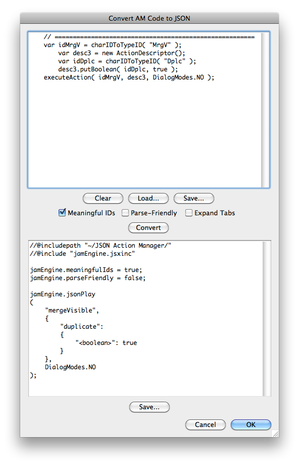

# Convert AM Code to JSON

## Description

“Convert AM Code to JSON” is a code utility script using the [JSON Action Manager](/JSON-Action-Manager) scripting library.

This stand-alone script written in JavaScript opens a resizeable dialog box with two text areas; in the first field, copy any Action Manager code obtained from the ScriptingListenerJS.log file, then click the Convert button to get it translated into executable JSON Action Manager calls in the second field. Basic editing support is provided, i.e., tabulations and new lines can be inserted.

## Requirements

This script can be used in Adobe Photoshop CS4 or later. It has been successfully tested in CS4 on Mac OS X, but should be platform agnostic.

## Copyright

This Software is copyright © 2011-2015 by Michel MARIANI.

## License

This Software is licensed under the [GNU General Public License (GPL) v3](https://www.gnu.org/licenses/gpl.html).

## Download

[Download Zip File](/Downloads/Convert-AM-Code-to-JSON-4.1.zip)

## Installation

Download the Zip file and unzip it.

Move the script to the `Presets/Scripts` folder in the default preset location of the Adobe Photoshop application. On next launch, the script will appear in the File>Automate submenu.
