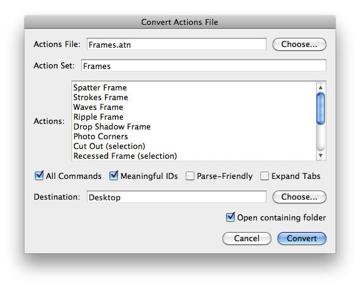
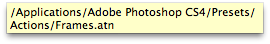
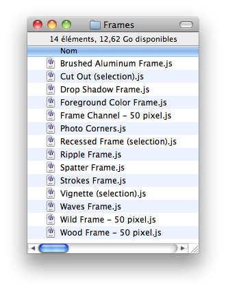

# Convert Actions File

## Description

“Convert Actions File” is an actions files utility script using the [JSON Action Manager](/JSON-Action-Manager) scripting library, and more specifically its module `jamActions`.

This stand-alone script written in JavaScript is used to convert a Photoshop actions file (.atn) into a folder of directly executable scripts (.js) which can be further edited; they are made up of sequential calls to the function `jamEngine.jsonPlay`.

Please refer to the [Photoshop Actions File Format](/Documentation/actions-file-format.html) document for detailed information about the structure of an actions file.

Tool-tips displaying their respective full path name are available while hovering over the actions file text field and the destination folder text field.

## Examples

**Scripts (Waves Frame.js and Wood Frame – 50 pixel.js) obtained from a converted actions file (Frames.atn)**:

- [Waves Frame.js](Waves%20Frame.js)

- [Wood Frame – 50 pixel.js](Wood%20Frame%20–%2050%20pixel.js)

## Requirements

This script can be used in Adobe Photoshop CS3 or later. It has been successfully tested in CS4 on Mac OS X, but should be platform agnostic.

## Copyright

This Software is copyright © 2011-2015 by Michel MARIANI

## License

This Software is licensed under the [GNU General Public License (GPL) v3](https://www.gnu.org/licenses/gpl.html).

## Download

[Download Zip File](/Downloads/Convert-Actions-File-2.1.zip)

## Installation

Download the Zip file and unzip it.

Move the entire script *FOLDER* (`Convert Actions File Folder`) with its contents into the `Presets/Scripts` folder in the default preset location of the Adobe Photoshop application. On next launch, the script will appear in the File>Automate submenu.
