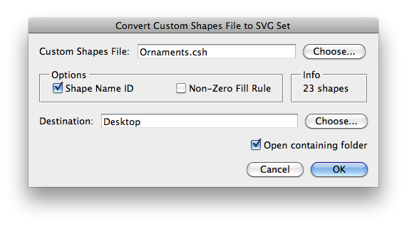
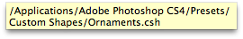
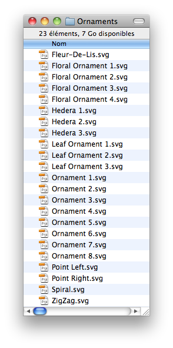
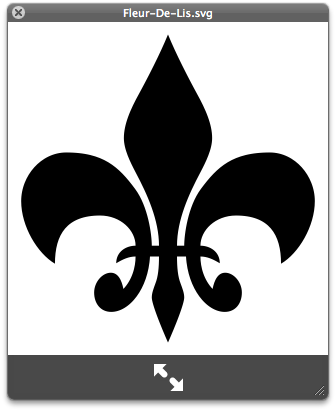

# Convert Custom Shapes File to SVG Set

## Description

“Convert Custom Shapes File to SVG Set” is a custom shapes files utility script using the [JSON Action Manager](/JSON-Action-Manager) scripting library, and more specifically its module `jamShapes`.

This stand-alone script written in JavaScript is used to convert a custom shapes file (.csh) or a custom shapes preferences file (CustomShapes.psp) into a set of SVG files.

Please refer to the [Photoshop Custom Shapes File Format](/Documentation/Photoshop-Custom-Shapes-File-Format) page for detailed information about the structure of a custom shapes file.

The SVG files use the same format than the SVG code generated by the script [Get SVG Code from Path](/Utility-Scripts/Get-SVG-Code-from-Path).



Tool-tips displaying their respective full path name are available while hovering over the custom shapes file text field and the destination folder text field.






**Warning**: the time needed to generate the set of SVG files is logically proportional to the actual number of custom shapes in the file, but above all, it depends on how many control/anchor points the paths are made of. Occasionally, for some large sets of complex custom shapes, the generation can be particularly slow, i.e., may take more than half an hour…

## Example

**SVG file (Fleur-De-Lis.svg) obtained from a converted custom shapes file (Ornaments.csh)**:

```xml
<svg xmlns="http://www.w3.org/2000/svg" viewBox="0 0 27 28">
<path id="Fleur-De-Lis" fill-rule="evenodd" d="
    M 14.8678750991821,18.8260366916656
    C 14.8678750991821,17.9139196872711 15.1720794439316,15.5197777748108 16.2742002010345,14.0378513336182
    C 17.6799250245094,12.1379163265228 18.9719477891922,10.9601957798004 22.0882052779198,10.9601957798004
    C 24.2162436246872,10.9601957798004 25.8881734013557,12.9357316493988 25.8881734013557,15.0642683506012
    C 25.8881734013557,17.1922075748444 24.5199490785599,19.4720478057861 23.0380210876465,20.3460648059845
    C 23.0380210876465,17.8382186889648 22.012103497982,16.2800905704498 19.2381527423859,16.2800905704498
    C 17.4900214076042,16.2800905704498 16.236099421978,17.5340144634247 16.236099421978,18.8260366916656
    C 17.0340142250061,18.8260366916656 17.86992841959,19.3201451301575 17.86992841959,20.3079631328583
    C 17.300117790699,19.966157913208 16.805910050869,19.7381536960602 16.236099421978,19.7381536960602
    C 16.236099421978,20.6502690315247 16.5398048758507,21.7142887115479 17.2620170116425,22.4740023612976
    C 17.4138198494911,21.7142887115479 17.718025803566,21.1063776016235 18.3259372115135,21.1063776016235
    C 19.0481493473053,21.1063776016235 19.7322623133659,21.9041929244995 19.7322623133659,22.7782082557678
    C 19.7322623133659,23.6903252601624 19.2000519633293,24.4120373725891 18.2879362106323,24.4120373725891
    C 16.7678092718124,24.4120373725891 15.1720794439316,22.4740023612976 15.0197777152061,19.7381536960602
    C 15.0197777152061,19.7381536960602 14.2599636912346,19.7381536960602 14.2599636912346,19.7381536960602
    C 14.2599636912346,20.6883707046509 14.3356647491455,21.4481844902039 14.5636691451073,22.017993927002
    C 14.7160722613335,22.4359023571014 14.8678750991821,22.816308259964 14.8678750991821,23.1962151527405
    C 14.8678750991821,23.7279245853424 14.1081608533859,25.6283602714539 13.4997505545616,26.9960834980011
    C 12.8918391466141,25.6283602714539 12.1320251226425,23.7279245853424 12.1320251226425,23.1962151527405
    C 12.1320251226425,22.816308259964 12.2839277386665,22.4359023571014 12.4357305765152,22.017993927002
    C 12.663734972477,21.4481844902039 12.7399365305901,20.6883707046509 12.7399365305901,19.7381536960602
    C 12.7399365305901,19.7381536960602 11.9797233939171,19.7381536960602 11.9797233939171,19.7381536960602
    C 11.8278191685677,22.4740023612976 10.23159044981,24.4120373725891 8.7115632891655,24.4120373725891
    C 7.79994803667068,24.4120373725891 7.26763790845871,23.6903252601624 7.26763790845871,22.7782082557678
    C 7.26763790845871,21.9041929244995 7.95174926519394,21.1063776016235 8.67396301031113,21.1063776016235
    C 9.28187441825867,21.1063776016235 9.58557987213135,21.7142887115479 9.73798298835754,22.4740023612976
    C 10.4595948457718,21.7142887115479 10.7638007998466,20.6502690315247 10.7638007998466,19.7381536960602
    C 10.1939901709557,19.7381536960602 9.69988220930099,19.966157913208 9.12997180223465,20.3079631328583
    C 9.12997180223465,19.3201451301575 9.9659857749939,18.8260366916656 10.7638007998466,18.8260366916656
    C 10.7638007998466,17.5340144634247 9.50987881422043,16.2800905704498 7.76184725761414,16.2800905704498
    C 4.98789650201797,16.2800905704498 3.96147841215134,17.8382186889648 3.96147841215134,20.3460648059845
    C 2.47955203056335,19.4720478057861 1.11182659864426,17.1922075748444 1.11182659864426,15.0642683506012
    C 1.11182659864426,12.9357316493988 2.78375637531281,10.9601957798004 4.91169494390488,10.9601957798004
    C 8.02795082330704,10.9601957798004 9.31997519731522,12.1379163265228 10.7257000207901,14.0378513336182
    C 11.8278191685677,15.5197777748108 12.1320251226425,17.9139196872711 12.1320251226425,18.8260366916656
    C 12.1320251226425,18.8260366916656 12.7399365305901,18.8260366916656 12.7399365305901,18.8260366916656
    C 12.7399365305901,16.6599974632263 11.75161921978,14.493958234787 10.7638007998466,12.6320247650146
    C 10.3077920079231,11.7580094337463 9.77598237991333,10.6939897537231 9.77598237991333,9.74387288093567
    C 9.77598237991333,8.60365319252014 10.3077920079231,7.34973096847534 11.0680067539215,5.98200607299805
    C 11.7897199988365,4.65198230743408 12.8161380887032,2.67584562301636 13.4997505545616,1.0039165019989
    C 14.1838619112968,2.67584562301636 15.2096813321114,4.65198230743408 15.9318934679031,5.98200607299805
    C 16.6922079920769,7.34973096847534 17.2239178419113,8.60365319252014 17.2239178419113,9.74387288093567
    C 17.2239178419113,10.6939897537231 16.6922079920769,11.7580094337463 16.236099421978,12.6320247650146
    C 15.2477821111679,14.493958234787 14.2599636912346,16.6599974632263 14.2599636912346,18.8260366916656
    C 14.2599636912346,18.8260366916656 14.8678750991821,18.8260366916656 14.8678750991821,18.8260366916656
    Z
" />
</svg>
```



## Requirements

This script can be used in Adobe Photoshop CS3 or later. It has been successfully tested in CS4 on Mac OS X, but should be platform agnostic.

## Copyright

This Software is copyright © 2015 by Michel MARIANI.

## License

This Software is licensed under the [GNU General Public License (GPL) v3](https://www.gnu.org/licenses/gpl.html).

## Download

[Download Zip File](/Downloads/Convert-Custom-Shapes-File-to-SVG-Set-1.3.zip)

## Installation

Download the Zip file and unzip it.

Move the script to the `Presets/Scripts` folder in the default preset location of the Adobe Photoshop application. On next launch, the script will appear in the File>Automate submenu.
