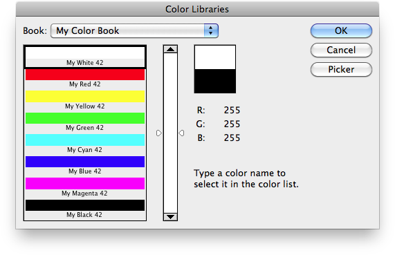
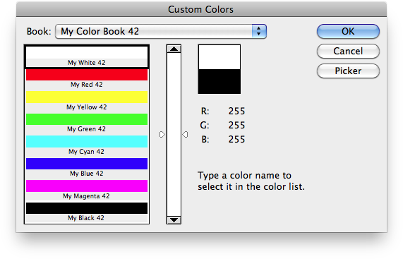

# Generate Color Book File

## Description

“Generate Color Book File” is a color books utility script using the [JSON Action Manager](/JSON-Action-Manager) scripting library.

This stand-alone script written in JavaScript is used to generate a Photoshop color book file (.acb) from a JSON text file.

It has been put in practice to generate two custom Color Books:

- [W3C Color Names](/Downloads/W3C-Color-Names.zip)
- [X11 Color Names](/Downloads/X11-Color-Names.zip)

The utility script [Parse Color Book File](/Utility-Scripts/Parse-Color-Book-File) performs the reverse operation, i.e., converts a Photoshop color book file (.acb) into a JSON text file.

The information about the color book file format comes from two main sources:

- [Adobe Color Book File Format Specification](http://magnetiq.com/pages/acb-spec/)
- [Adobe Photoshop File Formats Specification](https://www.adobe.com/devnet-apps/photoshop/fileformatashtml/#50577411_pgfId-1066780)

Two different, mutually exclusive keys are available to list each color in the JSON text file:

- `"rawComponents"`: **raw** color components (with values ranging from 0 to 255), or
- `"actualComponents"`: **actual** color components (with values converted from the raw color components).

In the second case, when generating the color book file, the actual color components are automatically converted back to the raw color components according to the following formulas:

**CMYK color space**:

    components[0] = 255 - Math.round (cyan * 255 / 100);
    components[1] = 255 - Math.round (magenta * 255 / 100);
    components[2] = 255 - Math.round (yellowColor * 255 / 100);
    components[3] = 255 - Math.round (black * 255 / 100);

**Lab color space**:

    components[0] = Math.round (luminance * 255 / 100);
    components[1] = Math.round (a) + 128;
    components[2] = Math.round (b) + 128;

**RGB color space**:

    components[0] = Math.round (red);
    components[1] = Math.round (green);
    components[2] = Math.round (blue);

## Example

**JSON text file (My Color Book.json) used as input to generate a color book file**:

```json
{
    "bookID": 42,
    "bookName": "My Color Book 42",
    "colorNamePrefix": "My ",
    "colorNameSuffix": " 42",
    "bookDescription": "Color book example",
    "colorsPerPage": 8,
    "keyColorIndex": 0,
    "colorSpace": "RGB",
    "colors":
    [
        {
            "colorName": "White",
            "colorKey": "W42   ",
            "actualComponents":
            [
                255,
                255,
                255
            ]
        },
        {
            "colorName": "Red",
            "colorKey": "R42   ",
            "actualComponents":
            [
                255,
                0,
                0
            ]
        },
        {
            "colorName": "Yellow",
            "colorKey": "Y42   ",
            "actualComponents":
            [
                255,
                255,
                0
            ]
        },
        {
            "colorName": "Green",
            "colorKey": "G42   ",
            "actualComponents":
            [
                0,
                255,
                0
            ]
        },
        {
            "colorName": "Cyan",
            "colorKey": "C42   ",
            "actualComponents":
            [
                0,
                255,
                255
            ]
        },
        {
            "colorName": "Blue",
            "colorKey": "B42   ",
            "actualComponents":
            [
                0,
                0,
                255
            ]
        },
        {
            "colorName": "Magenta",
            "colorKey": "M42   ",
            "actualComponents":
            [
                255,
                0,
                255
            ]
        },
        {
            "colorName": "Black",
            "colorKey": "K42   ",
            "actualComponents":
            [
                0,
                0,
                0
            ]
        }
    ]
}
```

**Color book (My Color Book.acb) displayed in the Color Libraries dialog (CS4)**:



**Color book (My Color Book.acb) displayed in the Custom Colors dialog (CS)**:



## Requirements

This script can be used in Adobe Photoshop CS3 or later. It has been successfully tested in CS4 on Mac OS X, but should be platform agnostic.

## Copyright

This Software is copyright © 2013-2016 by Michel MARIANI.

## License

This Software is licensed under the [GNU General Public License (GPL) v3](https://www.gnu.org/licenses/gpl.html).

## Download

[Download Zip File](/Downloads/Generate-Color-Book-File-1.5.zip)

## Installation

Download the Zip file and unzip it.

Move the script to the `Presets/Scripts` folder in the default preset location of the Adobe Photoshop application. On next launch, the script will appear in the File>Automate submenu.
