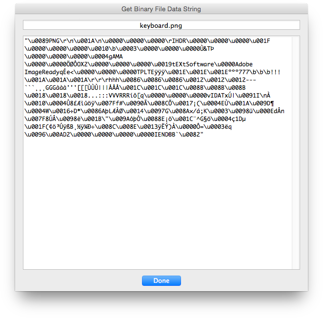
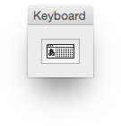

# Get Binary File Data String

## Description

“Get Binary File Data String” is a miscellaneous utility script using the [JSON Action Manager](/JSON-Action-Manager) scripting library.

This stand-alone script written in JavaScript generates a string representing the data of a binary file. This is especially useful for embedding a small image into a script, or a patterns file into a JSON structure, for instance.

**Notes**:

- The generated string makes use of \\u (Unicode) escape sequences; \\x (hexadecimal) escape sequences could have been chosen since they are shorter (2 digits instead of 4), but they are not JSON-compatible.
- The maximum size of the binary file is hard-coded and deliberately limited to 100 Kb for performance reasons, since handling of long strings is notoriously slow in JavaScript.



```javascript
var keyboardPNGFileBinaryData = "\u0089PNG\r\n\u001A\n\u0000\u0000\u0000\rIHDR\u0000\u0000\u0000\u001F\u0000\u0000\u0000\u0010\b\u0003\u0000\u0000\u0000Ù&TÞ\u0000\u0000\u0000\u0004gAMA\u0000\u0000ÖØÔOX2\u0000\u0000\u0000\u0019tEXtSoftware\u0000Adobe ImageReadyqÉe<\u0000\u0000\u0000TPLTEÿÿÿ\u001E\u001E\u001Eººº777\b\b\b!!!\u001A\u001A\u001A\r\r\rhhh\u0086\u0086\u0086\u0012\u0012\u0012---```¸¸¸GGGààà'''[[[ÙÙÙ|||ÅÅÅ\u001C\u001C\u001C\u008B\u008B\u008B\u0018\u0018\u0018...:::VVVRRRíô[q\u0000\u0000\u0000vIDATxÚ|\u0091I\nÀ \u0010\u0004Û8£Æìûöÿ\u007Ff#\u0090Ã\u008CÕ\u0017¡(\u0004EÙ\u001A\u009D¶\u0004W\u0016÷D*\u0086AþLÆÀØ\u0014\u0097G\u008A×/á;K\u0003\u0098ü\u000EdÂn\u007F8ÚÂ\u0098è\u001B\"\u009AôþÒ\u0088E¡ö\u001C¨^G§ö\u0004ç1Dµ\u001F(¢ö³ÚÿßB¸½ÿ¼Ð÷\u008C\u008E\u0013ÿËÝ)À\u0000Ô=\u0003ëq\u0096\u00AD2\u0000\u0000\u0000\u0000IEND®B`\u0082";
var w = new Window ('dialog', "Keyboard");
w.add ('iconbutton', undefined, keyboardPNGFileBinaryData);
w.show ();
```



## Requirements

This script can be used in Adobe Photoshop CS or later. It has been successfully tested in CS and CS4 on Mac OS X, but should be platform agnostic.

## Copyright

This Software is copyright © 2015-2016 by Michel MARIANI.

## License

This Software is licensed under the [GNU General Public License (GPL) v3](https://www.gnu.org/licenses/gpl.html).

## Download

[Download Zip File](/Downloads/Get-Binary-File-Data-String-1.2.zip)

## Installation

Download the Zip file and unzip it.

Move the script to the `Presets/Scripts` folder in the default preset location of the Adobe Photoshop application. On next launch, the script will get directly accessible from Photoshop’s File menu: in Photoshop CS or CS2, it will appear in the File>Scripts submenu, among all other scripts sorted by lexical order; from Photoshop CS3, it will appear grouped by category in the File>Automate submenu.
