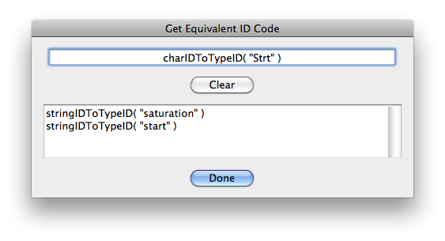
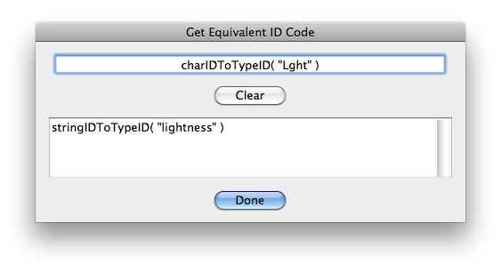
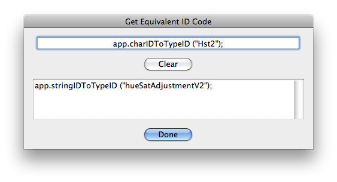
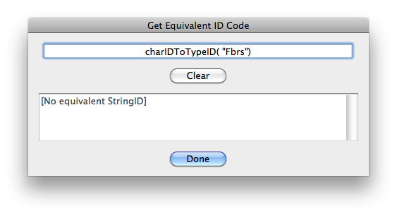
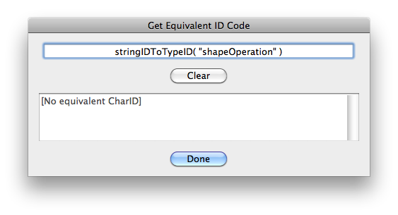
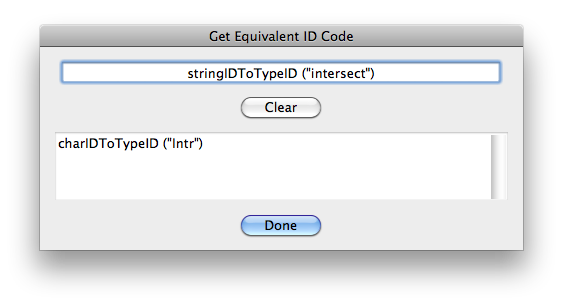

# Get Equivalent ID Code

## Description

“Get Equivalent ID Code” is a code utility script using the [JSON Action Manager](/JSON-Action-Manager) scripting library.

This stand-alone script written in JavaScript opens a dialog box with an input text field expecting the text string of a call to `app.charIDToTypeID ()`, pasted from code copied from the ScriptingListenerJS.log file, for instance. Provided it does exist, the equivalent call to `app.stringIDToTypeID ()` is then automatically displayed in real-time in another output text field (read-only); in some cases, more than one call (up to four) will be listed, when several (colliding/conflicting) equivalent StringIDs are available.

The output field format is kept identical to the input field format, including extra whitespace and optional elements: leading `app.` (Application root object) and trailing `;` (JavaScript statement delimiter).

For the sake of completeness, the script works also the other way around, but it is less useful for code copied from the ScriptingListenerJS.log file, since the ScriptingListener plug-in only generates calls to `app.stringIDToTypeID ()` for StringIDs which have *no* equivalent CharID.

## Examples

## Requirements

This script can be used in Adobe Photoshop CS3 or later. It has been successfully tested in CS4 on Mac OS X, but should be platform agnostic.

## Copyright

This Software is copyright © 2013-2016 by Michel MARIANI.

## License

This Software is licensed under the [GNU General Public License (GPL) v3](https://www.gnu.org/licenses/gpl.html).

## Download

[Download Zip File](/Downloads/Get-Equivalent-ID-Code-1.7.zip)

## Installation

Download the Zip file and unzip it.

Move the script to the `Presets/Scripts` folder in the default preset location of the Adobe Photoshop application. On next launch, the script will appear in the File>Automate submenu.
