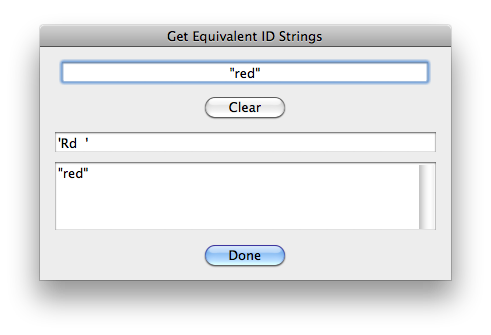
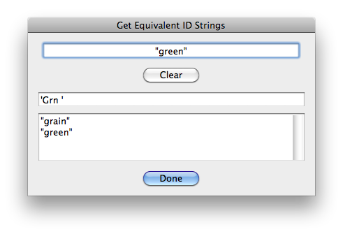
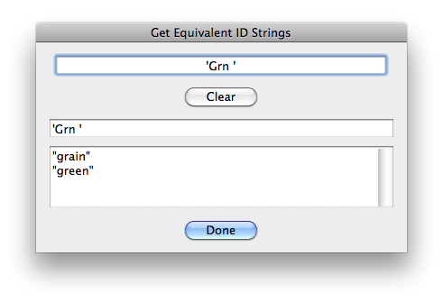
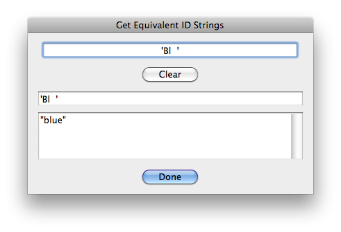
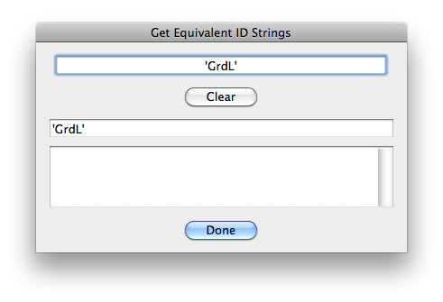
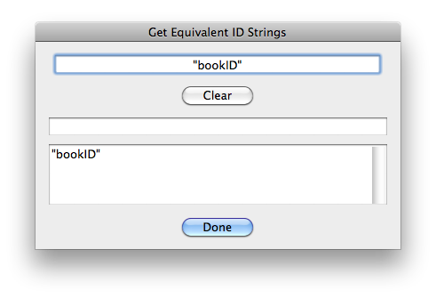
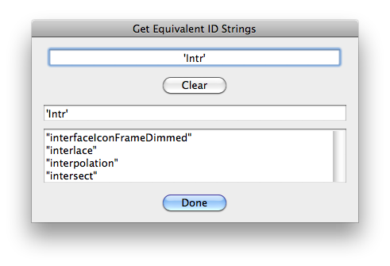

# Get Equivalent ID Strings

## Description

“Get Equivalent ID Strings” is a miscellaneous utility script using the [JSON Action Manager](/JSON-Action-Manager) scripting library.

This stand-alone script written in JavaScript opens a dialog box with an input text field expecting either a CharID or a StringID string. Equivalent strings get automatically listed in two read-only text fields, provided they exist; the first field displays the equivalent CharID string, and the second field displays all possible StringIDs, including colliding/conflicting ones.

By convention, a CharID string is expressed here as `'xxxx'` (or even `"'xxxx'"`), since they are made of four-letter “mnemonic” strings originating from the C language character constants used to represent 32-bit integers, while a StringID string is just `"xxxxxxxx"`, in plain, human-readable, standard string format.

## Examples

## Requirements

This script can be used in Adobe Photoshop CS3 or later. It has been successfully tested in CS4 on Mac OS X, but should be platform agnostic.

## Copyright

This Software is copyright © 2013-2016 by Michel MARIANI.

## License

This Software is licensed under the [GNU General Public License (GPL) v3](https://www.gnu.org/licenses/gpl.html).

## Download

[Download Zip File](/Downloads/Get-Equivalent-ID-Strings-1.5.zip)

## Installation

Download the Zip file and unzip it.

Move the script to the `Presets/Scripts` folder in the default preset location of the Adobe Photoshop application. On next launch, the script will appear in the File>Automate submenu.
