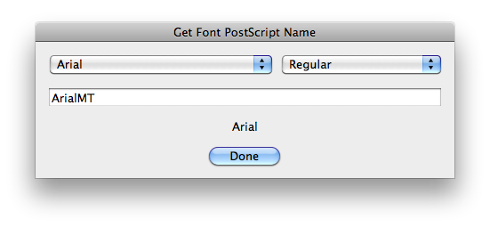
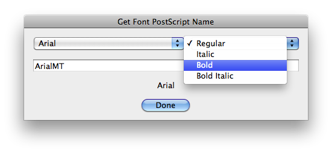

# Get Font PostScript Name

## Description

“Get Font PostScript Name” is a fonts utility script using the [JSON Action Manager](/JSON-Action-Manager) scripting library.

This stand-alone script written in JavaScript opens a dialog box with two popup menus and a text field; use the left menu to select the font family and the right menu to select the font style, then get the font PostScript name from the bottom text field (read-only).

Font family and style are presented in the same way they are displayed in the character palette or in the type tool bar.

## Requirements

This script can be used in Adobe Photoshop CS3 or later. It has been successfully tested in CS4 on Mac OS X, but should be platform agnostic.

## Copyright

This Software is copyright © 2011-2016 by Michel MARIANI.

## License

This Software is licensed under the [GNU General Public License (GPL) v3](https://www.gnu.org/licenses/gpl.html).

## Download

[Download Zip File](/Downloads/Get-Font-PostScript-Name-4.0.zip)

## Installation

Download the Zip file and unzip it.

Move the script to the `Presets/Scripts folder` in the default preset location of the Adobe Photoshop application. On next launch, the script will appear in the File>Automate submenu.
