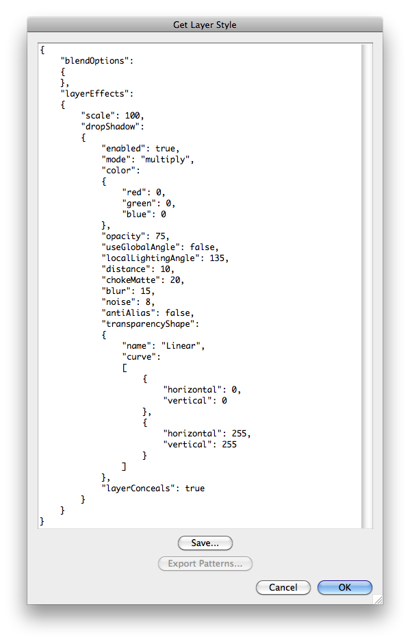
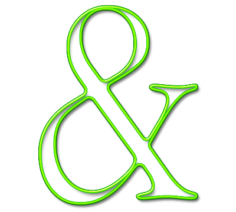

# Get Layer Style

## Description

“Get Layer Style” is a layer styles utility script using the [JSON Action Manager](/JSON-Action-Manager) scripting library, and more specifically its module `jamStyles`.

This stand-alone script written in JavaScript is used to get the style (blending options and layer effects) of the current layer in JSON simplified format; it is basically a user interface “wrapper” around the function `jamStyles.getLayerStyle`: it opens a dialog box with a text field containing a layer style JSON object made of two optional members:

- `"blendOptions"`: in [Blending Options Object Simplified Format](/JSON-Simplified-Formats/Blending-Options-Object-Simplified-Format)
- `"layerEffects"`: in [Layer Effects Object Simplified Format](/JSON-Simplified-Formats/Layer-Effects-Object-Simplified-Format)

You can copy or save the generated JSON text and use it in your own scripts by passing it to the function `jamStyles.setLayerStyle` to set the style of the current layer (blending options or/and layer effects).

Please refer to the [Layer Styles Quick Tutorial](/Tutorials/Layer-Styles-Quick-Tutorial) for more details.

In addition, you can also export patterns possibly used by layer effects into a new Photoshop patterns file. Please note that only three layer effects make actual use of a pattern:

- Bevel and Emboss: Texture
- Pattern Overlay
- Stroke (Fill Type: Pattern)

The export patterns feature is also available from the specialized script [Export Styles File Patterns](/Utility-Scripts/Export-Styles-File-Patterns).



**Warning**:

- Since the function `jamStyles.getLayerStyle` that this script relies on makes use of a temporary styles file, it may take one second or so to actually get the layer style.
- In Photoshop CS2, the above dialog is omitted, and a standard save file dialog is directly displayed instead.

## Examples

**Two layer style JSON objects (slightly edited for clarity)**:


```json
{
    "blendOptions":
    {
    },
    "layerEffects":
    {
        "scale": 100,
        "bevelEmboss":
        {
            "enabled": true,
            "highlightMode": "screen",
            "highlightColor": { "red": 255, "green": 255, "blue": 255 },
            "highlightOpacity": 100,
            "shadowMode": "multiply",
            "shadowColor": { "red": 0, "green": 0, "blue": 0 },
            "shadowOpacity": 100,
            "bevelTechnique": "softMatte",
            "bevelStyle": "innerBevel",
            "useGlobalAngle": false,
            "localLightingAngle": 90,
            "localLightingAltitude": 75,
            "strengthRatio": 80,
            "blur": 16,
            "bevelDirection": "stampIn",
            "transparencyShape":
            {
                "name": "Linear",
                "curve":
                [
                    { "horizontal": 0, "vertical": 0 },
                    { "horizontal": 255, "vertical": 255 }
                ]
            },
            "antialiasGloss": false,
            "softness": 0,
            "useShape": true,
            "mappingShape":
            {
                "name": "Half Round",
                "curve":
                [
                    { "horizontal": 0, "vertical": 0 },
                    { "horizontal": 29, "vertical": 71 },
                    { "horizontal": 87, "vertical": 167 },
                    { "horizontal": 195, "vertical": 240 },
                    { "horizontal": 255, "vertical": 255 }
                ]
            },
            "antiAlias": true,
            "inputRange": 70,
            "useTexture": false
        },
        "innerShadow":
        {
            "enabled": true,
            "mode": "multiply",
            "color": { "red": 0, "green": 0, "blue": 0 },
            "opacity": 70,
            "useGlobalAngle": false,
            "localLightingAngle": 90,
            "distance": 10,
            "chokeMatte": 15,
            "blur": 20,
            "noise": 0,
            "antiAlias": false,
            "transparencyShape":
            {
                "name": "Linear",
                "curve":
                [
                    { "horizontal": 0, "vertical": 0 },
                    { "horizontal": 255, "vertical": 255 }
                ]
            }
        },
        "innerGlow":
        {
            "enabled": true,
            "mode": "linearDodge",
            "color": { "red": 255, "green": 246, "blue": 168 },
            "opacity": 31,
            "glowTechnique": "preciseMatte",
            "chokeMatte": 0,
            "blur": 20,
            "shadingNoise": 0,
            "noise": 0,
            "antiAlias": true,
            "innerGlowSource": "centerGlow",
            "transparencyShape":
            {
                "name": "Half Round",
                "curve":
                [
                    { "horizontal": 0, "vertical": 0 },
                    { "horizontal": 29, "vertical": 71 },
                    { "horizontal": 87, "vertical": 167 },
                    { "horizontal": 195, "vertical": 240 },
                    { "horizontal": 255, "vertical": 255 }
                ]
            },
            "inputRange": 43
        },
        "solidFill":
        {
            "enabled": true,
            "mode": "normal",
            "opacity": 100,
            "color": { "red": 0, "green": 102, "blue": 255 }
        },
        "dropShadow":
        {
            "enabled": true,
            "mode": "multiply",
            "color": { "red": 0, "green": 0, "blue": 0 },
            "opacity": 70,
            "useGlobalAngle": false,
            "localLightingAngle": 90,
            "distance": 6,
            "chokeMatte": 0,
            "blur": 4,
            "noise": 0,
            "antiAlias": false,
            "transparencyShape":
            {
                "name": "Linear",
                "curve":
                [
                    { "horizontal": 0, "vertical": 0 },
                    { "horizontal": 255, "vertical": 255 }
                ]
            },
            "layerConceals": true
        }
    }
}
```



```json
{
    "blendOptions":
    {
        "fillOpacity": 0
    },
    "layerEffects":
    {
        "scale": 100,
        "dropShadow":
        {
            "enabled": true,
            "mode": "multiply",
            "color": { "red": 0, "green": 0, "blue": 0 },
            "opacity": 50,
            "useGlobalAngle": false,
            "localLightingAngle": 120,
            "distance": 8,
            "chokeMatte": 0,
            "blur": 8,
            "noise": 0,
            "antiAlias": true,
            "transparencyShape":
            {
                "name": "Linear",
                "curve":
                [
                    { "horizontal": 0, "vertical": 0 },
                    { "horizontal": 255, "vertical": 255 }
                ]
            },
            "layerConceals": true
        },
        "innerShadow":
        {
            "enabled": true,
            "mode": "multiply",
            "color": { "red": 0, "green": 0, "blue": 0 },
            "opacity": 50,
            "useGlobalAngle": false,
            "localLightingAngle": 120,
            "distance": 15,
            "chokeMatte": 20,
            "blur": 15,
            "noise": 0,
            "antiAlias": true,
            "transparencyShape":
            {
                "name": "Linear",
                "curve":
                [
                    { "horizontal": 0, "vertical": 0 },
                    { "horizontal": 255, "vertical": 255 }
                ]
            }
        },
        "bevelEmboss":
        {
            "enabled": true,
            "highlightMode": "screen",
            "highlightColor": { "red": 255, "green": 255, "blue": 255 },
            "highlightOpacity": 100,
            "shadowMode": "hardLight",
            "shadowColor": { "red": 0, "green": 0, "blue": 0 },
            "shadowOpacity": 24,
            "bevelTechnique": "softMatte",
            "bevelStyle": "strokeEmboss",
            "useGlobalAngle": false,
            "localLightingAngle": 120,
            "localLightingAltitude": 70,
            "strengthRatio": 610,
            "blur": 5,
            "bevelDirection": "stampIn",
            "transparencyShape":
            {
                "name": "Linear",
                "curve":
                [
                    { "horizontal": 0, "vertical": 0 },
                    { "horizontal": 255, "vertical": 255 }
                ]
            },
            "antialiasGloss": true,
            "softness": 0,
            "useShape": true,
            "mappingShape":
            {
                "name": "Half Round",
                "curve":
                [
                    { "horizontal": 0, "vertical": 0 },
                    { "horizontal": 29, "vertical": 71 },
                    { "horizontal": 87, "vertical": 167 },
                    { "horizontal": 195, "vertical": 240 },
                    { "horizontal": 255, "vertical": 255 }
                ]
            },
            "antiAlias": true,
            "inputRange": 60,
            "useTexture": false
        },
        "frameFX":
        {
            "enabled": true,
            "style": "insetFrame",
            "paintType": "gradientFill",
            "mode": "normal",
            "opacity": 100,
            "size": 9,
            "color": { "red": 0, "green": 114, "blue": 255 },
            "gradient":
            {
                "name": "Custom",
                "gradientForm": "customStops",
                "interpolation": 4096,
                "colors":
                [
                    {
                        "color": { "red": 0, "green": 110, "blue": 49 },
                        "type": "userStop",
                        "location": 0,
                        "midpoint": 50
                    },
                    {
                        "color": { "red": 150, "green": 255, "blue": 0 },
                        "type": "userStop",
                        "location": 1654,
                        "midpoint": 65
                    },
                    {
                        "color": { "red": 150, "green": 255, "blue": 0 },
                        "type": "userStop",
                        "location": 2468,
                        "midpoint": 50
                    },
                    {
                        "color": { "red": 0, "green": 110, "blue": 49 },
                        "type": "userStop",
                        "location": 4096,
                        "midpoint": 50
                    }
                ],
                "transparency":
                [
                    {
                        "opacity": 100,
                        "location": 0,
                        "midpoint": 50
                    },
                    {
                        "opacity": 100,
                        "location": 4096,
                        "midpoint": 50
                    }
                ]
            },
            "angle": 90,
            "type": "shapeburst",
            "reverse": false,
            "scale": 100,
            "align": true,
            "offset": { "horizontal": 0, "vertical": 0 }
        }
    }
}
```

## Requirements

This script can be used in Adobe Photoshop CS2 or later. It has been successfully tested in CS4 on Mac OS X, but should be platform agnostic.

## Copyright

This Software is copyright © 2013-2015 by Michel MARIANI.

## License

This Software is licensed under the [GNU General Public License (GPL) v3](https://www.gnu.org/licenses/gpl.html).

## Download

[Download Zip File](/Downloads/Get-Layer-Style-2.2.zip)

## Installation

Download the Zip file and unzip it.

Move the script to the `Presets/Scripts` folder in the default preset location of the Adobe Photoshop application. On next launch, the script will appear in the File>Automate submenu.
