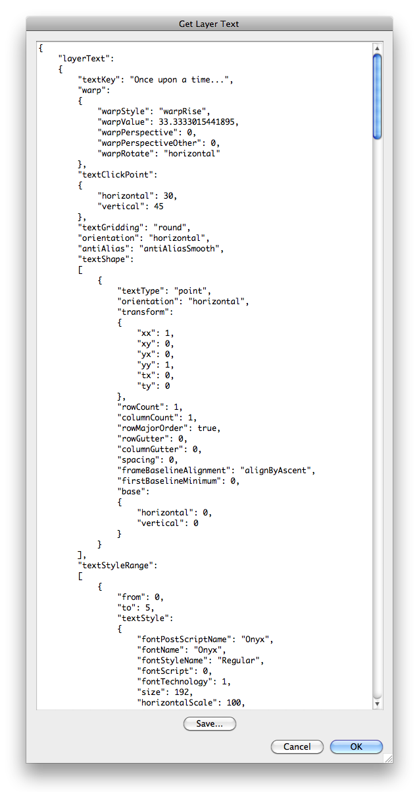

# Get Layer Text

## Description

“Get Layer Text” is a text layer utility script using the [JSON Action Manager](/JSON-Action-Manager) scripting library, and more specifically its module `jamText`.

This stand-alone script written in JavaScript is used to get the text of the current text layer in JSON simplified format; it is basically a user interface “wrapper” around the function `jamText.getLayerText`: it opens a dialog box with a text field containing a layer text JSON object in [Layer Text Object Simplified Format](/JSON-Simplified-Formats/Layer-Text-Object-Simplified-Format).

You can copy or save the generated JSON text and use it in your own scripts by passing it to the function `jamText.setLayerText` to set the text of the current text layer.

Please refer to the [Layer Text Quick Tutorial](/Tutorials/Layer-Text-Quick-Tutorial) for more details.

## Requirements

This script can be used in Adobe Photoshop CS3 or later. It has been successfully tested in CS4 on Mac OS X, but should be platform agnostic.

## Copyright

This Software is copyright © 2013-2015 by Michel MARIANI.

## License

This Software is licensed under the [GNU General Public License (GPL) v3](https://www.gnu.org/licenses/gpl.html).

## Download

[Download Zip File](/Downloads/Get-Layer-Text-1.7.zip)

## Installation

Download the Zip file and unzip it.

Move the script to the `Presets/Scripts` folder in the default preset location of the Adobe Photoshop application. On next launch, the script will appear in the File>Automate submenu.
