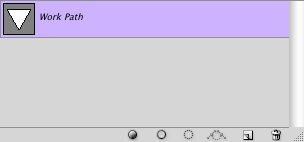
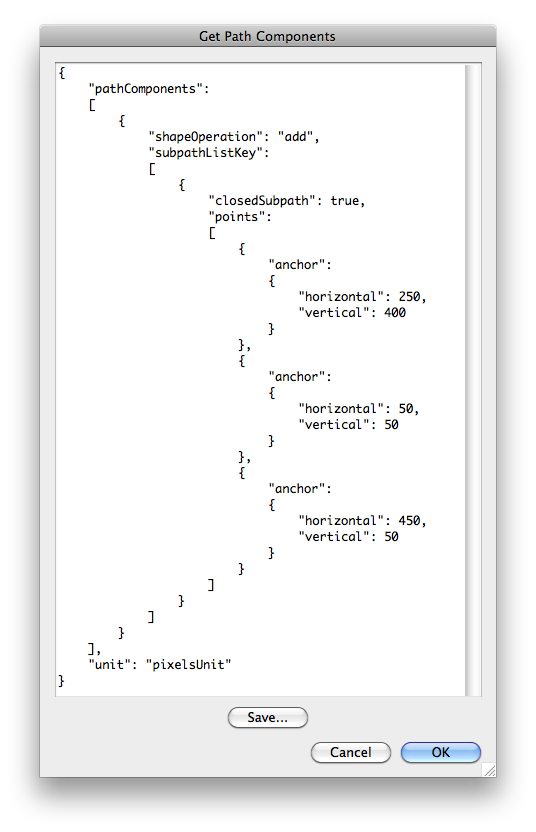

# Get Path Components

## Description

“Get Path Components” is a paths utility script using the [JSON Action Manager](/JSON-Action-Manager) scripting library.

This stand-alone script written in JavaScript opens a dialog box with a text field containing the JSON simplified format of the components of the currently selected path, making use of the JSON Action Manager scripting library; you can copy and/or save the generated text in [Path Component List Simplified Format](/JSON-Simplified-Formats/Path-Component-List-Simplified-Format) and use it in your own scripts by passing it to the function `jamHelpers.toPathComponentList`.

## Requirements

This script can be used in Adobe Photoshop CS3 or later. It has been successfully tested in CS4 on Mac OS X, but should be platform agnostic.

## Copyright

This Software is copyright © 2011-2015 by Michel MARIANI.

## License

This Software is licensed under the [GNU General Public License (GPL) v3](https://www.gnu.org/licenses/gpl.html).

## Download

[Download Zip File](/Downloads/Get-Path-Components-4.3.zip)

## Installation

Download the Zip file and unzip it.

Move the script to the `Presets/Scripts` folder in the default preset location of the Adobe Photoshop application. On next launch, the script will appear in the File>Automate submenu.
