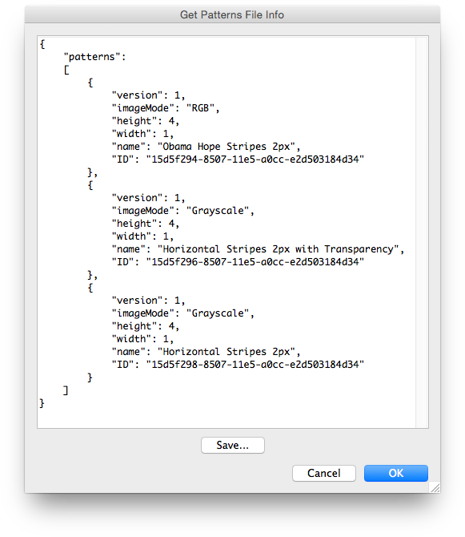

# Get Patterns File Info

## Description

“Get Patterns File Info” is a patterns utility script using the [JSON Action Manager](/JSON-Action-Manager) scripting library.

This stand-alone script written in JavaScript lets you get basic information from a Photoshop patterns file (.pat) or a patterns preferences file (Patterns.psp).

The information is returned as JSON text and includes the name and ID of each pattern found in the file. This is especially useful to uniquely identify patterns used by the [Layer Object Simplified Format](/JSON-Simplified-Formats/Layer-Object-Simplified-Format) (pattern fill layer) and by the [Layer Effects Object Simplified Format](/JSON-Simplified-Formats/Layer-Effects-Object-Simplified-Format) (texture of bevel and emboss; pattern overlay; pattern of stroke).

## Requirements

This script can be used in Adobe Photoshop CS3 or later. It has been successfully tested in CS4 on Mac OS X, but should be platform agnostic.

## Copyright

This Software is copyright © 2015 by Michel MARIANI.

## License

This Software is licensed under the [GNU General Public License (GPL) v3](https://www.gnu.org/licenses/gpl.html).

## Download

[Download Zip File](/Downloads/Get-Patterns-File-Info-1.1.zip)

## Installation

Download the Zip file and unzip it.

Move the script to the `Presets/Scripts` folder in the default preset location of the Adobe Photoshop application. On next launch, the script will appear in the File>Automate submenu.
