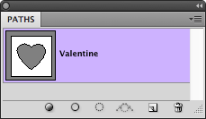
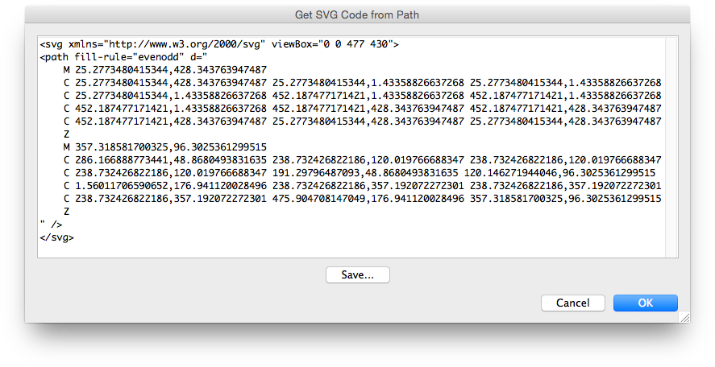

# Get SVG Code from Path

## Description

“Get SVG Code from Path” is a paths utility script using the [JSON Action Manager](/JSON-Action-Manager) scripting library.

This stand-alone script written in JavaScript allows you to get SVG code from any currently selected path in the Paths palette. It opens a dialog box with a text field containing the SVG code of the path; you can copy and/or save the generated SVG text.

The script displays SVG code in the same format than the SVG files generated by the script [Convert Custom Shapes File to SVG Set](/Utility-Scripts/Convert-Custom-Shapes-File-to-SVG-Set). In fact, it makes use of a temporary custom shapes file containing only one shape defined from the current path.

## Requirements

This script can be used in Adobe Photoshop CS3 or later. It has been successfully tested in CS4 on Mac OS X, but should be platform agnostic.

## Copyright

This Software is copyright © 2015 by Michel MARIANI.

## License

This Software is licensed under the [GNU General Public License (GPL) v3](https://www.gnu.org/licenses/gpl.html).

## Download

[Download Zip File](/Downloads/Get-SVG-Code-from-Path-1.1.zip)

## Installation

Download the Zip file and unzip it.

Move the script to the `Presets/Scripts` folder in the default preset location of the Adobe Photoshop application. On next launch, the script will appear in the File>Automate submenu.
