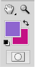
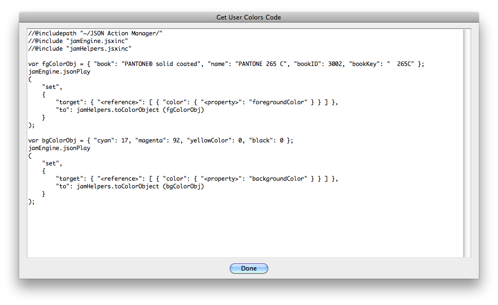

# Get User Colors Code

## Description

“Get User Colors Code” is a code utility script using the [JSON Action Manager](/JSON-Action-Manager) scripting library.

This stand-alone script written in JavaScript opens a dialog box with a text field containing the code used to set user colors to the current foreground and background values, making use of the JSON Action Manager scripting library; you can copy any part of the code, in particular the color data in [Color Object Simplified Format](/JSON-Simplified-Formats/Color-Object-Simplified-Format) expected by the function `jamHelpers.toColorObject`.

## Requirements

This script can be used in Adobe Photoshop CS or later. It has been successfully tested in CS and CS4 on Mac OS X, but should be platform agnostic.

## Copyright

This Software is copyright © 2011-2015 by Michel MARIANI.

## License

This Software is licensed under the [GNU General Public License (GPL) v3](https://www.gnu.org/licenses/gpl.html).

## Download

[Download Zip File](/Downloads/Get-User-Colors-Code-4.1.zip)

## Installation

Download the Zip file and unzip it.

Move the script to the `Presets/Scripts` folder in the default preset location of the Adobe Photoshop application. On next launch, the script will get directly accessible from Photoshop’s File menu: in Photoshop CS or CS2, it will appear in the File>Scripts submenu, among all other scripts sorted by lexical order; from Photoshop CS3, it will appear grouped by category in the File>Automate submenu.
