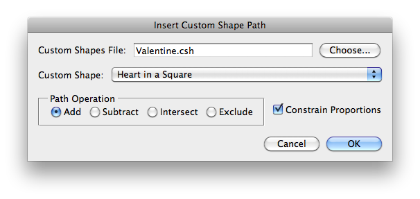
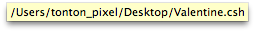
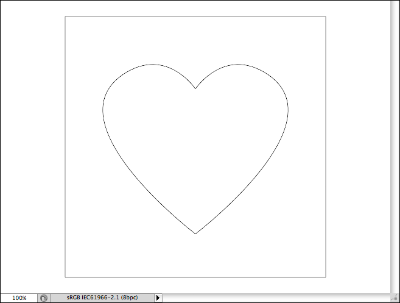

# Insert Custom Shape Path

Description

“Insert Custom Shape Path” is a custom shapes files utility script using the [JSON Action Manager](/JSON-Action-Manager) scripting library, and more specifically its module `jamShapes`.

This stand-alone script written in JavaScript is used to create a work path from a custom shape contained in a Photoshop custom shapes file (.csh).

Please refer to the [Photoshop Custom Shapes File Format](/Documentation/Photoshop-Custom-Shapes-File-Format) page for detailed information about the structure of a custom shapes file.

A tool-tip displaying the full path name of the custom shapes file is available while hovering over the custom shapes file text field.

## Example

**Path inserted from a custom shapes file (Valentine.csh)**:

## Requirements

This script can be used in Adobe Photoshop CS3 or later. It has been successfully tested in CS4 on Mac OS X, but should be platform agnostic.

## Copyright

This Software is copyright © 2011-2015 by Michel MARIANI.

## License

This Software is licensed under the [GNU General Public License (GPL) v3](https://www.gnu.org/licenses/gpl.html).

## Download

[Download Zip File](/Downloads/Insert-Custom-Shape-Path-2.0.zip)

## Installation

Download the Zip file and unzip it.

Move the script to the `Presets/Scripts` folder in the default preset location of the Adobe Photoshop application. On next launch, the script will appear in the File>Automate submenu.
