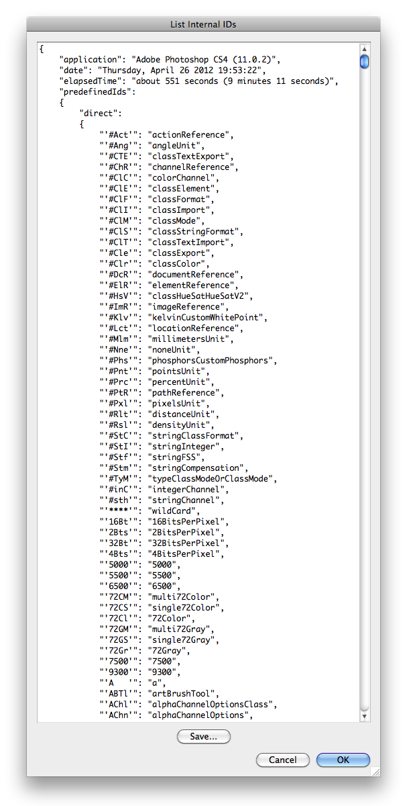
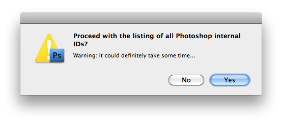

# List Internal IDs

## Description

“List Internal IDs” is a miscellaneous utility script using the [JSON Action Manager](/JSON-Action-Manager) scripting library.

This stand-alone script written in JavaScript opens a dialog box with a text field containing a JSON object listing all internal IDs used by Photoshop’s programming interface. You can copy or save the generated JSON text.

**Warning**:

- In Photoshop CS2, the above dialog is omitted, and a standard save file dialog is directly displayed instead, asking where the generated JSON text should be saved.
- In Photoshop CS, the generated JSON text is directly saved to a default file located on the user’s desktop.
- In all Photoshop versions, the script displays first a warning message stating that completing the operation definitely takes some time (between 10 and 20 minutes, or even more).

## Requirements

This script can be used in Adobe Photoshop CS or later. It has been successfully tested in CS and CS4 on Mac OS X, but should be platform agnostic.

## Copyright

This Software is copyright © 2011-2015 by Michel MARIANI.

## License

This Software is licensed under the [GNU General Public License (GPL) v3](https://www.gnu.org/licenses/gpl.html).

## Download

[Download Zip File](/Downloads/List-Internal-IDs-4.1.zip)

## Installation

Download the Zip file and unzip it.

Move the script to the `Presets/Scripts` folder in the default preset location of the Adobe Photoshop application. On next launch, the script will get directly accessible from Photoshop’s File menu: in Photoshop CS or CS2, it will appear in the File>Scripts submenu, among all other scripts sorted by lexical order; from Photoshop CS3, it will appear grouped by category in the File>Automate submenu.
