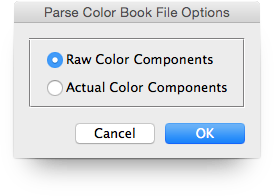

# Parse Color Book File

Description

“Parse Color Book File” is a color books utility script using the [JSON Action Manager](/JSON-Action-Manager) scripting library.

This stand-alone script written in JavaScript is used to parse a Photoshop color book file (.acb) into a JSON text file.

The utility script [Generate Color Book File](/Utility-Scripts/Generate-Color-Book-File) performs the reverse operation, i.e., converts a JSON text file into a Photoshop color book file (.acb).

The information about the color book file format comes from two main sources:

- [Adobe Color Book File Format Specification](http://magnetiq.com/pages/acb-spec/)
- [Adobe Photoshop File Formats Specification](https://www.adobe.com/devnet-apps/photoshop/fileformatashtml/#50577411_pgfId-1066780)

## Options

By default, color components are listed **raw**, exactly as they appear in the .acb file, with values ranging from 0 to 255.

It is also possible to obtain instead the **actual** color components values: in that case, extra conversion is automatically performed as follows (final rounding would only be necessary if the percentage values needed to be displayed as integers):

**CMYK color space**:

    cyan = (255 - components[0]) / 255 * 100; // 0% to 100%
    magenta = (255 - components[1]) / 255 * 100; // 0% to 100%
    yellowColor = (255 - components[2]) / 255 * 100; // 0% to 100%
    black = (255 - components[3]) / 255 * 100; // 0% to 100%

**Lab color space**:

    luminance = components[0] / 255 * 100; // 0% to 100%
    a = components[1] - 128; // -128 to 127
    b = components[2] - 128; // -128 to 127

**RGB color space**:

    red = components[0]; // 0 to 255
    green = components[1]; // 0 to 255
    blue = components[2]; // 0 to 255

## Examples

**Parsed color book file \[raw color components\]**:

[ANPA Color (rawComponents).json](ANPA%20Color%20(rawComponents).json)

**Parsed color book file \[actual color components\]**:

[ANPA Color (actualComponents).json](ANPA%20Color%20(actualComponents).json)

## Requirements

This script can be used in Adobe Photoshop CS3 or later. It has been successfully tested in CS4 on Mac OS X, but should be platform agnostic.

## Copyright

This Software is copyright © 2013-2016 by Michel MARIANI.

## License

This Software is licensed under the [GNU General Public License (GPL) v3](https://www.gnu.org/licenses/gpl.html).

## Download

[Download Zip File](/Downloads/Parse-Color-Book-File-1.5.zip)

## Installation

Download the Zip file and unzip it.

Move the script to the `Presets/Scripts` folder in the default preset location of the Adobe Photoshop application. On next launch, the script will appear in the File>Automate submenu.
