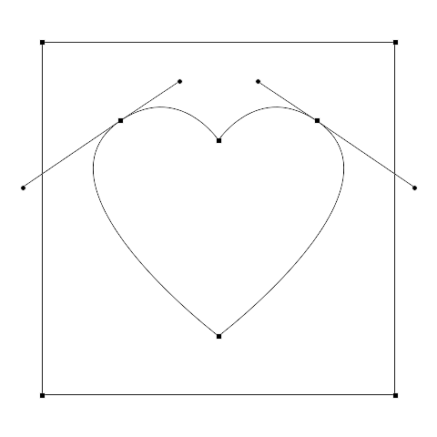

# Parse Custom Shapes File

## Description

“Parse Custom Shapes File” is a custom shapes files utility script using the [JSON Action Manager](/JSON-Action-Manager) scripting library, and more specifically its module `jamShapes`.

This stand-alone script written in JavaScript is used to parse a Photoshop custom shapes file (.csh) or a custom shapes preferences file (CustomShapes.psp) into a JSON text file.

Please refer to the [Photoshop Custom Shapes File Format](/Documentation/custom-shapes-file-format.html) document for detailed information about the structure of a custom shapes file.

## Example

**Parsed custom shapes file (Valentine.json)**:

```json
{
    "fileVersion": 2,
    "customShapes":
    [
        {
            "name": "Heart in a Square",
            "ID": "425441a3-7191-11e2-bf7c-89eed4dfa6ce",
            "bounds":
            [
                22,
                -1,
                458,
                481
            ],
            "pathRecords":
            [
                [
                    "pathFill",
                    null
                ],
                [
                    "initialFill",
                    0
                ],
                [
                    "closedLength",
                    4
                ],
                [
                    "closedUnlinked",
                    [
                        [
                            0.99541282653809,
                            0.05186724662781
                        ],
                        [
                            0.99541282653809,
                            0.05186724662781
                        ],
                        [
                            0.99541282653809,
                            0.05186724662781
                        ]
                    ]
                ],
                [
                    "closedUnlinked",
                    [
                        [
                            0.00458717346191,
                            0.05186724662781
                        ],
                        [
                            0.00458717346191,
                            0.05186724662781
                        ],
                        [
                            0.00458717346191,
                            0.05186724662781
                        ]
                    ]
                ],
                [
                    "closedUnlinked",
                    [
                        [
                            0.00458717346191,
                            0.94813275337219
                        ],
                        [
                            0.00458717346191,
                            0.94813275337219
                        ],
                        [
                            0.00458717346191,
                            0.94813275337219
                        ]
                    ]
                ],
                [
                    "closedUnlinked",
                    [
                        [
                            0.99541282653809,
                            0.94813275337219
                        ],
                        [
                            0.99541282653809,
                            0.94813275337219
                        ],
                        [
                            0.99541282653809,
                            0.94813275337219
                        ]
                    ]
                ],
                [
                    "closedLength",
                    4
                ],
                [
                    "closedLinked",
                    [
                        [
                            0.41192662715912,
                            0.99792528152466
                        ],
                        [
                            0.22477066516876,
                            0.74896264076233
                        ],
                        [
                            0.11467891931534,
                            0.59958505630493
                        ]
                    ]
                ],
                [
                    "closedUnlinked",
                    [
                        [
                            0.27981650829315,
                            0.5
                        ],
                        [
                            0.27981650829315,
                            0.5
                        ],
                        [
                            0.27981650829315,
                            0.5
                        ]
                    ]
                ],
                [
                    "closedLinked",
                    [
                        [
                            0.11467891931534,
                            0.40041494369507
                        ],
                        [
                            0.22477066516876,
                            0.25103735923767
                        ],
                        [
                            0.41192662715912,
                            0.00207471847534
                        ]
                    ]
                ],
                [
                    "closedUnlinked",
                    [
                        [
                            0.83027523756027,
                            0.5
                        ],
                        [
                            0.83027523756027,
                            0.5
                        ],
                        [
                            0.83027523756027,
                            0.5
                        ]
                    ]
                ]
            ]
        }
    ]
}
```



## Requirements

This script can be used in Adobe Photoshop CS3 or later. It has been successfully tested in CS4 on Mac OS X, but should be platform agnostic.

## Copyright

This Software is copyright © 2011-2015 by Michel MARIANI.

## License

This Software is licensed under the [GNU General Public License (GPL) v3](https://www.gnu.org/licenses/gpl.html).

## Download

[Download Zip File](/Downloads/Parse-Custom-Shapes-File-2.0.zip)

## Installation

Download the Zip file and unzip it.

Move the script to the `Presets/Scripts` folder in the default preset location of the Adobe Photoshop application. On next launch, the script will appear in the File>Automate submenu.
