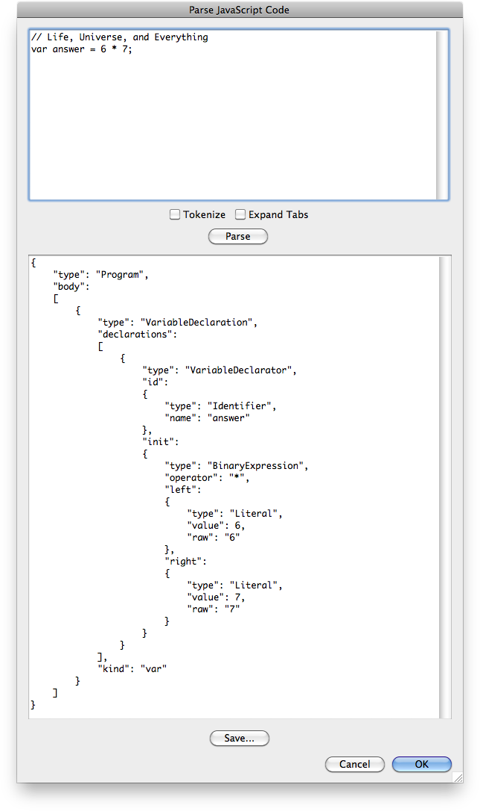

# Parse JavaScript Code

## Description

“Parse JavaScript Code” is a syntax utility script using the [JSON Action Manager](/JSON-Action-Manager) scripting library.

This stand-alone script written in JavaScript opens a resizeable dialog box with two text areas; in the first field, type or paste any JavaScript code, then click the “Parse” button to parse it into an abstract syntax tree (AST) displayed as a JSON object. Basic editing support is provided, i.e., tabulations and new lines can be inserted.

If the “Tokenize” checkbox is checked when clicking on the “Parse” button, then the JavaScript code in displayed as a JSON array of tokens.

This script uses a slighly modified version of the [Esprima](http://esprima.org/) parser created and maintained by [Ariya Hidayat](https://ariya.io/about):

[esprima.jsxinc](esprima.jsxinc)

## Requirements

This script can be used in Adobe Photoshop CS4 or later. It has been successfully tested in CS4 on Mac OS X, but should be platform agnostic.

## Copyright

This Software is copyright © 2014-2015 by Michel MARIANI.

## License

This Software is licensed under the [GNU General Public License (GPL) v3](https://www.gnu.org/licenses/gpl.html).

## Download

[Download Zip File](/Downloads/Parse-JavaScript-Code-1.3.zip)

## Installation

Download the Zip file and unzip it.

Move the entire script *FOLDER* (`Parse JavaScript Code Folder`) with its contents into the `Presets/Scripts` folder in the default preset location of the Adobe Photoshop application. On next launch, the script will appear in the File>Automate submenu.

