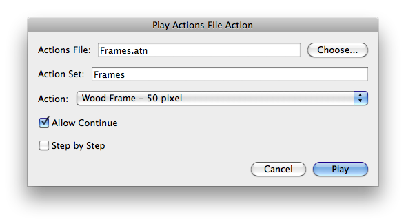

# Play Actions File Action

## Description

“Play Actions File Action” is an actions files utility script using the [JSON Action Manager](/JSON-Action-Manager) scripting library, and more specifically its module `jamActions`.

This stand-alone script written in JavaScript is used to play a specific action contained in a Photoshop actions file (.atn), without the need to load the file in the Actions Palette.

Please refer to the [Photoshop Actions File Format](/Documentation/actions-file-format.html) document for detailed information about the structure of an actions file.

A tool-tip displaying the full path name of the actions file is available while hovering over the actions file text field.

## Requirements

This script can be used in Adobe Photoshop CS3 or later. It has been successfully tested in CS4 on Mac OS X, but should be platform agnostic.

## Copyright

This Software is copyright © 2011-2015 by Michel MARIANI.

## License

This Software is licensed under the [GNU General Public License (GPL) v3](https://www.gnu.org/licenses/gpl.html).

## Download

[Download Zip File](/Downloads/Play-Actions-File-Action-1.8.zip)

## Installation

Download the Zip file and unzip it.

Move the script to the `Presets/Scripts` folder in the default preset location of the Adobe Photoshop application. On next launch, the script will appear in the File>Automate submenu.
