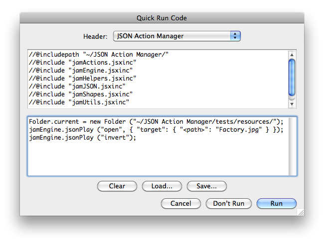

# Quick Run Code

## Description

“Quick Run Code” is a code utility script using the [JSON Action Manager](/JSON-Action-Manager) scripting library.

This stand-alone script written in JavaScript opens a resizeable dialog box with one text area; copy or type any JavaScript code in it, then click the Run button to get it executed. Basic editing support is provided, i.e., tabulations and new lines can be inserted.

## Requirements

This script can be used in Adobe Photoshop CS4 or later. It has been successfully tested in CS4 on Mac OS X, but should be platform agnostic.

## Copyright

This Software is copyright © 2011-2016 by Michel MARIANI.

## License

This Software is licensed under the [GNU General Public License (GPL) v3](https://www.gnu.org/licenses/gpl.html).

## Download

[Download Zip File](/Downloads/Quick-Run-Code-4.4.zip)

## Installation

Download the Zip file and unzip it.

Move the script to the `Presets/Scripts` folder in the default preset location of the Adobe Photoshop application. On next launch, the script will appear in the File>Automate submenu.
